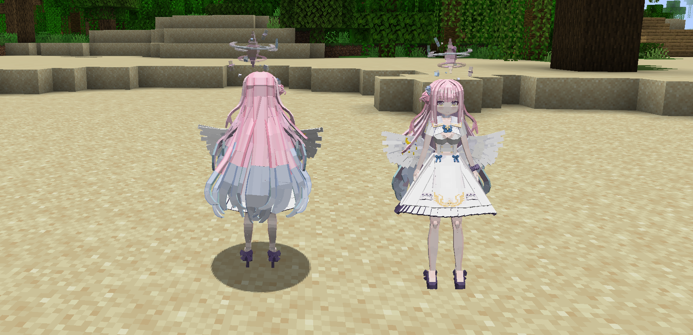
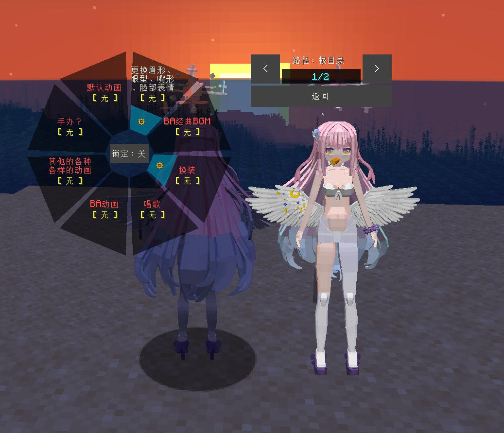

# BA_圣园未花_Mika-Misono_LA

## Model Info

Expand/Collapse

<!-- GENERATED MODEL PREVIEW README START -->

<!-- GENERATED MODEL PREVIEW README END -->

- **Name**: #圣园未花 | #Mika-Misono
- **Category**: #Game
  - **Game**: #BA #Blue-Archive #碧蓝档案

## Download

Expand/Collapse

- [BA_圣园未花_Mika-Misono.ysm (22.2 MB)](https://raw.githubusercontent.com/nekohalawrence/YSM-Model-Author/main/0000--OMEGAZERO-/BA_%E5%9C%A3%E5%9B%AD%E6%9C%AA%E8%8A%B1_Mika-Misono_LA/BA_%E5%9C%A3%E5%9B%AD%E6%9C%AA%E8%8A%B1_Mika-Misono.ysm)
- [BA_圣园未花_Mika-Misono_v1.2.ysm (12.1 MB)](https://raw.githubusercontent.com/nekohalawrence/YSM-Model-Author/main/0000--OMEGAZERO-/BA_%E5%9C%A3%E5%9B%AD%E6%9C%AA%E8%8A%B1_Mika-Misono_LA/BA_%E5%9C%A3%E5%9B%AD%E6%9C%AA%E8%8A%B1_Mika-Misono_v1.2.ysm)
- [BA_圣园未花_Mika-Misono_v1.7.ysm (28.3 MB)](https://raw.githubusercontent.com/nekohalawrence/YSM-Model-Author/main/0000--OMEGAZERO-/BA_%E5%9C%A3%E5%9B%AD%E6%9C%AA%E8%8A%B1_Mika-Misono_LA/BA_%E5%9C%A3%E5%9B%AD%E6%9C%AA%E8%8A%B1_Mika-Misono_v1.7.ysm)
- [BA_圣园未花_Mika-Misono_v2.2.ysm (29.6 MB)](https://raw.githubusercontent.com/nekohalawrence/YSM-Model-Author/main/0000--OMEGAZERO-/BA_%E5%9C%A3%E5%9B%AD%E6%9C%AA%E8%8A%B1_Mika-Misono_LA/BA_%E5%9C%A3%E5%9B%AD%E6%9C%AA%E8%8A%B1_Mika-Misono_v2.2.ysm)
- [BA_圣园未花_Mika-Misono_v2.2.zip (16.5 MB)](https://raw.githubusercontent.com/nekohalawrence/YSM-Model-Author/main/0000--OMEGAZERO-/BA_%E5%9C%A3%E5%9B%AD%E6%9C%AA%E8%8A%B1_Mika-Misono_LA/BA_%E5%9C%A3%E5%9B%AD%E6%9C%AA%E8%8A%B1_Mika-Misono_v2.2.zip)
- [BA_圣园未花_Mika-Misono_v2.5.ysm (16.7 MB)](https://raw.githubusercontent.com/nekohalawrence/YSM-Model-Author/main/0000--OMEGAZERO-/BA_%E5%9C%A3%E5%9B%AD%E6%9C%AA%E8%8A%B1_Mika-Misono_LA/BA_%E5%9C%A3%E5%9B%AD%E6%9C%AA%E8%8A%B1_Mika-Misono_v2.5.ysm)

## Author Info

Expand/Collapse

## Author

- **Name**: #-OMEGAZERO-
  - **Author ID**: `0000`
  - **Role**: #模型 | #Model
  - **SocialPlatform**: #Bilibili
    - **Bilibili**: https://space.bilibili.com/359658906

