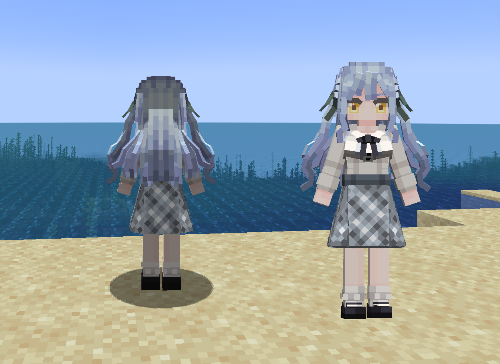

# AveMujica_Togawa-Sakiko_丰川祥子_LB

## Model Info

Expand/Collapse

<!-- GENERATED MODEL PREVIEW README START -->

<!-- GENERATED MODEL PREVIEW README END -->

- **Name**: #丰川祥子 | #Togawa-Sakiko
- **Category**: #Anime
  - **Game**: #AveMujica #BanG Dream! Ave Mujica #颂乐人偶

## Download

Expand/Collapse

- [AveMujica_丰川祥子_Togawa-Sakiko_1.ysm (2.4 MB)](https://raw.githubusercontent.com/nekohalawrence/YSM-Model-Author/main/0001-02Bunny%2C%E8%93%9D%E7%8E%AB%E7%91%B0/AveMujica_Togawa-Sakiko_%E4%B8%B0%E5%B7%9D%E7%A5%A5%E5%AD%90_LB/AveMujica_%E4%B8%B0%E5%B7%9D%E7%A5%A5%E5%AD%90_Togawa-Sakiko_1.ysm)

## Author Info

Expand/Collapse

## Author

- **Name**: #02Bunny | #蓝玫瑰
  - **Author ID**: `0001`
  - **Role**: #模型 #贴图 #动画 | #Model #Texture #Animation
  - **SocialPlatform**: #Bilibili #QQ
    - **Bilibili**: https://space.bilibili.com/11814817
    - **QQ**: 584570528

