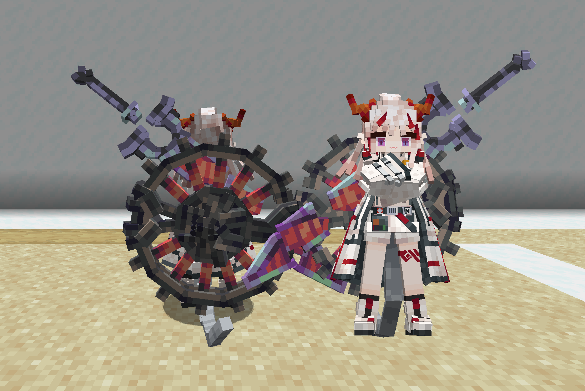
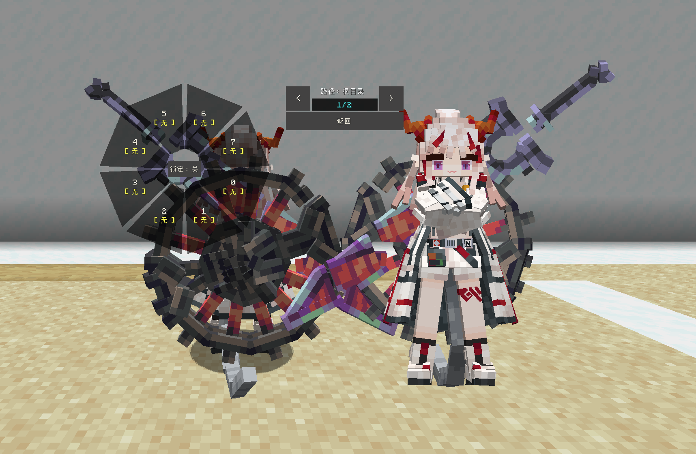

# AK_年_Nian

## Model Info

Expand/Collapse

<!-- GENERATED MODEL PREVIEW README START -->

<!-- GENERATED MODEL PREVIEW README END -->

- **Name**: #年 | #Nian
- **Category**: #Game
  - **Game**: #AK #Arknights #明日方舟

## Download

Expand/Collapse

- [nian.ysm (678.0 KB)](https://raw.githubusercontent.com/nekohalawrence/YSM-Model-Author/main/0002-%E6%98%A0%E7%B4%A0%2C%E6%98%A0%E7%B4%A0%E4%BD%9C%E5%9D%8A/AK_%E5%B9%B4_Nian/nian.ysm)

## Author Info

Expand/Collapse

## Author

- **Name**: #映素 | #映素作坊
  - **Author ID**: `0002`
  - **Role**: #模型 #动作 #动画 | #Model #Motion #Animation
  - **SocialPlatform**: #Bilibili #QQ
    - **Bilibili**: https://space.bilibili.com/400235810
    - **QQ**: 833187861
  - **SupportPlatform**: #Afdian
    - **Afdian**: https://afdian.com/a/6TGESILA

