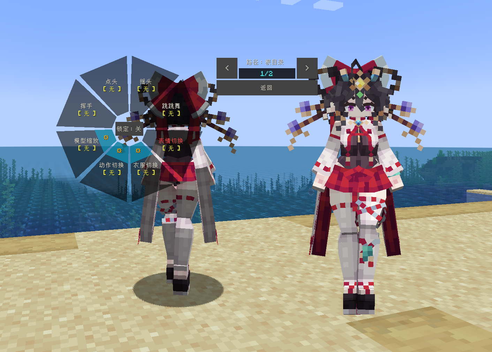
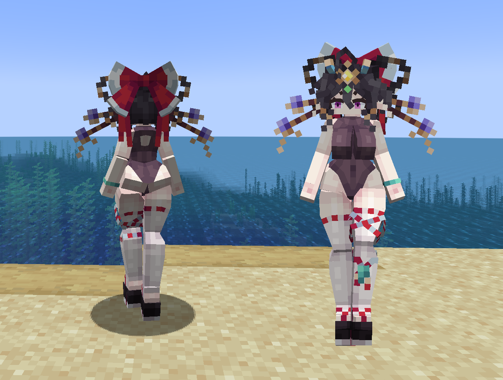
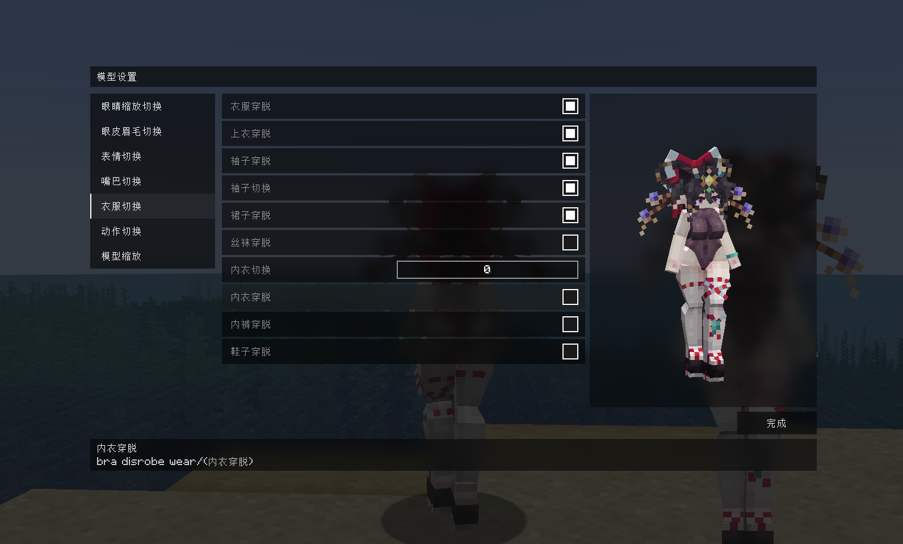

# OC_Haitai-Umita_海太umita_LA

## Model Info

Expand/Collapse

<!-- GENERATED MODEL PREVIEW README START -->

<!-- GENERATED MODEL PREVIEW README END -->

- **Name**: #海太umita | #Haitai-Umita
- **Category**: #Original
  - **Game**: #OC #Original Character #原创角色

## Download

Expand/Collapse

- [OC_海太_Umita-Haitai-Umita_v1.2.ysm (387.7 KB)](https://raw.githubusercontent.com/nekohalawrence/YSM-Model-Author/main/0005-omo%E4%BB%99%E8%B4%9D2%E5%8F%B7%2Como%2Cmo%2CFujiwaranoMoku114514/OC_Haitai-Umita_%E6%B5%B7%E5%A4%AAumita_LA/OC_%E6%B5%B7%E5%A4%AA_Umita-Haitai-Umita_v1.2.ysm)
- [OC_海太_Umita-Haitai-Umita_v1.2.zip (464.6 KB)](https://raw.githubusercontent.com/nekohalawrence/YSM-Model-Author/main/0005-omo%E4%BB%99%E8%B4%9D2%E5%8F%B7%2Como%2Cmo%2CFujiwaranoMoku114514/OC_Haitai-Umita_%E6%B5%B7%E5%A4%AAumita_LA/OC_%E6%B5%B7%E5%A4%AA_Umita-Haitai-Umita_v1.2.zip)

## Author Info

Expand/Collapse

## Author

- **Name**: #omo仙贝2号 | #omo | #mo | #FujiwaranoMoku114514
  - **Author ID**: `0005`
  - **Role**: #全部
  - **SocialPlatform**: #Bilibili #YouTube #Twitter
    - **Bilibili**: https://space.bilibili.com/1959304255
    - **YouTube**: https://www.youtube.com/@%E8%97%A4%E5%8E%9F%E5%A6%B9%E7%BA%A2-i3q
    - **Twitter**: https://x.com/wOelxdwlnwq5Zl0
  - **SupportPlatform**: #Afdian #Patreon
    - **Afdian**: https://afdian.com/a/omomomomomomo
    - **Patreon**: https://www.patreon.com/c/omo595/posts

## Co-creator

- **Name**: 海太umita
  - **Role**: #人设oc
  - **SocialPlatform**: #Twitter #Bilibili
    - **Twitter**: @yu123v
    - **Bilibili**: (https://space.bilibili.com/1184568432?spm_id_from=333.1007.0.0)

- **Name**: 甜粽子
  - **Role**: #动画 | #Animation

