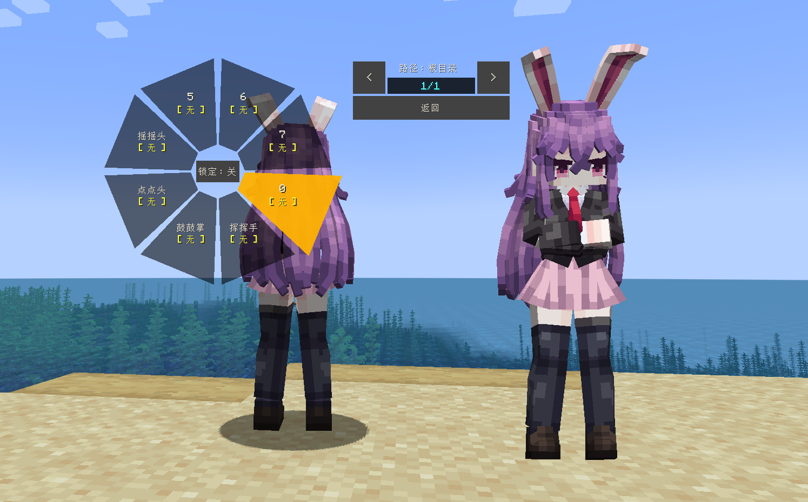

# Touhou_Reisen-Udongein-Inaba_铃仙·优昙华院·因幡_LB

## Model Info

Expand/Collapse

<!-- GENERATED MODEL PREVIEW README START -->

<!-- GENERATED MODEL PREVIEW README END -->

- **Name**: #铃仙·优昙华院·因幡 | #Reisen-Udongein-Inaba
- **Category**: #Other
  - **Game**: #Touhou #Touhou-Project #东方 Project

## Download

Expand/Collapse

- [Touhou_铃仙·优昙华院·因幡_Reisen-Udongein-Inaba.ysm (815.8 KB)](https://raw.githubusercontent.com/nekohalawrence/YSM-Model-Author/main/0005-omo%E4%BB%99%E8%B4%9D2%E5%8F%B7%2Como%2Cmo%2CFujiwaranoMoku114514/Touhou_Reisen-Udongein-Inaba_%E9%93%83%E4%BB%99%C2%B7%E4%BC%98%E6%98%99%E5%8D%8E%E9%99%A2%C2%B7%E5%9B%A0%E5%B9%A1_LB/Touhou_%E9%93%83%E4%BB%99%C2%B7%E4%BC%98%E6%98%99%E5%8D%8E%E9%99%A2%C2%B7%E5%9B%A0%E5%B9%A1_Reisen-Udongein-Inaba.ysm)

## Author Info

Expand/Collapse

## Author

- **Name**: #omo仙贝2号 | #omo | #mo | #FujiwaranoMoku114514
  - **Author ID**: `0005`
  - **Role**: #全部
  - **SocialPlatform**: #Bilibili #YouTube #Twitter
    - **Bilibili**: https://space.bilibili.com/1959304255
    - **YouTube**: https://www.youtube.com/@%E8%97%A4%E5%8E%9F%E5%A6%B9%E7%BA%A2-i3q
    - **Twitter**: https://x.com/wOelxdwlnwq5Zl0
  - **SupportPlatform**: #Afdian #Patreon
    - **Afdian**: https://afdian.com/a/omomomomomomo
    - **Patreon**: https://www.patreon.com/c/omo595/posts

