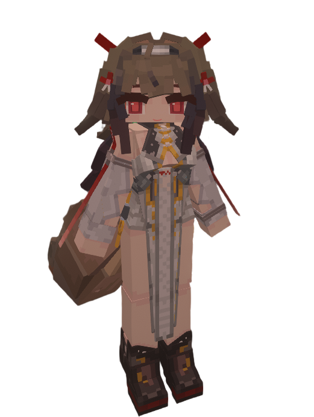

# ZZZ_Ye-Shunguang_叶瞬光

## Model Info

Expand/Collapse

<!-- GENERATED MODEL PREVIEW README START -->

<!-- GENERATED MODEL PREVIEW README END -->

- **Name**: #叶瞬光 | #Ye-Shunguang
- **Category**: #Game
  - **Game**: #ZZZ #Zenless-Zone-Zero #绝区零

## Download

Expand/Collapse

- [2.4YSM版叶瞬光.ysm (990.5 KB)](https://raw.githubusercontent.com/nekohalawrence/YSM-Model-Author/main/0008-%E7%99%BD%E8%89%B2%E5%8C%97%E7%86%8A/ZZZ_Ye-Shunguang_%E5%8F%B6%E7%9E%AC%E5%85%89/2.4YSM%E7%89%88%E5%8F%B6%E7%9E%AC%E5%85%89.ysm)
- [ZZZ_叶瞬光.ysm (1.8 MB)](https://raw.githubusercontent.com/nekohalawrence/YSM-Model-Author/main/0008-%E7%99%BD%E8%89%B2%E5%8C%97%E7%86%8A/ZZZ_Ye-Shunguang_%E5%8F%B6%E7%9E%AC%E5%85%89/ZZZ_%E5%8F%B6%E7%9E%AC%E5%85%89.ysm)
- [ZZZ_叶瞬光_v3.1.1.ysm (512.7 KB)](https://raw.githubusercontent.com/nekohalawrence/YSM-Model-Author/main/0008-%E7%99%BD%E8%89%B2%E5%8C%97%E7%86%8A/ZZZ_Ye-Shunguang_%E5%8F%B6%E7%9E%AC%E5%85%89/ZZZ_%E5%8F%B6%E7%9E%AC%E5%85%89_v3.1.1.ysm)
- [ZZZ_叶瞬光_v3.1.ysm (514.9 KB)](https://raw.githubusercontent.com/nekohalawrence/YSM-Model-Author/main/0008-%E7%99%BD%E8%89%B2%E5%8C%97%E7%86%8A/ZZZ_Ye-Shunguang_%E5%8F%B6%E7%9E%AC%E5%85%89/ZZZ_%E5%8F%B6%E7%9E%AC%E5%85%89_v3.1.ysm)
- [叶瞬光.原（新年特别版）.ysm (259.7 KB)](https://raw.githubusercontent.com/nekohalawrence/YSM-Model-Author/main/0008-%E7%99%BD%E8%89%B2%E5%8C%97%E7%86%8A/ZZZ_Ye-Shunguang_%E5%8F%B6%E7%9E%AC%E5%85%89/%E5%8F%B6%E7%9E%AC%E5%85%89.%E5%8E%9F%EF%BC%88%E6%96%B0%E5%B9%B4%E7%89%B9%E5%88%AB%E7%89%88%EF%BC%89.ysm)
- [叶瞬光.白（新年特别版）.ysm (272.9 KB)](https://raw.githubusercontent.com/nekohalawrence/YSM-Model-Author/main/0008-%E7%99%BD%E8%89%B2%E5%8C%97%E7%86%8A/ZZZ_Ye-Shunguang_%E5%8F%B6%E7%9E%AC%E5%85%89/%E5%8F%B6%E7%9E%AC%E5%85%89.%E7%99%BD%EF%BC%88%E6%96%B0%E5%B9%B4%E7%89%B9%E5%88%AB%E7%89%88%EF%BC%89.ysm)
- [叶瞬光3.0.ysm (268.9 KB)](https://raw.githubusercontent.com/nekohalawrence/YSM-Model-Author/main/0008-%E7%99%BD%E8%89%B2%E5%8C%97%E7%86%8A/ZZZ_Ye-Shunguang_%E5%8F%B6%E7%9E%AC%E5%85%89/%E5%8F%B6%E7%9E%AC%E5%85%893.0.ysm)
- [叶瞬光3.1.ysm (283.7 KB)](https://raw.githubusercontent.com/nekohalawrence/YSM-Model-Author/main/0008-%E7%99%BD%E8%89%B2%E5%8C%97%E7%86%8A/ZZZ_Ye-Shunguang_%E5%8F%B6%E7%9E%AC%E5%85%89/%E5%8F%B6%E7%9E%AC%E5%85%893.1.ysm)
- [叶瞬光3.2.ysm (282.1 KB)](https://raw.githubusercontent.com/nekohalawrence/YSM-Model-Author/main/0008-%E7%99%BD%E8%89%B2%E5%8C%97%E7%86%8A/ZZZ_Ye-Shunguang_%E5%8F%B6%E7%9E%AC%E5%85%89/%E5%8F%B6%E7%9E%AC%E5%85%893.2.ysm)
- [叶瞬光3.3.ysm (293.7 KB)](https://raw.githubusercontent.com/nekohalawrence/YSM-Model-Author/main/0008-%E7%99%BD%E8%89%B2%E5%8C%97%E7%86%8A/ZZZ_Ye-Shunguang_%E5%8F%B6%E7%9E%AC%E5%85%89/%E5%8F%B6%E7%9E%AC%E5%85%893.3.ysm)

## Author Info

Expand/Collapse

## Author

- **Name**: #白色北熊
  - **Author ID**: `0008`
  - **Role**: #模型 | #Model
  - **SocialPlatform**: #Bilibili #QQ
    - **Bilibili**: https://space.bilibili.com/175342453
    - **QQ**: 1067426280
  - **SupportPlatform**: #Afdian
    - **Afdian**: https://afdian.com/a/bx233

## Co-creator

- **Name**: 什么鸭
  - **Role**: #动画 | #Animation

