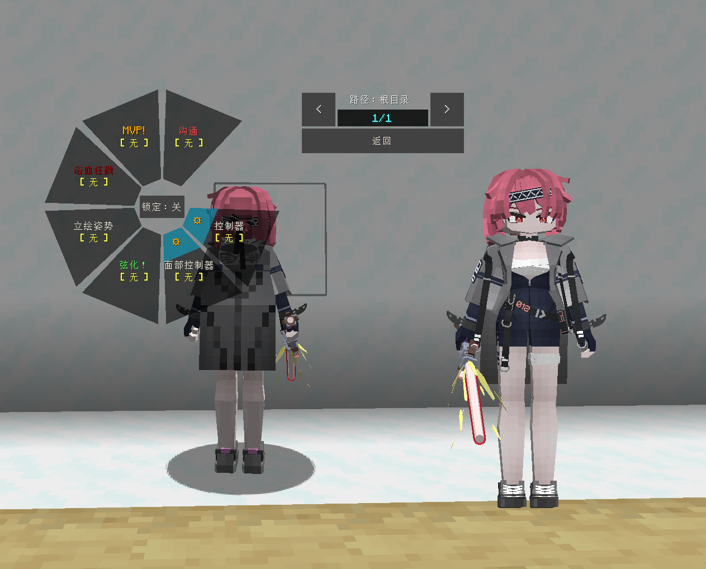
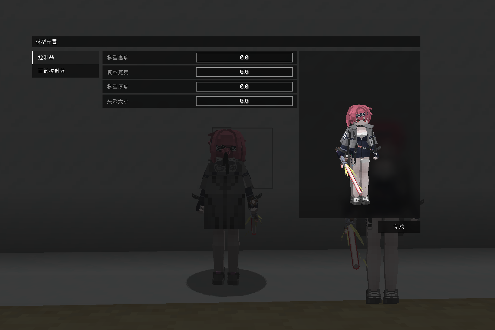

# Strinova_绯莎_Fuchsia_LB

## Model Info

Expand/Collapse

<!-- GENERATED MODEL PREVIEW README START -->

<!-- GENERATED MODEL PREVIEW README END -->

- **Name**: #绯莎 | #Fuchsia
- **Category**: #Game
  - **Game**: #Strinova #卡拉比丘

## Download

Expand/Collapse

- [Strinova_绯莎_Fuchsia_v1.0.ysm (667.1 KB)](https://raw.githubusercontent.com/nekohalawrence/YSM-Model-Author/main/0012-%E8%B5%A4%E6%81%92-AzaMire%2C%E8%B5%A4%E6%81%92RedConstant/Strinova_%E7%BB%AF%E8%8E%8E_Fuchsia_LB/Strinova_%E7%BB%AF%E8%8E%8E_Fuchsia_v1.0.ysm)
- [Strinova_绯莎_Fuchsia_v1.1.ysm (865.3 KB)](https://raw.githubusercontent.com/nekohalawrence/YSM-Model-Author/main/0012-%E8%B5%A4%E6%81%92-AzaMire%2C%E8%B5%A4%E6%81%92RedConstant/Strinova_%E7%BB%AF%E8%8E%8E_Fuchsia_LB/Strinova_%E7%BB%AF%E8%8E%8E_Fuchsia_v1.1.ysm)

## Author Info

Expand/Collapse

## Author

- **Name**: #赤恒-AzaMire | 赤恒RedConstant
  - **Author ID**: `0012`
  - **Role**: #依旧ALL IN
  - **SocialPlatform**: #Bilibili
    - **Bilibili**: https://space.bilibili.com/235888316

