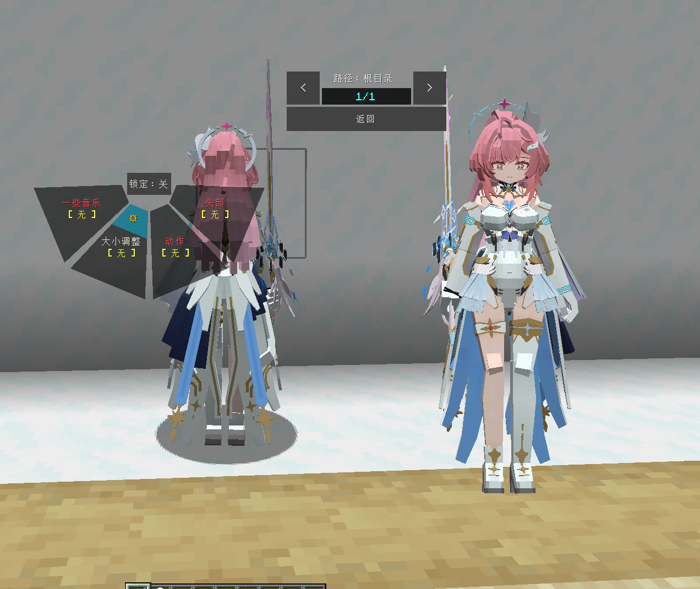
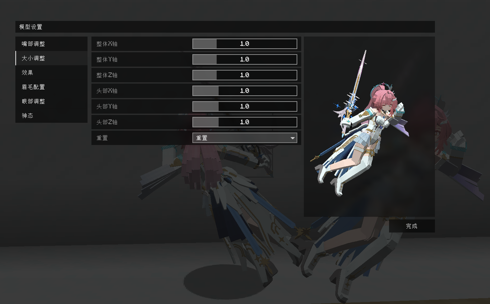

# WW_爱弥斯_Aemeath_LA

## Model Info

Expand/Collapse

<!-- GENERATED MODEL PREVIEW README START -->

<!-- GENERATED MODEL PREVIEW README END -->

- **Name**: #爱弥斯 | #Aemeath
- **Category**: #Game
  - **Game**: #WW #Wuthering-Waves #鸣潮

## Download

Expand/Collapse

- [WW_爱弥斯_Aemeath.ysm (12.4 MB)](https://raw.githubusercontent.com/nekohalawrence/YSM-Model-Author/main/0012-%E8%B5%A4%E6%81%92-AzaMire%2C%E8%B5%A4%E6%81%92RedConstant/WW_%E7%88%B1%E5%BC%A5%E6%96%AF_Aemeath_LA/WW_%E7%88%B1%E5%BC%A5%E6%96%AF_Aemeath.ysm)

## Author Info

Expand/Collapse

## Author

- **Name**: #赤恒-AzaMire | 赤恒RedConstant
  - **Author ID**: `0012`
  - **Role**: #模型 | #Model
  - **SocialPlatform**: #Bilibili
    - **Bilibili**: https://space.bilibili.com/235888316

