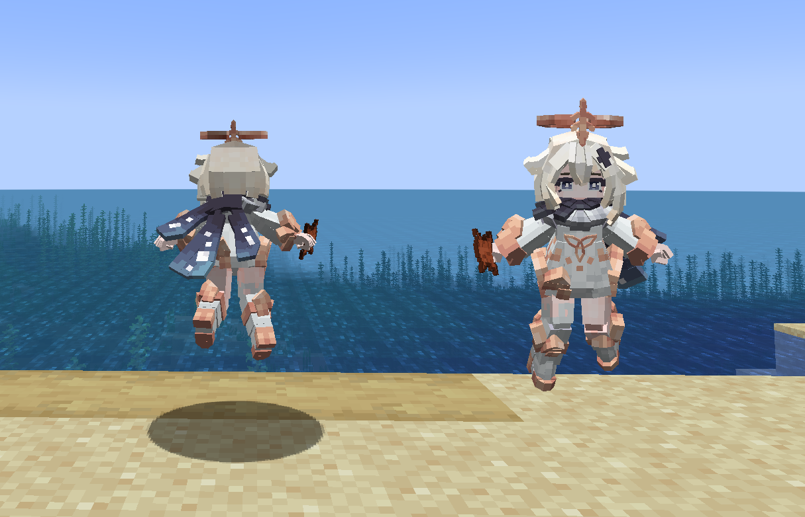
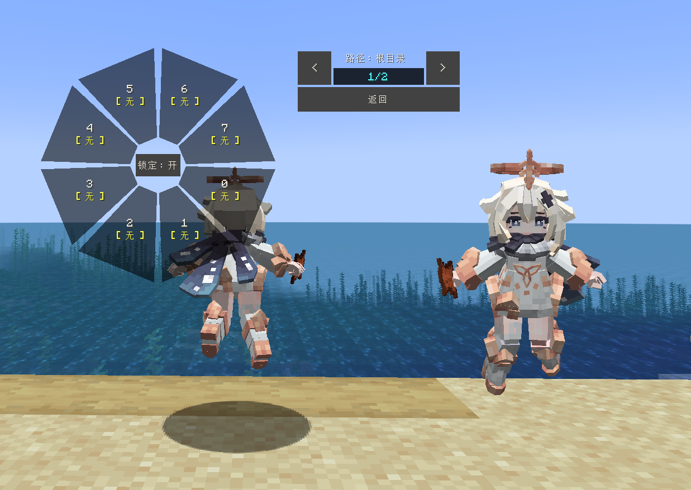

# GI_Paimon_派蒙

## Model Info

Expand/Collapse

<!-- GENERATED MODEL PREVIEW README START -->

<!-- GENERATED MODEL PREVIEW README END -->

- **Name**: #派蒙 | #Paimon
- **Category**: #Game
  - **Game**: #GI #Genshin Impact #原神

## Download

Expand/Collapse

- [GI_派蒙_Paimeng.ysm (157.8 KB)](https://raw.githubusercontent.com/nekohalawrence/YSM-Model-Author/main/0015-%E5%AF%92%E5%8F%94hs%2C%E7%83%88%E9%B8%9F%E6%AF%94%E7%99%BE%2CFrosty_Uncle/GI_Paimon_%E6%B4%BE%E8%92%99/GI_%E6%B4%BE%E8%92%99_Paimeng.ysm)
- [GI_派蒙_Paimeng.zip (66.1 KB)](https://raw.githubusercontent.com/nekohalawrence/YSM-Model-Author/main/0015-%E5%AF%92%E5%8F%94hs%2C%E7%83%88%E9%B8%9F%E6%AF%94%E7%99%BE%2CFrosty_Uncle/GI_Paimon_%E6%B4%BE%E8%92%99/GI_%E6%B4%BE%E8%92%99_Paimeng.zip)

## Author Info

Expand/Collapse

## Author

- **Name**: #寒叔hs | #烈鸟比百 | #Frosty_Uncle
  - **Author ID**: `0015`
  - **Role**: #模型 #动作 #动画 | #Model #Motion #Animation
  - **SocialPlatform**: #Bilibili #YouTube
    - **Bilibili**: https://space.bilibili.com/329066935
    - **YouTube**: https://www.youtube.com/@%E7%83%88%E9%B8%9F%E6%AF%94%E7%99%BE
  - **SupportPlatform**: #Afdian
    - **Afdian**: https://afdian.com/a/Aigoblin

