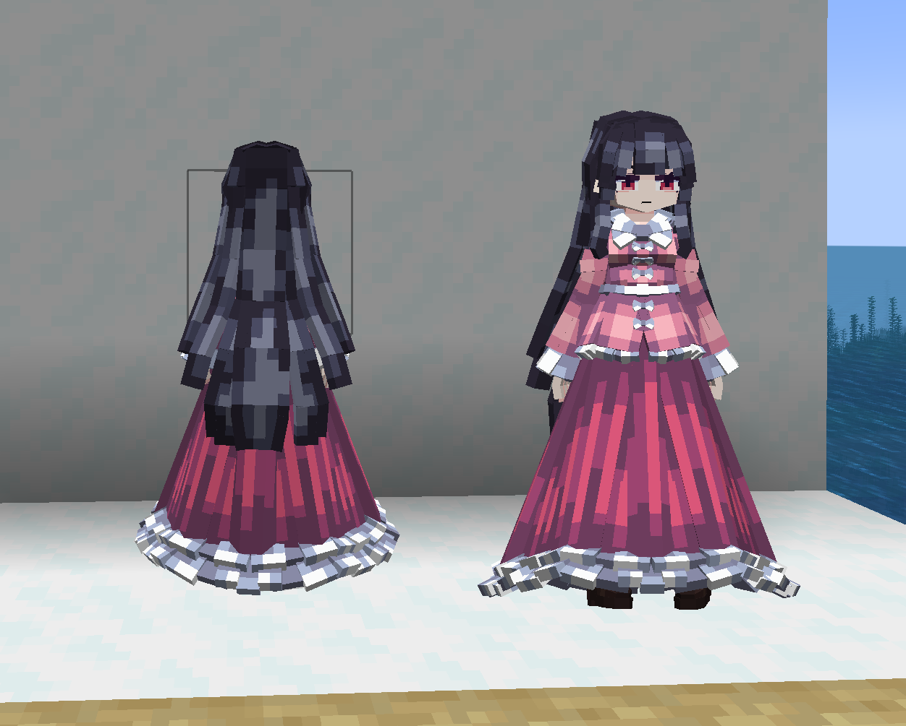
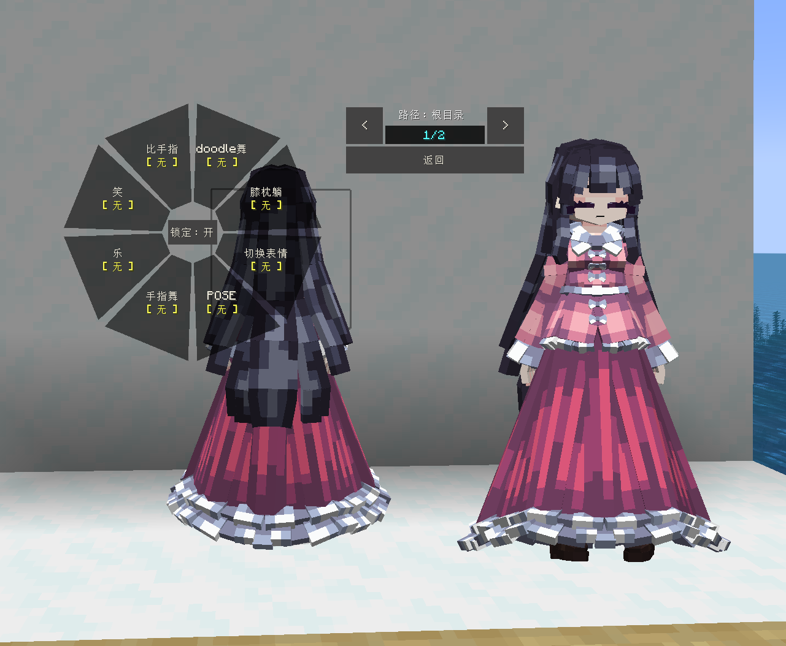
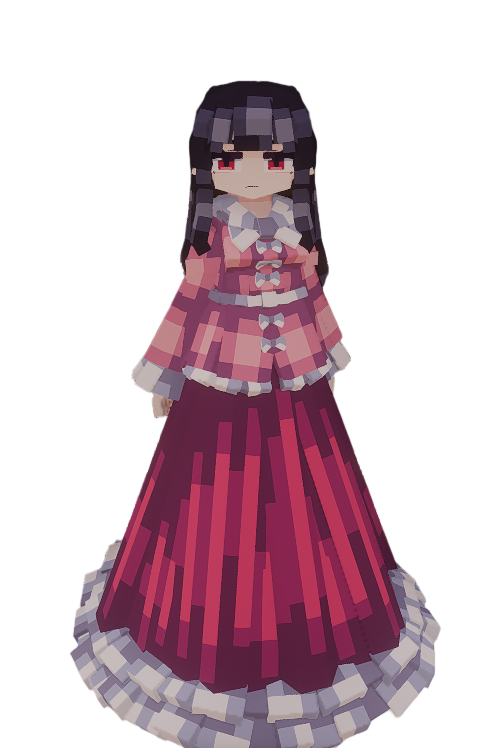

# Touhou_蓬莱山辉夜_Houraisan-Kaguya_LB

## Model Info

Expand/Collapse

<!-- GENERATED MODEL PREVIEW README START -->

<!-- GENERATED MODEL PREVIEW README END -->

- **Name**: #蓬莱山辉夜 | #Houraisan-Kaguya
- **Category**: #Other
  - **Game**: #Touhou #Touhou-Project #东方 Project

## Download

Expand/Collapse

- [Touhou_蓬莱山辉夜_Houraisan-Kaguya.ysm (244.2 KB)](https://raw.githubusercontent.com/nekohalawrence/YSM-Model-Author/main/0016-%E7%A5%B8%E5%BE%A1%E7%A5%9E/Touhou_%E8%93%AC%E8%8E%B1%E5%B1%B1%E8%BE%89%E5%A4%9C_Houraisan-Kaguya_LB/Touhou_%E8%93%AC%E8%8E%B1%E5%B1%B1%E8%BE%89%E5%A4%9C_Houraisan-Kaguya.ysm)

## Author Info

Expand/Collapse

## Author

- **Name**: #祸御神
  - **Author ID**: `0016`
  - **Role**: #嘟嘟哒嘟嘟哒
  - **SocialPlatform**: #Bilibili
    - **Bilibili**: https://space.bilibili.com/164557734
  - **SupportPlatform**: #Afdian
    - **Afdian**: https://afdian.com/a/YS444

## Co-creator

- **Name**: YSM作者导航页
  - **Role**: #看我
  - **OtherPlatform**: #qwq #awa
    - **qwq**: 点进来点进来点进来
    - **awa**: 点击右下角主页进入

