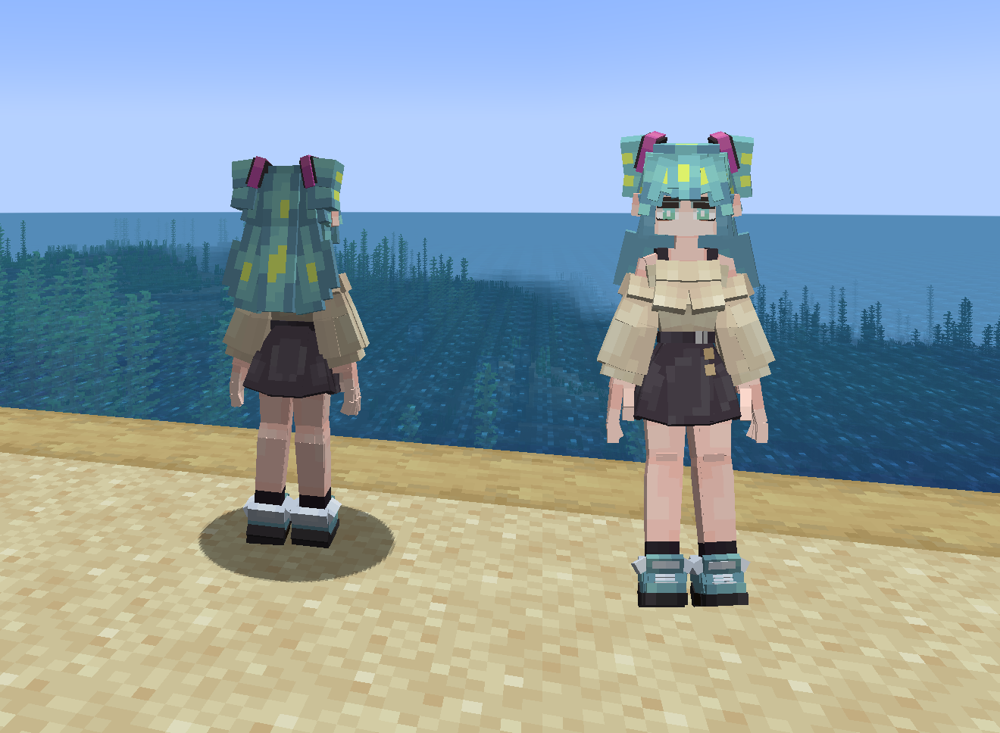
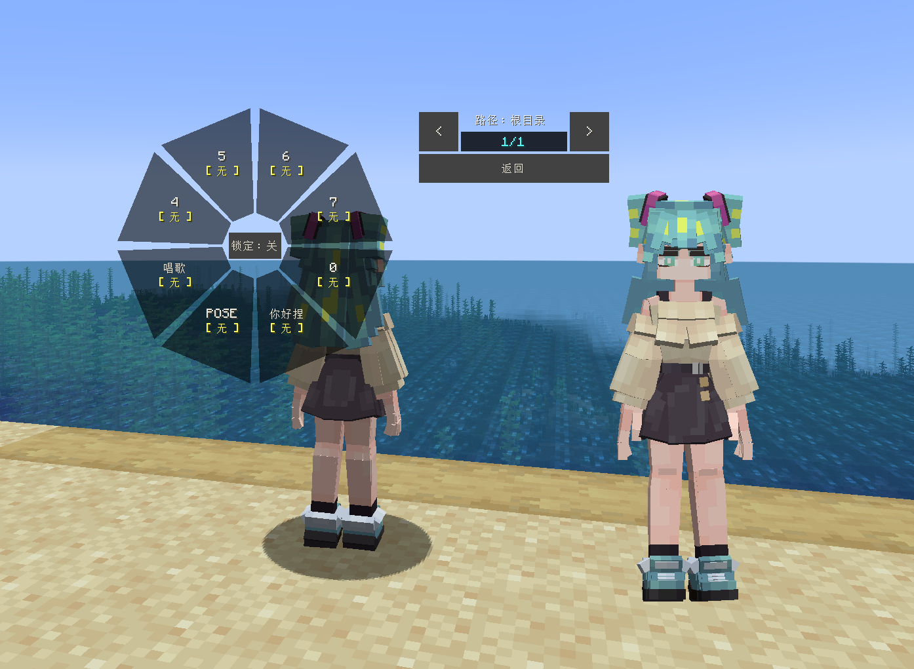
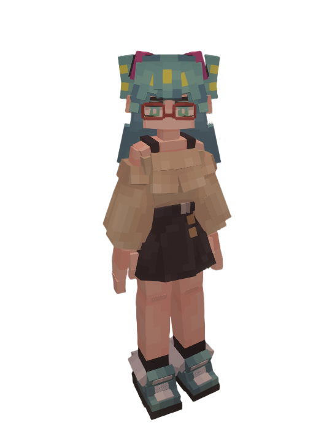

# VOC_初音未来_Hatsune-Miku_LC

## Model Info

Expand/Collapse

<!-- GENERATED MODEL PREVIEW README START -->

<!-- GENERATED MODEL PREVIEW README END -->

- **Name**: #初音未来 | #Hatsune-Miku
- **Category**: #Music
  - **Game**: #VOC #VOCALOID #虚拟歌姬

## Download

Expand/Collapse

- [VOC_初音未来_Hatsune-Miku_v3.ysm (68.6 KB)](https://raw.githubusercontent.com/nekohalawrence/YSM-Model-Author/main/0016-%E7%A5%B8%E5%BE%A1%E7%A5%9E/VOC_%E5%88%9D%E9%9F%B3%E6%9C%AA%E6%9D%A5_Hatsune-Miku_LC/VOC_%E5%88%9D%E9%9F%B3%E6%9C%AA%E6%9D%A5_Hatsune-Miku_v3.ysm)

## Author Info

Expand/Collapse

## Author

- **Name**: #祸御神
  - **Author ID**: `0016`
  - **Role**: #模型 #动作 #动画 | #Model #Motion #Animation
  - **SocialPlatform**: #Bilibili
    - **Bilibili**: https://space.bilibili.com/164557734
  - **SupportPlatform**: #Afdian
    - **Afdian**: https://afdian.com/a/YS444

