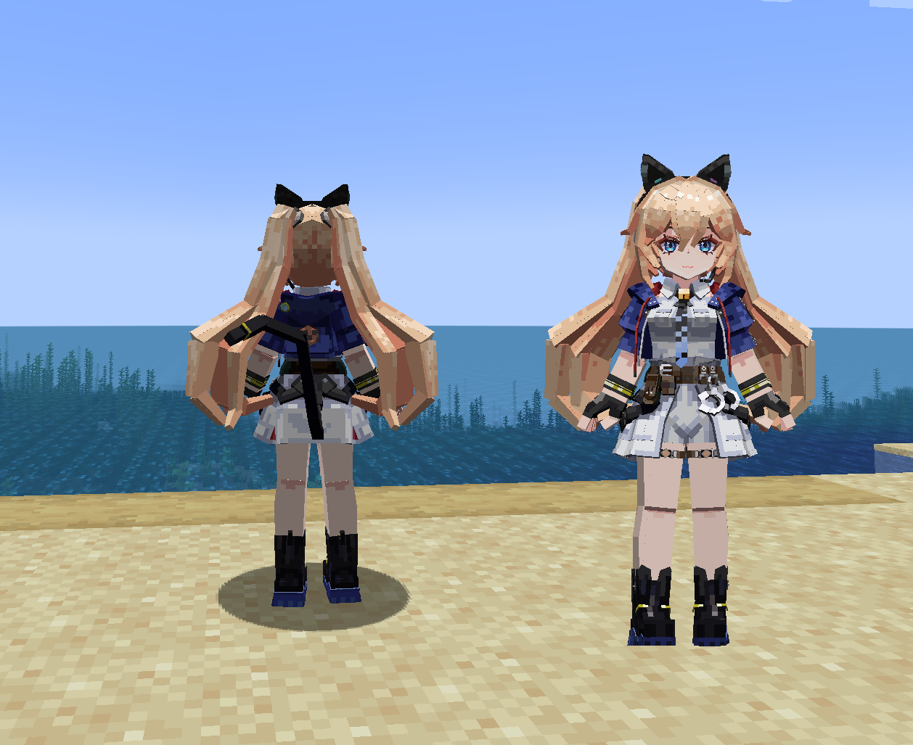
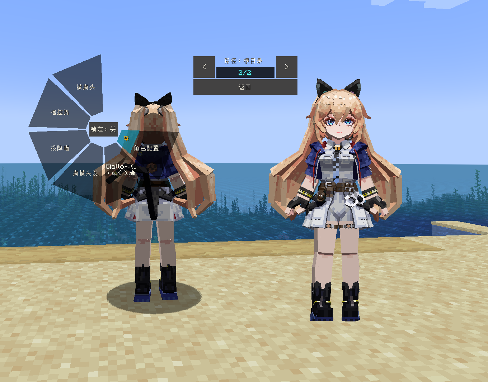

# Strinova_米雪儿·李_Michele_LA

## Model Info

Expand/Collapse

<!-- GENERATED MODEL PREVIEW README START -->

<!-- GENERATED MODEL PREVIEW README END -->

- **Name**: #米雪儿·李 | #Michele
- **Category**: #Game
  - **Game**: #Strinova #卡拉比丘

## Download

Expand/Collapse

- [Strinova_米雪儿·李_Michele.ysm (838.0 KB)](https://raw.githubusercontent.com/nekohalawrence/YSM-Model-Author/main/0018-%E5%A4%B9%E5%BF%83%E6%9E%9C%E9%A3%8E/Strinova_%E7%B1%B3%E9%9B%AA%E5%84%BF%C2%B7%E6%9D%8E_Michele_LA/Strinova_%E7%B1%B3%E9%9B%AA%E5%84%BF%C2%B7%E6%9D%8E_Michele.ysm)

## Author Info

Expand/Collapse

## Author

- **Name**: #夹心果风
  - **Author ID**: `0018`
  - **Role**: #模型 #动作 #动画 | #Model #Motion #Animation
  - **SocialPlatform**: #Bilibili #QQ
    - **Bilibili**: https://space.bilibili.com/178099567
    - **QQ**: 916346960
  - **SupportPlatform**: #Afdian
    - **Afdian**: https://afdian.com/a/jxgf2077

