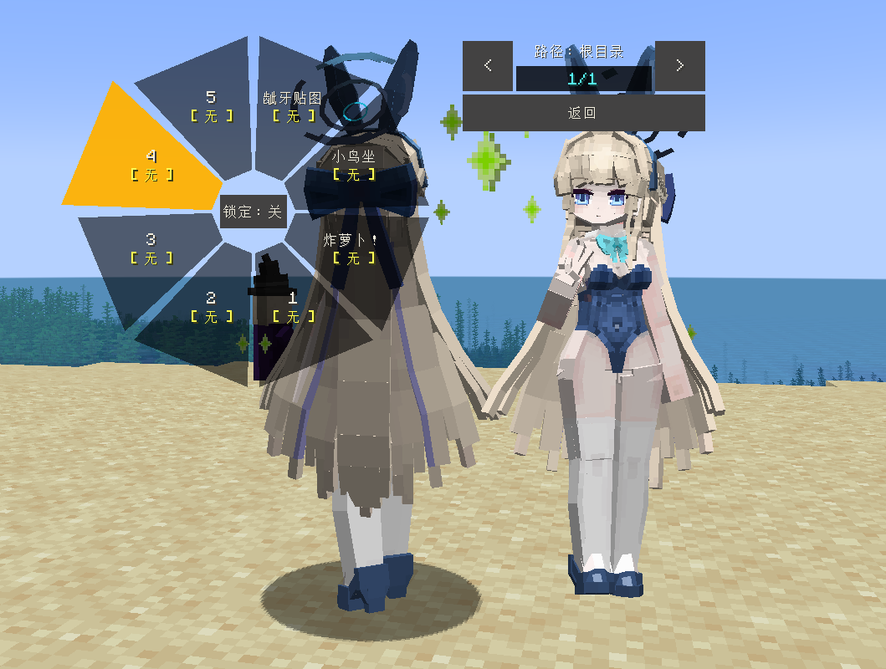

# BA_Asuma-Toki_飞鸟马时_LA

## Model Info

Expand/Collapse

<!-- GENERATED MODEL PREVIEW README START -->

<!-- GENERATED MODEL PREVIEW README END -->

- **Name**: #飞鸟马时 | #Asuma-Toki
- **Category**: #Game
  - **Game**: #BA #Blue-Archive #碧蓝档案

## Download

Expand/Collapse

- [BA_飞鸟马时_Asuma-Toki.zip (82.2 KB)](https://raw.githubusercontent.com/nekohalawrence/YSM-Model-Author/main/0020-%E5%B0%B1%E5%8F%AB%E7%BA%B8%E6%9D%BF%2C%E7%BA%B8%E6%9D%BF/BA_Asuma-Toki_%E9%A3%9E%E9%B8%9F%E9%A9%AC%E6%97%B6_LA/BA_%E9%A3%9E%E9%B8%9F%E9%A9%AC%E6%97%B6_Asuma-Toki.zip)
- [BA_飞鸟马时_Asuma-Toki_bunnygirl.ysm (202.1 KB)](https://raw.githubusercontent.com/nekohalawrence/YSM-Model-Author/main/0020-%E5%B0%B1%E5%8F%AB%E7%BA%B8%E6%9D%BF%2C%E7%BA%B8%E6%9D%BF/BA_Asuma-Toki_%E9%A3%9E%E9%B8%9F%E9%A9%AC%E6%97%B6_LA/BA_%E9%A3%9E%E9%B8%9F%E9%A9%AC%E6%97%B6_Asuma-Toki_bunnygirl.ysm)
- [BA_飞鸟马时_Asuma-Toki_v1.0.ysm (242.4 KB)](https://raw.githubusercontent.com/nekohalawrence/YSM-Model-Author/main/0020-%E5%B0%B1%E5%8F%AB%E7%BA%B8%E6%9D%BF%2C%E7%BA%B8%E6%9D%BF/BA_Asuma-Toki_%E9%A3%9E%E9%B8%9F%E9%A9%AC%E6%97%B6_LA/BA_%E9%A3%9E%E9%B8%9F%E9%A9%AC%E6%97%B6_Asuma-Toki_v1.0.ysm)
- [飞鸟马时v4.ysm (4.4 MB)](https://raw.githubusercontent.com/nekohalawrence/YSM-Model-Author/main/0020-%E5%B0%B1%E5%8F%AB%E7%BA%B8%E6%9D%BF%2C%E7%BA%B8%E6%9D%BF/BA_Asuma-Toki_%E9%A3%9E%E9%B8%9F%E9%A9%AC%E6%97%B6_LA/%E9%A3%9E%E9%B8%9F%E9%A9%AC%E6%97%B6v4.ysm)

## Author Info

Expand/Collapse

## Author

- **Name**: #就叫纸板 | #纸板
  - **Author ID**: `0020`
  - **Role**: #模型 | #Model
  - **SocialPlatform**: #Bilibili #QQ
    - **Bilibili**: https://space.bilibili.com/29208164
    - **QQ**: 1535492940
  - **SupportPlatform**: #Afdian
    - **Afdian**: https://afdian.com/a/15354qq

## Co-creator

- **Name**: 星屑海螺
  - **Role**: #动画 | #Animation

