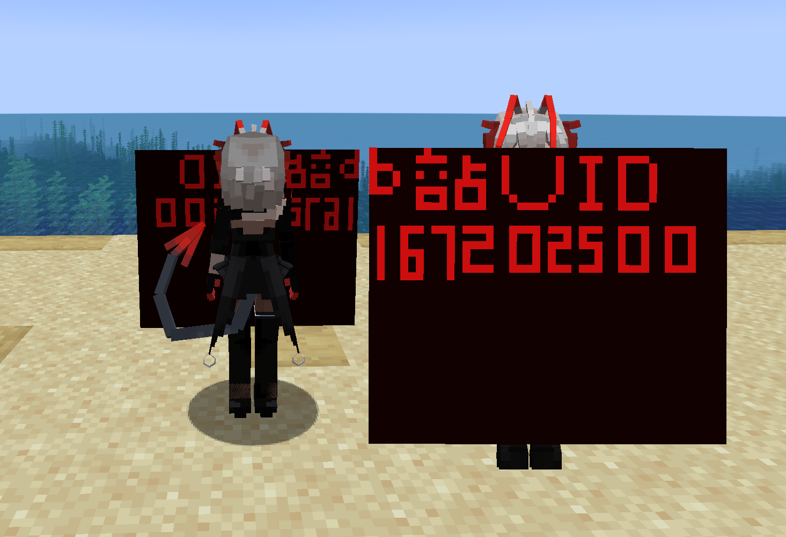

# w_音律联觉_LC

## Model Info

Expand/Collapse

<!-- GENERATED MODEL PREVIEW README START -->

<!-- GENERATED MODEL PREVIEW README END -->

- **Name**: 
- **Category**: #Unknown
  - **Game**: #Unknown

## Download

Expand/Collapse

- [w_音律联觉_1.ysm (295.1 KB)](https://raw.githubusercontent.com/nekohalawrence/YSM-Model-Author/main/0030-%E5%97%AF%E5%97%AFowo/w_%E9%9F%B3%E5%BE%8B%E8%81%94%E8%A7%89_LC/w_%E9%9F%B3%E5%BE%8B%E8%81%94%E8%A7%89_1.ysm)

## Author Info

Expand/Collapse

## Author

- **Name**: #嗯嗯owo
  - **Author ID**: `0030`
  - **Role**: #模型 #动作 #动画 | #Model #Motion #Animation
  - **SocialPlatform**: #Bilibili #YouTube
    - **Bilibili**: https://space.bilibili.com/167202500
    - **YouTube**: https://space.bilibili.com/167202500
  - **SupportPlatform**: #Afdian
    - **Afdian**: https://afdian.com/a/enenowo

