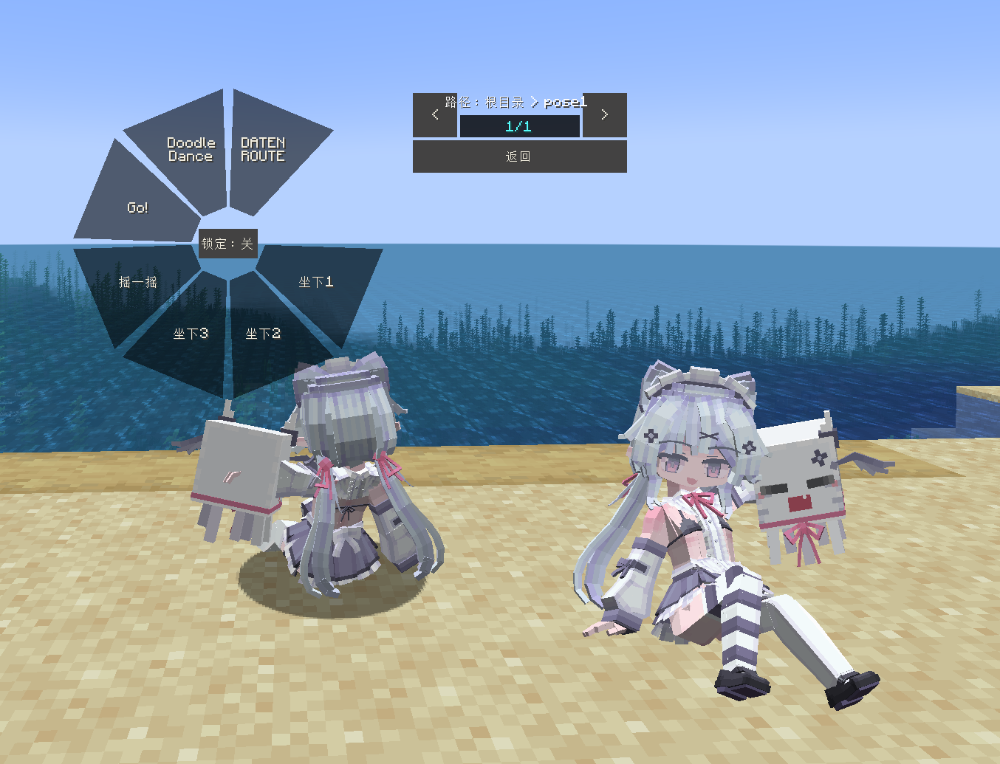
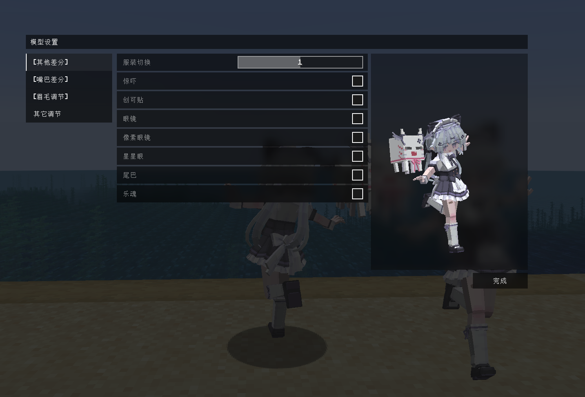

# Minecraft_乐魂_LB

## Model Info

Expand/Collapse

<!-- GENERATED MODEL PREVIEW README START -->

<!-- GENERATED MODEL PREVIEW README END -->

- **Name**: 
- **Category**: #Game
  - **Game**: #Minecraft #我的世界

## Download

Expand/Collapse

- [Minecraft_乐魂_v2.1.zip (720.8 KB)](https://raw.githubusercontent.com/nekohalawrence/YSM-Model-Author/main/0032-%E4%BD%A0%E4%B8%AA%E4%BA%BA%E6%9C%BAcc%2Ccc/Minecraft_%E4%B9%90%E9%AD%82_LB/Minecraft_%E4%B9%90%E9%AD%82_v2.1.zip)
- [Minecraft_乐魂_v2.2.ysm (794.7 KB)](https://raw.githubusercontent.com/nekohalawrence/YSM-Model-Author/main/0032-%E4%BD%A0%E4%B8%AA%E4%BA%BA%E6%9C%BAcc%2Ccc/Minecraft_%E4%B9%90%E9%AD%82_LB/Minecraft_%E4%B9%90%E9%AD%82_v2.2.ysm)
- [Minecraft_乐魂_v2.2.zip (837.7 KB)](https://raw.githubusercontent.com/nekohalawrence/YSM-Model-Author/main/0032-%E4%BD%A0%E4%B8%AA%E4%BA%BA%E6%9C%BAcc%2Ccc/Minecraft_%E4%B9%90%E9%AD%82_LB/Minecraft_%E4%B9%90%E9%AD%82_v2.2.zip)
- [Minecraft_乐魂_v2.6.ysm (698.0 KB)](https://raw.githubusercontent.com/nekohalawrence/YSM-Model-Author/main/0032-%E4%BD%A0%E4%B8%AA%E4%BA%BA%E6%9C%BAcc%2Ccc/Minecraft_%E4%B9%90%E9%AD%82_LB/Minecraft_%E4%B9%90%E9%AD%82_v2.6.ysm)
- [Minecraft_乐魂_v2.ysm (623.0 KB)](https://raw.githubusercontent.com/nekohalawrence/YSM-Model-Author/main/0032-%E4%BD%A0%E4%B8%AA%E4%BA%BA%E6%9C%BAcc%2Ccc/Minecraft_%E4%B9%90%E9%AD%82_LB/Minecraft_%E4%B9%90%E9%AD%82_v2.ysm)

## Author Info

Expand/Collapse

## Author

- **Name**: #你个人机cc | #cc
  - **Author ID**: `0032`
  - **Role**: #模型 | #Model
  - **SocialPlatform**: #Bilibili #QQ
    - **Bilibili**: https://space.bilibili.com/400763031
    - **QQ**: 1055945725
  - **SupportPlatform**: #Afdian
    - **Afdian**: https://afdian.com/a/ccnie

