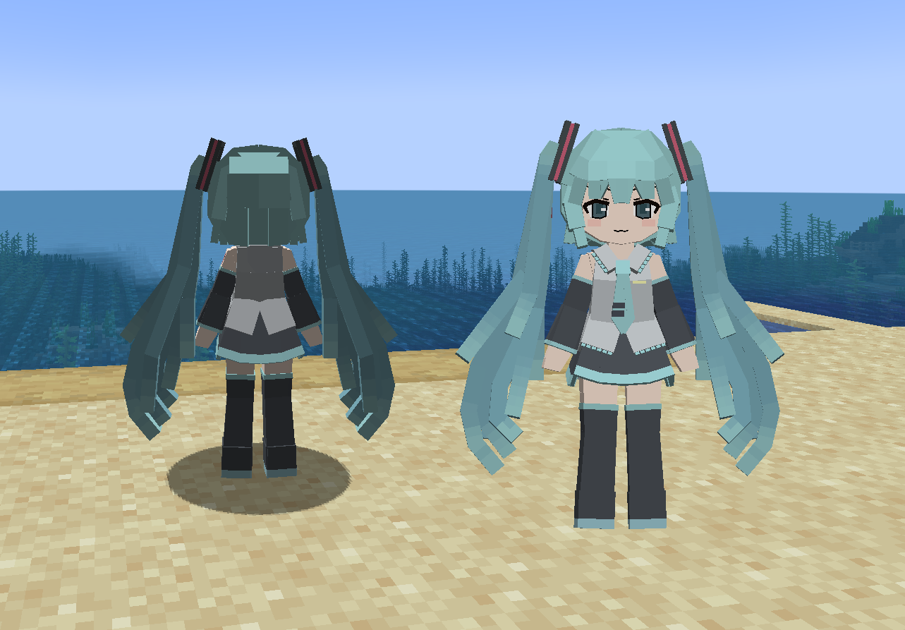

# VOC_初音未来_Hatsune-Miku

## Model Info

Expand/Collapse

<!-- GENERATED MODEL PREVIEW README START -->

<!-- GENERATED MODEL PREVIEW README END -->

- **Name**: #初音未来 | #Hatsune-Miku
- **Category**: #Music
  - **Game**: #VOC #VOCALOID #虚拟歌姬

## Download

Expand/Collapse

- [VOC_初音未来_Hatsune-Miku_v20250518.ysm (129.5 KB)](https://raw.githubusercontent.com/nekohalawrence/YSM-Model-Author/main/0034-%E5%B9%B3%E8%A1%A1%E8%8A%9D%E5%85%89/VOC_%E5%88%9D%E9%9F%B3%E6%9C%AA%E6%9D%A5_Hatsune-Miku/VOC_%E5%88%9D%E9%9F%B3%E6%9C%AA%E6%9D%A5_Hatsune-Miku_v20250518.ysm)

## Author Info

Expand/Collapse

## Author

- **Name**: #平衡芝光
  - **Author ID**: `0034`
  - **Role**: #模型 #动作 #动画 | #Model #Motion #Animation
  - **SocialPlatform**: #Bilibili
    - **Bilibili**: https://space.bilibili.com/526319760

