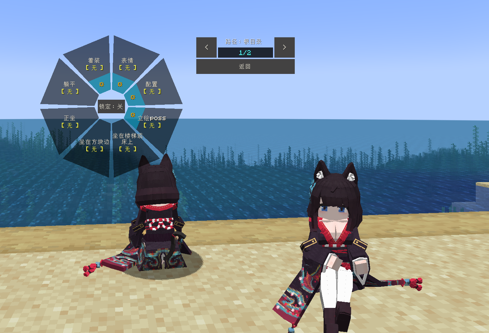

# AL_Fusou_扶桑_LA

## Model Info

Expand/Collapse

<!-- GENERATED MODEL PREVIEW README START -->

<!-- GENERATED MODEL PREVIEW README END -->

- **Name**: #扶桑 | #Fusou
- **Category**: #Game
  - **Game**: #AL #Azur-Lane #碧蓝航线

## Download

Expand/Collapse

- [AL_扶桑_Fusou.ysm (9.8 MB)](https://raw.githubusercontent.com/nekohalawrence/YSM-Model-Author/main/0045-%E9%9B%BE%E9%9B%A8%E6%B3%A2%E6%B3%A2%E6%B2%99/AL_Fusou_%E6%89%B6%E6%A1%91_LA/AL_%E6%89%B6%E6%A1%91_Fusou.ysm)
- [AL_扶桑_Fusou_v2.4.9.ysm (7.5 MB)](https://raw.githubusercontent.com/nekohalawrence/YSM-Model-Author/main/0045-%E9%9B%BE%E9%9B%A8%E6%B3%A2%E6%B3%A2%E6%B2%99/AL_Fusou_%E6%89%B6%E6%A1%91_LA/AL_%E6%89%B6%E6%A1%91_Fusou_v2.4.9.ysm)
- [AL_扶桑_Fusou_v2.4.9_1.ysm (4.7 MB)](https://raw.githubusercontent.com/nekohalawrence/YSM-Model-Author/main/0045-%E9%9B%BE%E9%9B%A8%E6%B3%A2%E6%B3%A2%E6%B2%99/AL_Fusou_%E6%89%B6%E6%A1%91_LA/AL_%E6%89%B6%E6%A1%91_Fusou_v2.4.9_1.ysm)
- [AL_扶桑_Fusou_v2.5.0.ysm (5.0 MB)](https://raw.githubusercontent.com/nekohalawrence/YSM-Model-Author/main/0045-%E9%9B%BE%E9%9B%A8%E6%B3%A2%E6%B3%A2%E6%B2%99/AL_Fusou_%E6%89%B6%E6%A1%91_LA/AL_%E6%89%B6%E6%A1%91_Fusou_v2.5.0.ysm)
- [AL_扶桑_Fusou_v2.5.2.ysm (5.0 MB)](https://raw.githubusercontent.com/nekohalawrence/YSM-Model-Author/main/0045-%E9%9B%BE%E9%9B%A8%E6%B3%A2%E6%B3%A2%E6%B2%99/AL_Fusou_%E6%89%B6%E6%A1%91_LA/AL_%E6%89%B6%E6%A1%91_Fusou_v2.5.2.ysm)
- [AL_扶桑_Fusou_v2.5.2_1.ysm (5.5 MB)](https://raw.githubusercontent.com/nekohalawrence/YSM-Model-Author/main/0045-%E9%9B%BE%E9%9B%A8%E6%B3%A2%E6%B3%A2%E6%B2%99/AL_Fusou_%E6%89%B6%E6%A1%91_LA/AL_%E6%89%B6%E6%A1%91_Fusou_v2.5.2_1.ysm)
- [AL_扶桑_Fusou_v2.5.4.ysm (5.0 MB)](https://raw.githubusercontent.com/nekohalawrence/YSM-Model-Author/main/0045-%E9%9B%BE%E9%9B%A8%E6%B3%A2%E6%B3%A2%E6%B2%99/AL_Fusou_%E6%89%B6%E6%A1%91_LA/AL_%E6%89%B6%E6%A1%91_Fusou_v2.5.4.ysm)
- [AL_扶桑_Fusou_v2.5.5.ysm (5.5 MB)](https://raw.githubusercontent.com/nekohalawrence/YSM-Model-Author/main/0045-%E9%9B%BE%E9%9B%A8%E6%B3%A2%E6%B3%A2%E6%B2%99/AL_Fusou_%E6%89%B6%E6%A1%91_LA/AL_%E6%89%B6%E6%A1%91_Fusou_v2.5.5.ysm)
- [AL_扶桑_Fusou_v2.5.6.ysm (5.5 MB)](https://raw.githubusercontent.com/nekohalawrence/YSM-Model-Author/main/0045-%E9%9B%BE%E9%9B%A8%E6%B3%A2%E6%B3%A2%E6%B2%99/AL_Fusou_%E6%89%B6%E6%A1%91_LA/AL_%E6%89%B6%E6%A1%91_Fusou_v2.5.6.ysm)

## Author Info

Expand/Collapse

## Author

- **Name**: #雾雨波波沙
  - **Author ID**: `0045`
  - **Role**: #模型 | #Model
  - **SocialPlatform**: #Bilibili #Pixiv
    - **Bilibili**: https://space.bilibili.com/36761228
    - **Pixiv**: https://www.pixiv.net/users/26720481

## Co-creator

- **Name**: 星语
  - **Role**: #动作 | #Motion
  - **SocialPlatform**: #Bilibili
    - **Bilibili**: 316739550

- **Name**: 失语喵
  - **Role**: #控制器
  - **SocialPlatform**: #Bilibili
    - **Bilibili**: 171415484

- **Name**: 秋枫落叶
  - **Role**: #技术支持
  - **GroupChat**: #QQ-Group
    - **QQ-Group**: 176023847

- **Name**: 墨子吉安
  - **Role**: #定制者

