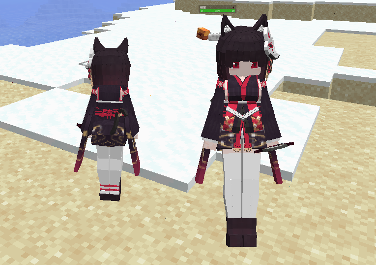
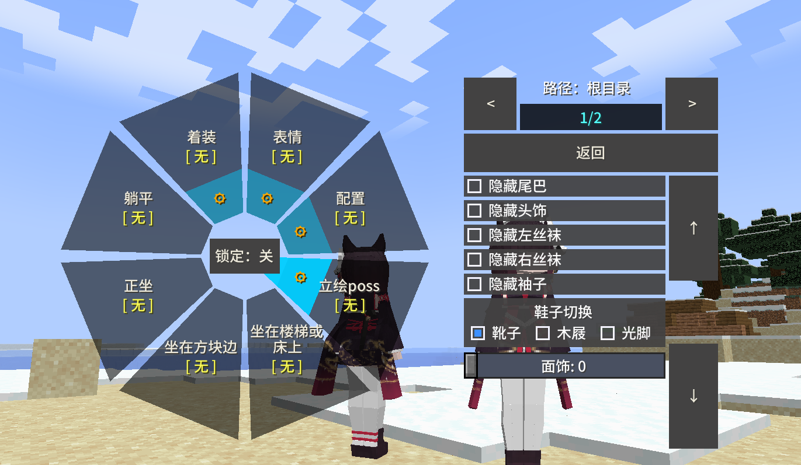
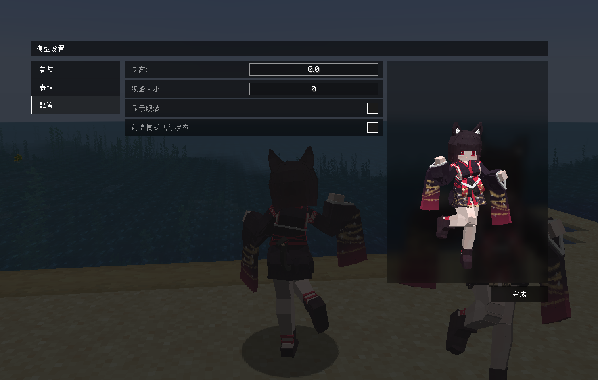

# AL_Yamashiro_山城_LA

## Model Info

Expand/Collapse

<!-- GENERATED MODEL PREVIEW README START -->

<!-- GENERATED MODEL PREVIEW README END -->

- **Name**: #山城 | #Yamashiro
- **Category**: #Game
  - **Game**: #AL #Azur-Lane #碧蓝航线

## Download

Expand/Collapse

- [AL_山城_Yamashiro_v2.3.2.1.ysm (5.4 MB)](https://raw.githubusercontent.com/nekohalawrence/YSM-Model-Author/main/0045-%E9%9B%BE%E9%9B%A8%E6%B3%A2%E6%B3%A2%E6%B2%99/AL_Yamashiro_%E5%B1%B1%E5%9F%8E_LA/AL_%E5%B1%B1%E5%9F%8E_Yamashiro_v2.3.2.1.ysm)
- [AL_山城_Yamashiro_v2.4.3.ysm (5.6 MB)](https://raw.githubusercontent.com/nekohalawrence/YSM-Model-Author/main/0045-%E9%9B%BE%E9%9B%A8%E6%B3%A2%E6%B3%A2%E6%B2%99/AL_Yamashiro_%E5%B1%B1%E5%9F%8E_LA/AL_%E5%B1%B1%E5%9F%8E_Yamashiro_v2.4.3.ysm)
- [AL_山城_Yamashiro_v2.4.3_1.ysm (10.2 MB)](https://raw.githubusercontent.com/nekohalawrence/YSM-Model-Author/main/0045-%E9%9B%BE%E9%9B%A8%E6%B3%A2%E6%B3%A2%E6%B2%99/AL_Yamashiro_%E5%B1%B1%E5%9F%8E_LA/AL_%E5%B1%B1%E5%9F%8E_Yamashiro_v2.4.3_1.ysm)
- [AL_山城_Yamashiro_v2.4.4.ysm (4.9 MB)](https://raw.githubusercontent.com/nekohalawrence/YSM-Model-Author/main/0045-%E9%9B%BE%E9%9B%A8%E6%B3%A2%E6%B3%A2%E6%B2%99/AL_Yamashiro_%E5%B1%B1%E5%9F%8E_LA/AL_%E5%B1%B1%E5%9F%8E_Yamashiro_v2.4.4.ysm)
- [AL_山城_Yamashiro_v2.4.4.zip (4.8 MB)](https://raw.githubusercontent.com/nekohalawrence/YSM-Model-Author/main/0045-%E9%9B%BE%E9%9B%A8%E6%B3%A2%E6%B3%A2%E6%B2%99/AL_Yamashiro_%E5%B1%B1%E5%9F%8E_LA/AL_%E5%B1%B1%E5%9F%8E_Yamashiro_v2.4.4.zip)
- [AL_山城_Yamashiro_v2.4.4_1.ysm (5.6 MB)](https://raw.githubusercontent.com/nekohalawrence/YSM-Model-Author/main/0045-%E9%9B%BE%E9%9B%A8%E6%B3%A2%E6%B3%A2%E6%B2%99/AL_Yamashiro_%E5%B1%B1%E5%9F%8E_LA/AL_%E5%B1%B1%E5%9F%8E_Yamashiro_v2.4.4_1.ysm)
- [AL_山城_Yamashiro_v2.5.4.ysm (11.3 MB)](https://raw.githubusercontent.com/nekohalawrence/YSM-Model-Author/main/0045-%E9%9B%BE%E9%9B%A8%E6%B3%A2%E6%B3%A2%E6%B2%99/AL_Yamashiro_%E5%B1%B1%E5%9F%8E_LA/AL_%E5%B1%B1%E5%9F%8E_Yamashiro_v2.5.4.ysm)
- [AL_山城_Yamashiro_v2.5.5.ysm (6.3 MB)](https://raw.githubusercontent.com/nekohalawrence/YSM-Model-Author/main/0045-%E9%9B%BE%E9%9B%A8%E6%B3%A2%E6%B3%A2%E6%B2%99/AL_Yamashiro_%E5%B1%B1%E5%9F%8E_LA/AL_%E5%B1%B1%E5%9F%8E_Yamashiro_v2.5.5.ysm)
- [AL_山城_Yamashiro_v2.5.6.1.ysm (12.3 MB)](https://raw.githubusercontent.com/nekohalawrence/YSM-Model-Author/main/0045-%E9%9B%BE%E9%9B%A8%E6%B3%A2%E6%B3%A2%E6%B2%99/AL_Yamashiro_%E5%B1%B1%E5%9F%8E_LA/AL_%E5%B1%B1%E5%9F%8E_Yamashiro_v2.5.6.1.ysm)
- [AL_山城_Yamashiro_v2.5.6.ysm (6.8 MB)](https://raw.githubusercontent.com/nekohalawrence/YSM-Model-Author/main/0045-%E9%9B%BE%E9%9B%A8%E6%B3%A2%E6%B3%A2%E6%B2%99/AL_Yamashiro_%E5%B1%B1%E5%9F%8E_LA/AL_%E5%B1%B1%E5%9F%8E_Yamashiro_v2.5.6.ysm)
- [AL_山城_Yamashiro_v2.5.6.zip (7.0 MB)](https://raw.githubusercontent.com/nekohalawrence/YSM-Model-Author/main/0045-%E9%9B%BE%E9%9B%A8%E6%B3%A2%E6%B3%A2%E6%B2%99/AL_Yamashiro_%E5%B1%B1%E5%9F%8E_LA/AL_%E5%B1%B1%E5%9F%8E_Yamashiro_v2.5.6.zip)
- [AL_山城_Yamashiro_v2.5.7.ysm (8.5 MB)](https://raw.githubusercontent.com/nekohalawrence/YSM-Model-Author/main/0045-%E9%9B%BE%E9%9B%A8%E6%B3%A2%E6%B3%A2%E6%B2%99/AL_Yamashiro_%E5%B1%B1%E5%9F%8E_LA/AL_%E5%B1%B1%E5%9F%8E_Yamashiro_v2.5.7.ysm)

## Author Info

Expand/Collapse

## Author

- **Name**: #雾雨波波沙
  - **Author ID**: `0045`
  - **Role**: #模型 | #Model
  - **SocialPlatform**: #Bilibili #Pixiv
    - **Bilibili**: https://space.bilibili.com/36761228
    - **Pixiv**: https://www.pixiv.net/users/26720481

## Co-creator

- **Name**: 星语
  - **Role**: #动作 | #Motion
  - **SocialPlatform**: #Bilibili
    - **Bilibili**: 316739550

- **Name**: 秋枫落叶
  - **Role**: #技术支持
  - **GroupChat**: #QQ-Group
    - **QQ-Group**: 176023847

- **Name**: Cosine_line
  - **Role**: #测试 | #Test
  - **GroupChat**: #QQ-Group
    - **QQ-Group**: 3454346519

