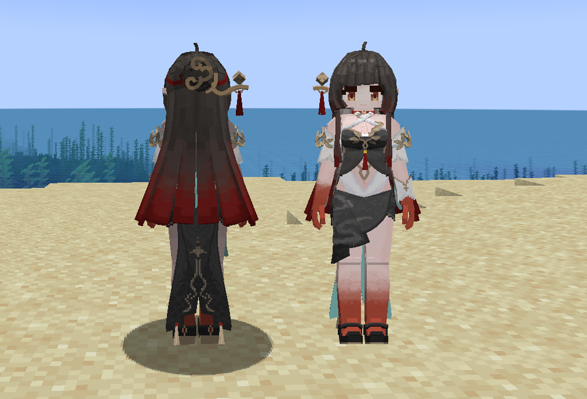
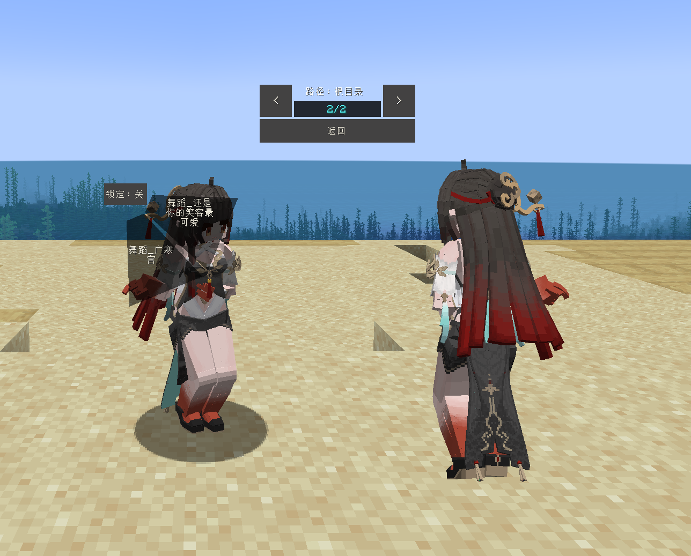

# Unknown_灵砂

## Model Info

Expand/Collapse

<!-- GENERATED MODEL PREVIEW README START -->

<!-- GENERATED MODEL PREVIEW README END -->

- **Name**: #灵砂 | #Lingsha
- **Category**: #Unknown
  - **Game**: #Unknown

## Download

Expand/Collapse

- [Unknown_灵砂.ysm (2.4 MB)](https://raw.githubusercontent.com/nekohalawrence/YSM-Model-Author/main/0052-%E3%82%9A%E7%83%9F%E9%9B%A8%E7%94%BB%E6%A1%A5/Unknown_%E7%81%B5%E7%A0%82/Unknown_%E7%81%B5%E7%A0%82.ysm)
- [Unknown_灵砂_1.ysm (2.4 MB)](https://raw.githubusercontent.com/nekohalawrence/YSM-Model-Author/main/0052-%E3%82%9A%E7%83%9F%E9%9B%A8%E7%94%BB%E6%A1%A5/Unknown_%E7%81%B5%E7%A0%82/Unknown_%E7%81%B5%E7%A0%82_1.ysm)
- [Unknown_灵砂_v0.1.ysm (4.7 MB)](https://raw.githubusercontent.com/nekohalawrence/YSM-Model-Author/main/0052-%E3%82%9A%E7%83%9F%E9%9B%A8%E7%94%BB%E6%A1%A5/Unknown_%E7%81%B5%E7%A0%82/Unknown_%E7%81%B5%E7%A0%82_v0.1.ysm)

## Author Info

Expand/Collapse

## Author

- **Name**: #゚烟雨画桥
  - **Author ID**: `0052`
  - **Role**: #模型 | #Model
  - **SocialPlatform**: #Bilibili
    - **Bilibili**: https://space.bilibili.com/1268865161
  - **SupportPlatform**: #Afdian
    - **Afdian**: https://afdian.com/a/mj204

