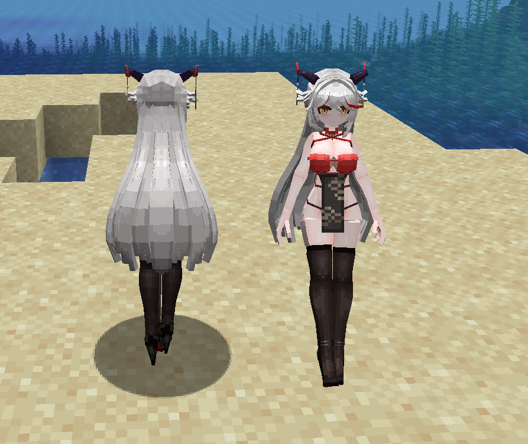
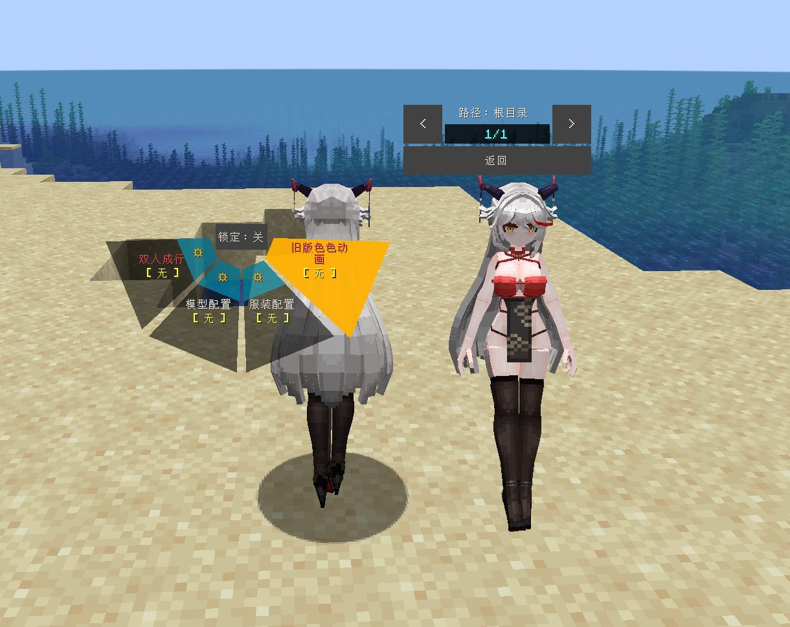
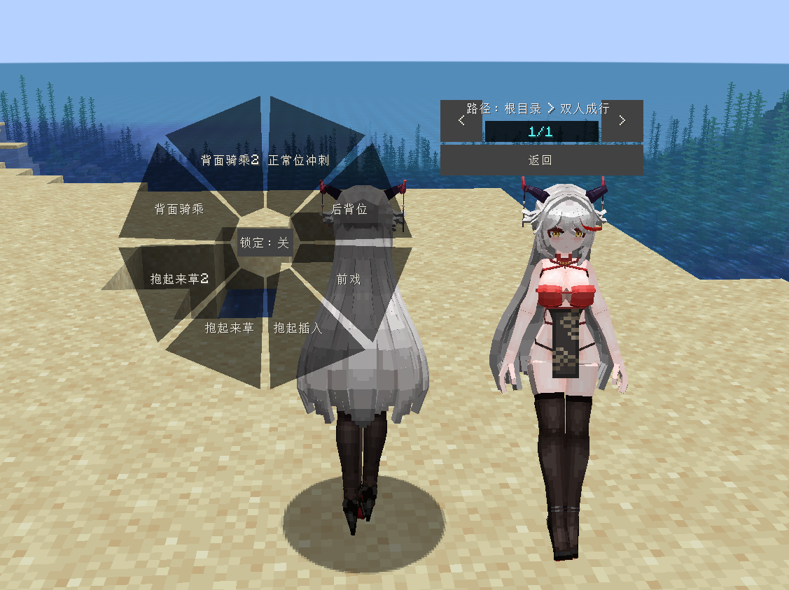

# AL_埃吉尔_Kms-ägir_LA

## Model Info

Expand/Collapse

<!-- GENERATED MODEL PREVIEW README START -->

<!-- GENERATED MODEL PREVIEW README END -->

- **Name**: #埃吉尔 | #Kms-ägir
- **Category**: #Game
  - **Game**: #AL #Azur-Lane #碧蓝航线

## Download

Expand/Collapse

- [AL_埃吉尔_Kms-ägir_v3.2.ysm (3.1 MB)](https://raw.githubusercontent.com/nekohalawrence/YSM-Model-Author/main/0055-%E4%BC%8A%E8%95%BE%E5%A8%9C%E5%AE%B6%E7%9A%84%E5%92%B8%E9%B1%BC/AL_%E5%9F%83%E5%90%89%E5%B0%94_Kms-%C3%A4gir_LA/AL_%E5%9F%83%E5%90%89%E5%B0%94_Kms-%C3%A4gir_v3.2.ysm)
- [AL_埃吉尔_Kms-ägir_v3.5.1.ysm (1.7 MB)](https://raw.githubusercontent.com/nekohalawrence/YSM-Model-Author/main/0055-%E4%BC%8A%E8%95%BE%E5%A8%9C%E5%AE%B6%E7%9A%84%E5%92%B8%E9%B1%BC/AL_%E5%9F%83%E5%90%89%E5%B0%94_Kms-%C3%A4gir_LA/AL_%E5%9F%83%E5%90%89%E5%B0%94_Kms-%C3%A4gir_v3.5.1.ysm)

## Author Info

Expand/Collapse

## Author

- **Name**: #伊蕾娜家的咸鱼
  - **Author ID**: `0055`
  - **Role**: #模型 | #Model
  - **SocialPlatform**: #Bilibili
    - **Bilibili**: https://space.bilibili.com/20682514
  - **SupportPlatform**: #Afdian
    - **Afdian**: https://afdian.com/a/elainasaltfish

## Co-creator

- **Name**: 星屑海螺
  - **Role**: #动画 | #Animation
  - **SocialPlatform**: #Bilibili
    - **Bilibili**: https://space.bilibili.com/14975572
  - **SupportPlatform**: #Afdian
    - **Afdian**: https://afdian.net/a/lucia2048

