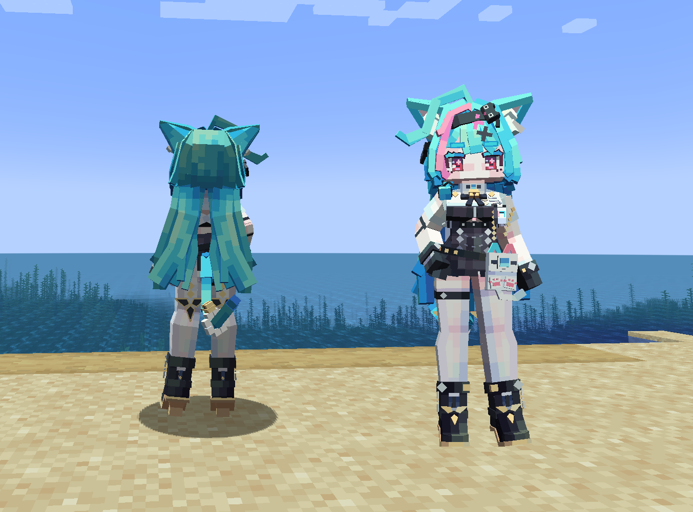
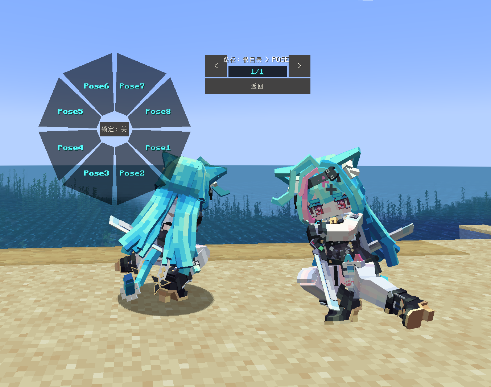
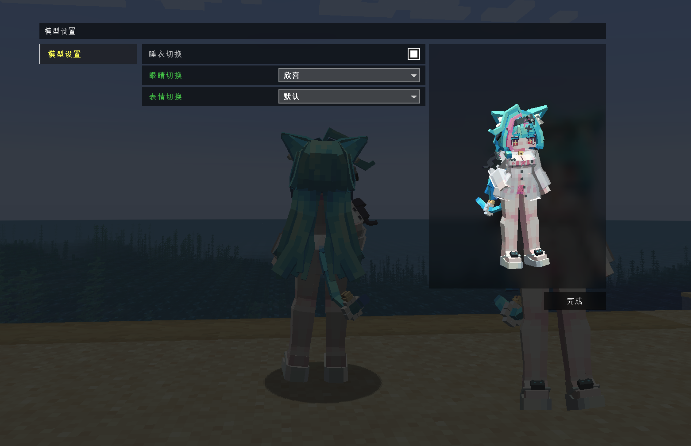

# NTE_薄荷_Bohe_LA

## Model Info

Expand/Collapse

<!-- GENERATED MODEL PREVIEW README START -->

<!-- GENERATED MODEL PREVIEW README END -->

- **Name**: #薄荷 | #Bohe
- **Category**: #Game
  - **Game**: #NTE #Neverness to Everness #异环

## Download

Expand/Collapse

- [NTE_薄荷_Bohe.ysm (4.7 MB)](https://raw.githubusercontent.com/nekohalawrence/YSM-Model-Author/main/0058-%E8%89%BA%E6%96%B9%E5%83%8F%E7%B4%A0%2C%E8%89%BA%E6%96%B9%E5%A0%82%2C%E5%B0%BB%2C%E8%89%BA%E6%96%B9%E5%9D%8A%2C%E8%89%BA%E6%96%B9%E9%98%81/NTE_%E8%96%84%E8%8D%B7_Bohe_LA/NTE_%E8%96%84%E8%8D%B7_Bohe.ysm)

## Author Info

Expand/Collapse

## Author

- **Name**: #艺方像素 | #艺方堂 | #尻 | #艺方坊 | #艺方阁
  - **Author ID**: `0058`
  - **Role**: #版权所有
  - **SocialPlatform**: #Bilibili #QQ
    - **Bilibili**: https://space.bilibili.com/107318873
    - **QQ**: 1320812591

