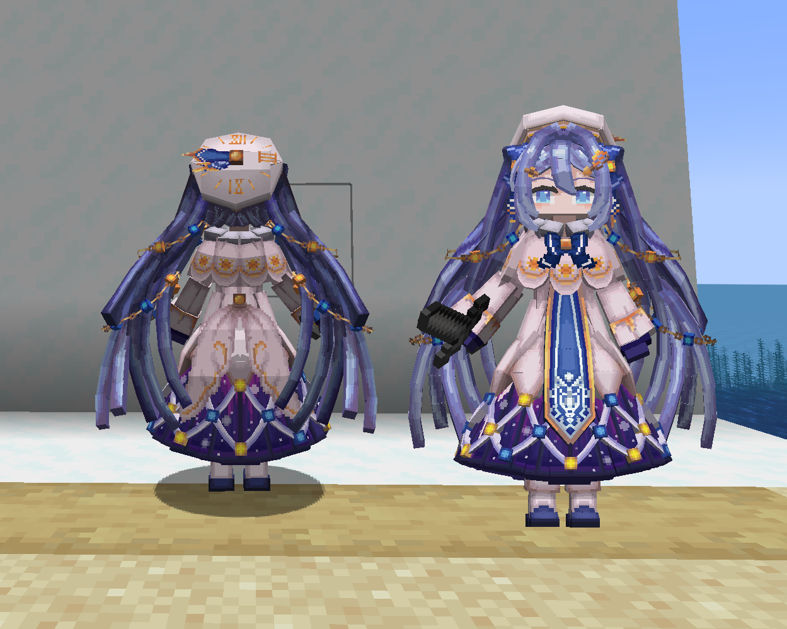

# VOC_雪未来_Yuki-Miku_LB

## Model Info

Expand/Collapse

<!-- GENERATED MODEL PREVIEW README START -->

<!-- GENERATED MODEL PREVIEW README END -->

- **Name**: #雪未来 | #Yuki-Miku
- **Category**: #Music
  - **Game**: #VOC #VOCALOID #虚拟歌姬

## Download

Expand/Collapse

- [VOC_雪未来_Yuki-Miku_21.ysm (190.0 KB)](https://raw.githubusercontent.com/nekohalawrence/YSM-Model-Author/main/0058-%E8%89%BA%E6%96%B9%E5%83%8F%E7%B4%A0%2C%E8%89%BA%E6%96%B9%E5%A0%82%2C%E5%B0%BB%2C%E8%89%BA%E6%96%B9%E5%9D%8A%2C%E8%89%BA%E6%96%B9%E9%98%81/VOC_%E9%9B%AA%E6%9C%AA%E6%9D%A5_Yuki-Miku_LB/VOC_%E9%9B%AA%E6%9C%AA%E6%9D%A5_Yuki-Miku_21.ysm)

## Author Info

Expand/Collapse

## Author

- **Name**: #艺方像素 | #艺方堂 | #尻 | #艺方坊 | #艺方阁
  - **Author ID**: `0058`
  - **Role**: #模型 #动作 #动画 | #Model #Motion #Animation
  - **SocialPlatform**: #Bilibili #QQ
    - **Bilibili**: https://space.bilibili.com/107318873
    - **QQ**: 1320812591

