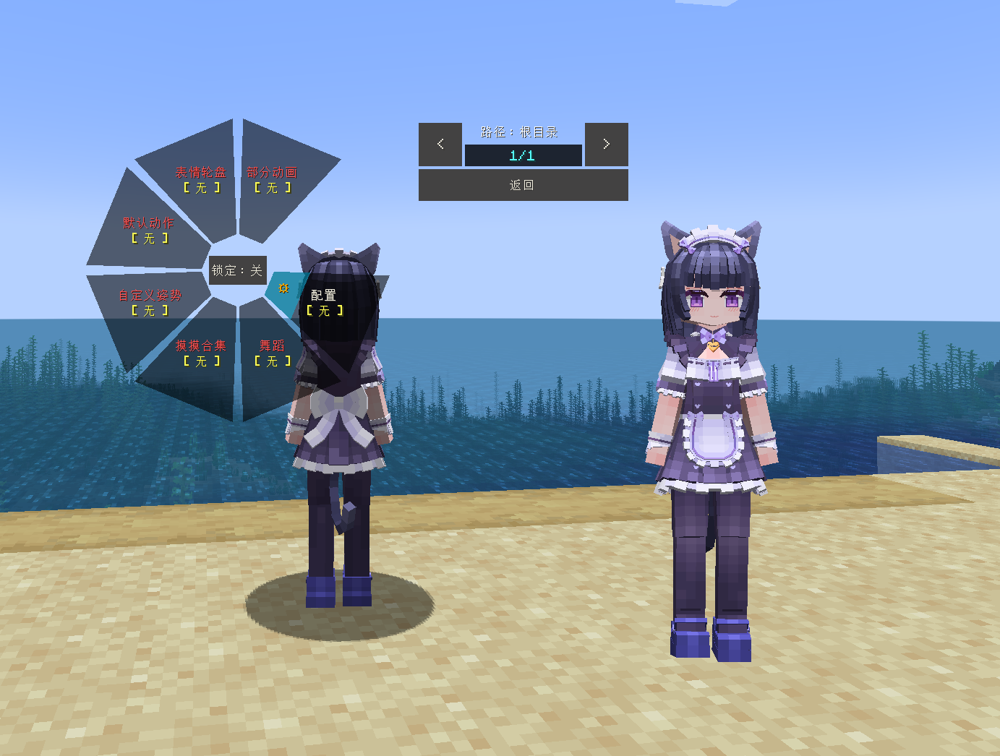

# NEKOPARA_水无月时雨_LA

## Model Info

Expand/Collapse

<!-- GENERATED MODEL PREVIEW README START -->

<!-- GENERATED MODEL PREVIEW README END -->

- **Name**: 
- **Category**: #Game
  - **Game**: #NEKOPARA #巧克力与香子兰

## Download

Expand/Collapse

- [NEKOPARA_水无月时雨.ysm (873.4 KB)](https://raw.githubusercontent.com/nekohalawrence/YSM-Model-Author/main/0065-%E7%83%9B%E7%81%AB%E7%9A%84%E6%AC%A1%E5%85%83%E5%AE%87%E5%AE%99/NEKOPARA_%E6%B0%B4%E6%97%A0%E6%9C%88%E6%97%B6%E9%9B%A8_LA/NEKOPARA_%E6%B0%B4%E6%97%A0%E6%9C%88%E6%97%B6%E9%9B%A8.ysm)

## Author Info

Expand/Collapse

## Author

- **Name**: #烛火的次元宇宙
  - **Author ID**: `0065`
  - **Role**: #模型 | #Model
  - **SocialPlatform**: #Bilibili
    - **Bilibili**: https://space.bilibili.com/57715833
  - **SupportPlatform**: #Afdian
    - **Afdian**: https://afdian.com/a/zhuhuo

