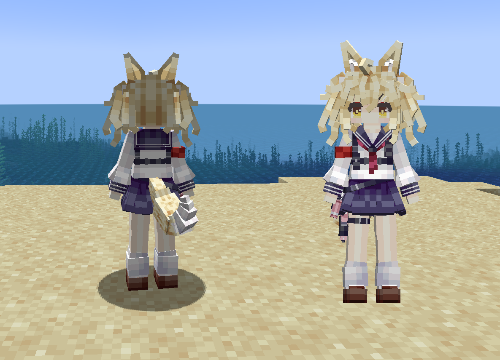
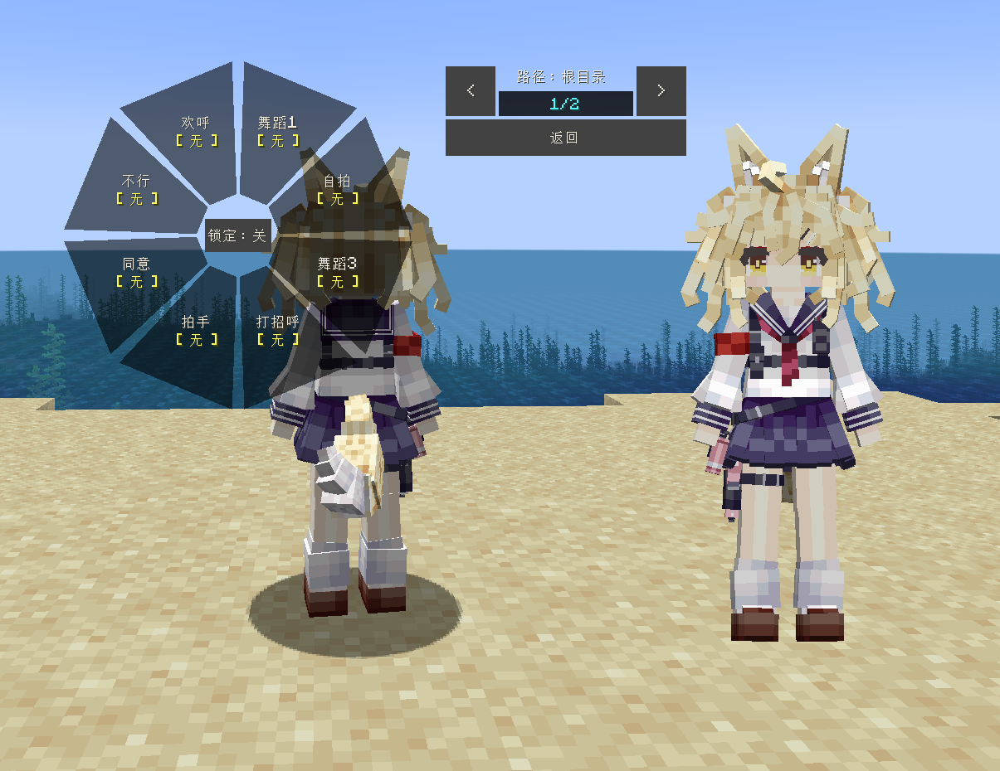
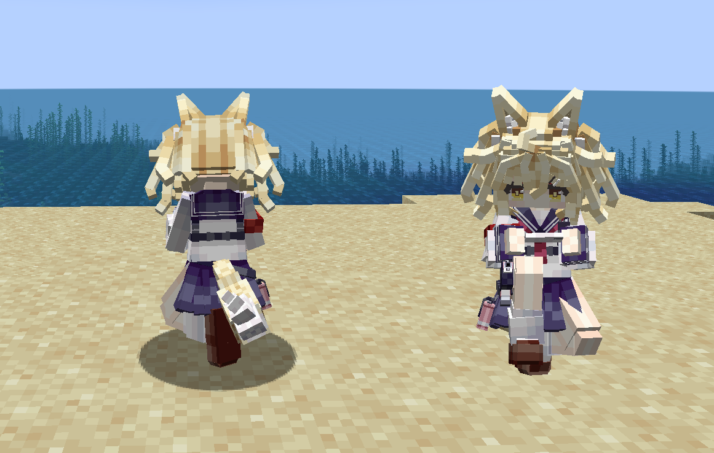

# OC_Eanes_LB

## Model Info

Expand/Collapse

<!-- GENERATED MODEL PREVIEW README START -->

<!-- GENERATED MODEL PREVIEW README END -->

- **Name**: 
- **Category**: #Original
  - **Game**: #OC #Original Character #原创角色

## Download

Expand/Collapse

- [OC_Eanes.ysm (229.3 KB)](https://raw.githubusercontent.com/nekohalawrence/YSM-Model-Author/main/0067-Almeta_owx/OC_Eanes_LB/OC_Eanes.ysm)
- [OC_Eanes_1.ysm (208.7 KB)](https://raw.githubusercontent.com/nekohalawrence/YSM-Model-Author/main/0067-Almeta_owx/OC_Eanes_LB/OC_Eanes_1.ysm)
- [OC_Eanes_2.ysm (208.4 KB)](https://raw.githubusercontent.com/nekohalawrence/YSM-Model-Author/main/0067-Almeta_owx/OC_Eanes_LB/OC_Eanes_2.ysm)

## Author Info

Expand/Collapse

## Author

- **Name**: #Almeta_owx
  - **Author ID**: `0067`
  - **Role**: #模型 #动画 | #Model #Animation
  - **SocialPlatform**: #Bilibili
    - **Bilibili**: https://space.bilibili.com/4328692
  - **SupportPlatform**: #Afdian
    - **Afdian**: https://afdian.com/a/Almeta

