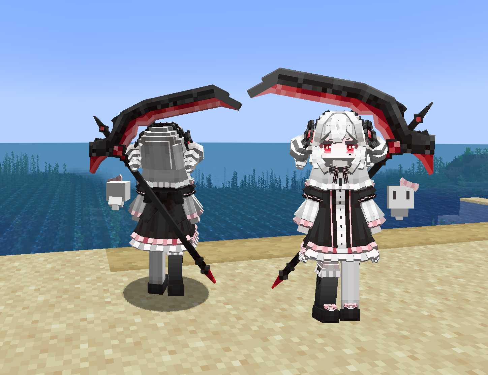

# YogYard_特莉波卡_Tlipoca_LB

## Model Info

Expand/Collapse

<!-- GENERATED MODEL PREVIEW README START -->

<!-- GENERATED MODEL PREVIEW README END -->

- **Name**: #特莉波卡 | #Tlipoca
- **Category**: #Game
  - **Game**: #YogYard #Yog-Sothoth's Yard #犹格索托斯的庭院：炼金旅社

## Download

Expand/Collapse

- [YogYard_特莉波卡_Tlipoca.ysm (529.0 KB)](https://raw.githubusercontent.com/nekohalawrence/YSM-Model-Author/main/0067-Almeta_owx/YogYard_%E7%89%B9%E8%8E%89%E6%B3%A2%E5%8D%A1_Tlipoca_LB/YogYard_%E7%89%B9%E8%8E%89%E6%B3%A2%E5%8D%A1_Tlipoca.ysm)
- [YogYard_特莉波卡_Tlipoca_1.ysm (529.8 KB)](https://raw.githubusercontent.com/nekohalawrence/YSM-Model-Author/main/0067-Almeta_owx/YogYard_%E7%89%B9%E8%8E%89%E6%B3%A2%E5%8D%A1_Tlipoca_LB/YogYard_%E7%89%B9%E8%8E%89%E6%B3%A2%E5%8D%A1_Tlipoca_1.ysm)

## Author Info

Expand/Collapse

## Author

- **Name**: #Almeta_owx
  - **Author ID**: `0067`
  - **Role**: #模型 #动画 | #Model #Animation
  - **SocialPlatform**: #Bilibili
    - **Bilibili**: https://space.bilibili.com/4328692
  - **SupportPlatform**: #Afdian
    - **Afdian**: https://afdian.com/a/Almeta

