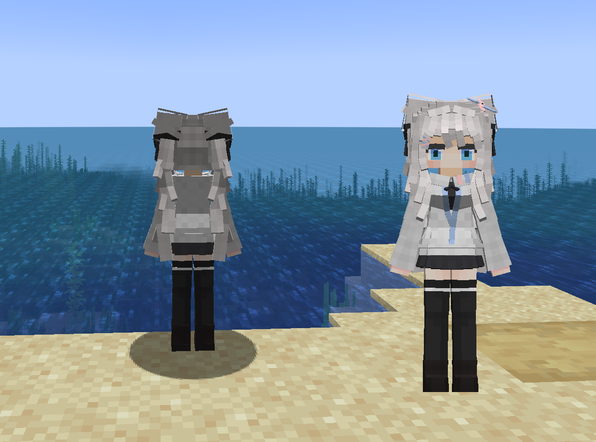

# Unknown_枫璃

## Model Info

Expand/Collapse

<!-- GENERATED MODEL PREVIEW README START -->

<!-- GENERATED MODEL PREVIEW README END -->

- **Name**: 
- **Category**: #Unknown
  - **Game**: #Unknown

## Download

Expand/Collapse

- [Unknown_枫璃_v0.9.ysm (564.7 KB)](https://raw.githubusercontent.com/nekohalawrence/YSM-Model-Author/main/0069-ccci202/Unknown_%E6%9E%AB%E7%92%83/Unknown_%E6%9E%AB%E7%92%83_v0.9.ysm)
- [Unknown_枫璃_v1.0.ysm (313.8 KB)](https://raw.githubusercontent.com/nekohalawrence/YSM-Model-Author/main/0069-ccci202/Unknown_%E6%9E%AB%E7%92%83/Unknown_%E6%9E%AB%E7%92%83_v1.0.ysm)
- [Unknown_枫璃_v1.1.ysm (323.4 KB)](https://raw.githubusercontent.com/nekohalawrence/YSM-Model-Author/main/0069-ccci202/Unknown_%E6%9E%AB%E7%92%83/Unknown_%E6%9E%AB%E7%92%83_v1.1.ysm)
- [Unknown_枫璃_v1.2.0.ysm (390.7 KB)](https://raw.githubusercontent.com/nekohalawrence/YSM-Model-Author/main/0069-ccci202/Unknown_%E6%9E%AB%E7%92%83/Unknown_%E6%9E%AB%E7%92%83_v1.2.0.ysm)
- [Unknown_枫璃_v1.2.1.ysm (392.2 KB)](https://raw.githubusercontent.com/nekohalawrence/YSM-Model-Author/main/0069-ccci202/Unknown_%E6%9E%AB%E7%92%83/Unknown_%E6%9E%AB%E7%92%83_v1.2.1.ysm)
- [Unknown_枫璃_v1.2.2.ysm (385.5 KB)](https://raw.githubusercontent.com/nekohalawrence/YSM-Model-Author/main/0069-ccci202/Unknown_%E6%9E%AB%E7%92%83/Unknown_%E6%9E%AB%E7%92%83_v1.2.2.ysm)
- [Unknown_枫璃_v1.3.0.ysm (422.8 KB)](https://raw.githubusercontent.com/nekohalawrence/YSM-Model-Author/main/0069-ccci202/Unknown_%E6%9E%AB%E7%92%83/Unknown_%E6%9E%AB%E7%92%83_v1.3.0.ysm)
- [Unknown_枫璃_v1.3.1.ysm (422.5 KB)](https://raw.githubusercontent.com/nekohalawrence/YSM-Model-Author/main/0069-ccci202/Unknown_%E6%9E%AB%E7%92%83/Unknown_%E6%9E%AB%E7%92%83_v1.3.1.ysm)
- [Unknown_枫璃_v1.3.2.ysm (422.3 KB)](https://raw.githubusercontent.com/nekohalawrence/YSM-Model-Author/main/0069-ccci202/Unknown_%E6%9E%AB%E7%92%83/Unknown_%E6%9E%AB%E7%92%83_v1.3.2.ysm)
- [Unknown_枫璃_v1.4.0.ysm (524.5 KB)](https://raw.githubusercontent.com/nekohalawrence/YSM-Model-Author/main/0069-ccci202/Unknown_%E6%9E%AB%E7%92%83/Unknown_%E6%9E%AB%E7%92%83_v1.4.0.ysm)
- [Unknown_枫璃_v1.4.1.ysm (535.9 KB)](https://raw.githubusercontent.com/nekohalawrence/YSM-Model-Author/main/0069-ccci202/Unknown_%E6%9E%AB%E7%92%83/Unknown_%E6%9E%AB%E7%92%83_v1.4.1.ysm)
- [Unknown_枫璃_v1.4.2.ysm (536.3 KB)](https://raw.githubusercontent.com/nekohalawrence/YSM-Model-Author/main/0069-ccci202/Unknown_%E6%9E%AB%E7%92%83/Unknown_%E6%9E%AB%E7%92%83_v1.4.2.ysm)

## Author Info

Expand/Collapse

## Author

- **Name**: #ccci202
  - **Author ID**: `0069`
  - **Role**: #角色
  - **SocialPlatform**: #Bilibili
    - **Bilibili**: https://space.bilibili.com/2019133736
  - **SupportPlatform**: #Afdian
    - **Afdian**: https://afdian.com/a/ccci202

