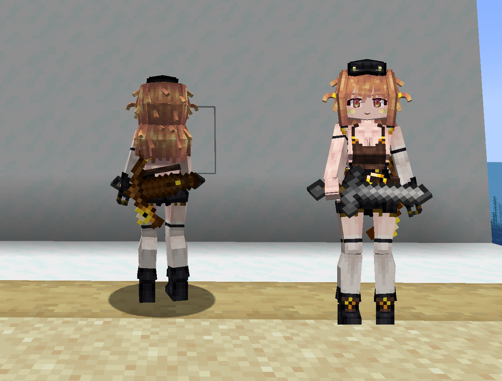
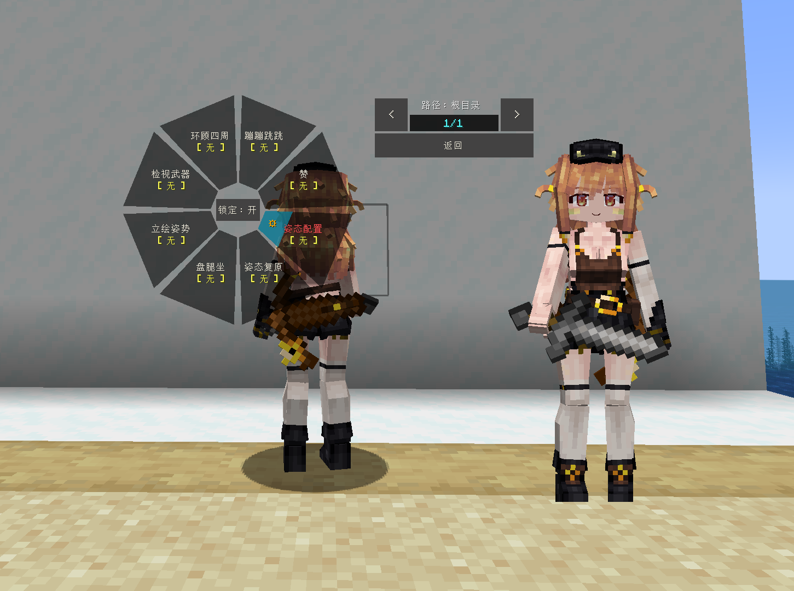
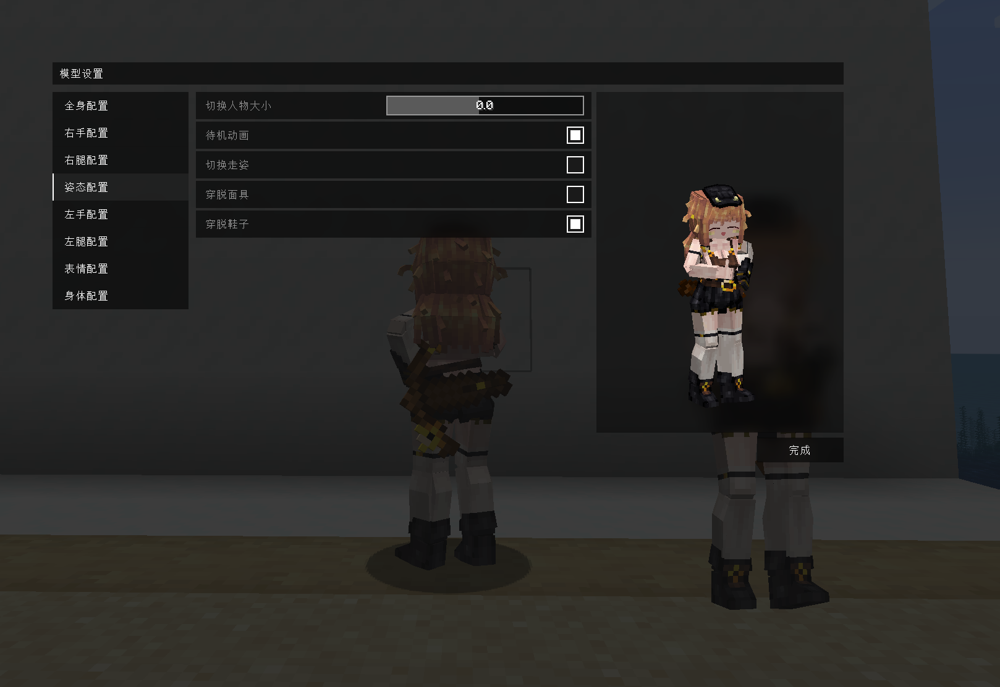
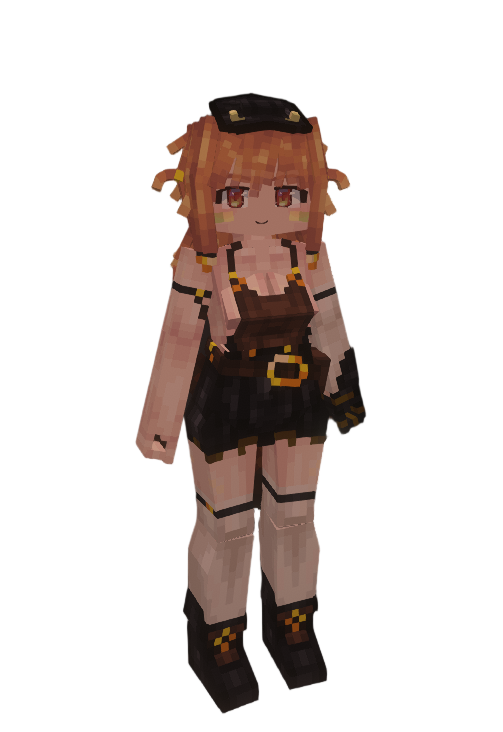

# Minecraft_猪灵酱_Piglin_LB

## Model Info

Expand/Collapse

<!-- GENERATED MODEL PREVIEW README START -->

<!-- GENERATED MODEL PREVIEW README END -->

- **Name**: #猪灵酱 | #Piglin
- **Category**: #Game
  - **Game**: #Minecraft #我的世界

## Download

Expand/Collapse

- [Minecraft_猪灵酱_Piglin.ysm (316.1 KB)](https://raw.githubusercontent.com/nekohalawrence/YSM-Model-Author/main/0074-Killot%2CKillot945/Minecraft_%E7%8C%AA%E7%81%B5%E9%85%B1_Piglin_LB/Minecraft_%E7%8C%AA%E7%81%B5%E9%85%B1_Piglin.ysm)

## Author Info

Expand/Collapse

## Author

- **Name**: #Killot | #Killot945
  - **Author ID**: `0074`
  - **Role**: #模型 #动作 #动画 | #Model #Motion #Animation
  - **SocialPlatform**: #Bilibili
    - **Bilibili**: https://space.bilibili.com/6348825
  - **SupportPlatform**: #Afdian
    - **Afdian**: https://afdian.com/a/Killot945

