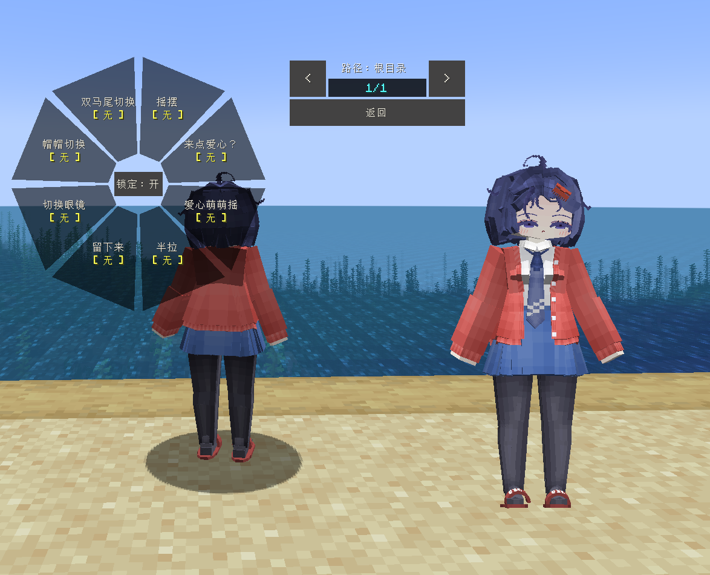

# MiSide_Mila_米拉_LB

## Model Info

Expand/Collapse

<!-- GENERATED MODEL PREVIEW README START -->

<!-- GENERATED MODEL PREVIEW README END -->

- **Name**: #米拉 | #Mila
- **Category**: #Game
  - **Game**: #MiSide #米塔

## Download

Expand/Collapse

- [MiSide_米拉.ysm (166.1 KB)](https://raw.githubusercontent.com/nekohalawrence/YSM-Model-Author/main/0076-White_clams%E7%99%BD%E8%9B%A4%E8%9C%8A%2C%E7%99%BD%E8%9B%A4%E8%9C%8A%2CWhite_Clams%E7%99%BD%E8%9B%A4%E8%9C%8A/MiSide_Mila_%E7%B1%B3%E6%8B%89_LB/MiSide_%E7%B1%B3%E6%8B%89.ysm)

## Author Info

Expand/Collapse

## Author

- **Name**: #White_clams白蛤蜊 | #白蛤蜊 | #White_Clams白蛤蜊
  - **Author ID**: `0076`
  - **Role**: #模型 | #Model
  - **SocialPlatform**: #Bilibili
    - **Bilibili**: https://space.bilibili.com/168185637
  - **SupportPlatform**: #Afdian
    - **Afdian**: https://afdian.com/a/whiteclams

