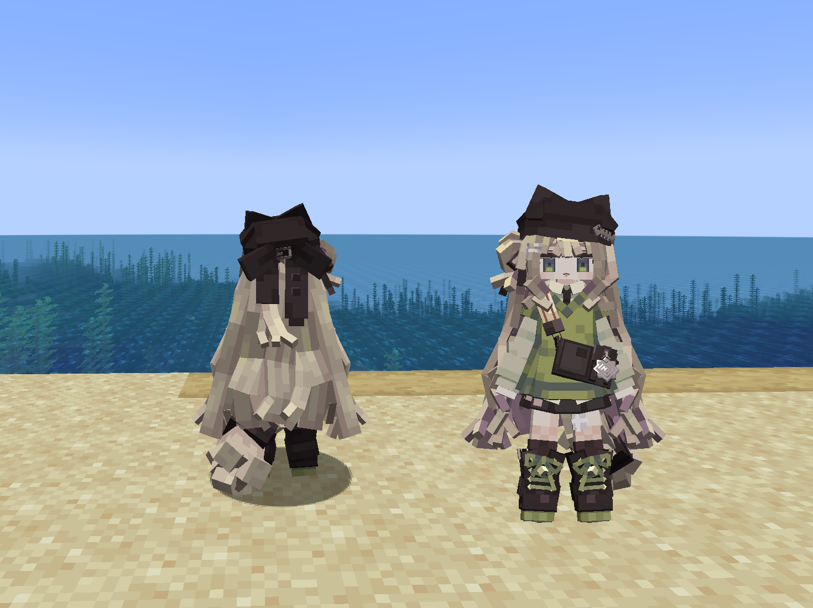
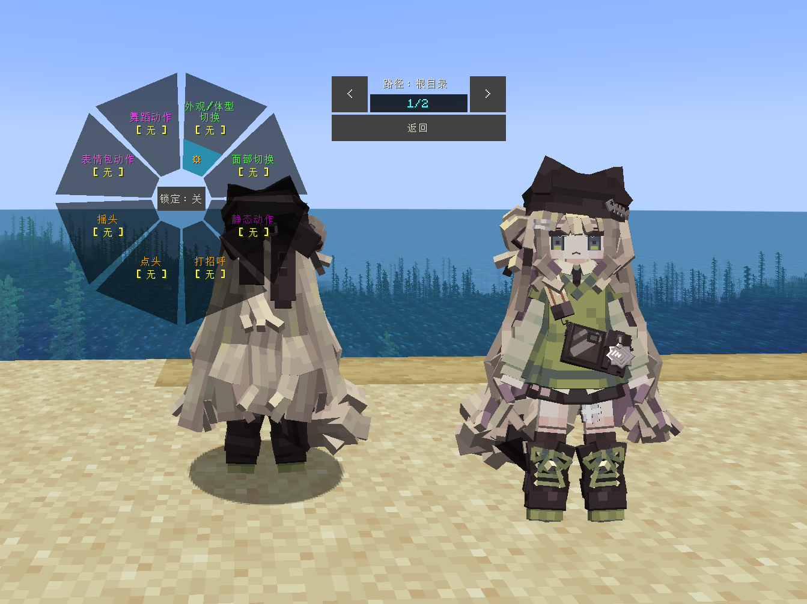
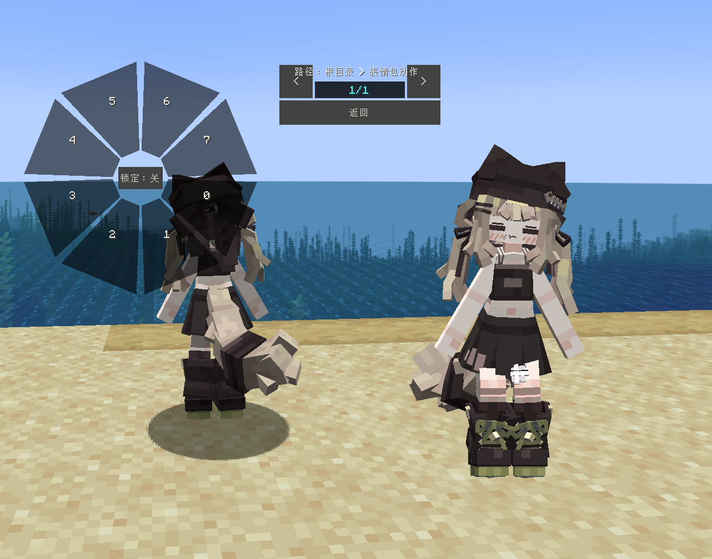

# Mochiyama Kingyo_Kipfel_方块_LA

## Model Info

Expand/Collapse

<!-- GENERATED MODEL PREVIEW README START -->

<!-- GENERATED MODEL PREVIEW README END -->

- **Name**: #方块 | #Kipfel
- **Category**: #Other
  - **Game**: #Mochiyama Kingyo #もち山金魚

## Download

Expand/Collapse

- [Mochiyama Kingyo_方块_Kipfel_v1.2.ysm (582.3 KB)](https://raw.githubusercontent.com/nekohalawrence/YSM-Model-Author/main/0080-Nona_Reeves%2CNona_reeves%2CNona-Reeves/Mochiyama%20Kingyo_Kipfel_%E6%96%B9%E5%9D%97_LA/Mochiyama%20Kingyo_%E6%96%B9%E5%9D%97_Kipfel_v1.2.ysm)
- [Mochiyama Kingyo_方块_Kipfel_v1.2.zip (389.0 KB)](https://raw.githubusercontent.com/nekohalawrence/YSM-Model-Author/main/0080-Nona_Reeves%2CNona_reeves%2CNona-Reeves/Mochiyama%20Kingyo_Kipfel_%E6%96%B9%E5%9D%97_LA/Mochiyama%20Kingyo_%E6%96%B9%E5%9D%97_Kipfel_v1.2.zip)
- [Mochiyama Kingyo_方块_Kipfel_v2.0.ysm (694.6 KB)](https://raw.githubusercontent.com/nekohalawrence/YSM-Model-Author/main/0080-Nona_Reeves%2CNona_reeves%2CNona-Reeves/Mochiyama%20Kingyo_Kipfel_%E6%96%B9%E5%9D%97_LA/Mochiyama%20Kingyo_%E6%96%B9%E5%9D%97_Kipfel_v2.0.ysm)

## Author Info

Expand/Collapse

## Author

- **Name**: #Nona_Reeves | #Nona_reeves | #Nona-Reeves
  - **Author ID**: `0080`
  - **Role**: #模型 | #Model
  - **SocialPlatform**: #QQ
    - **QQ**: 1926615510

