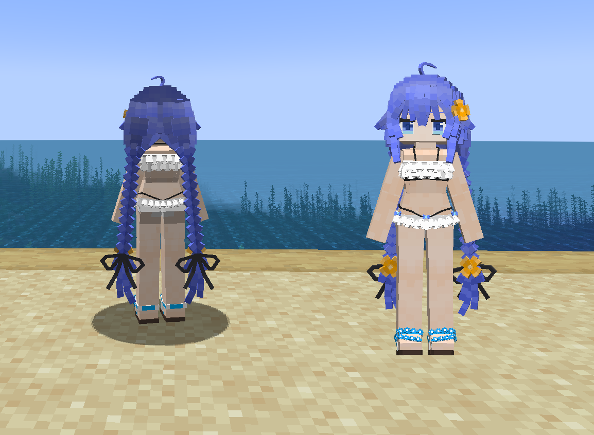
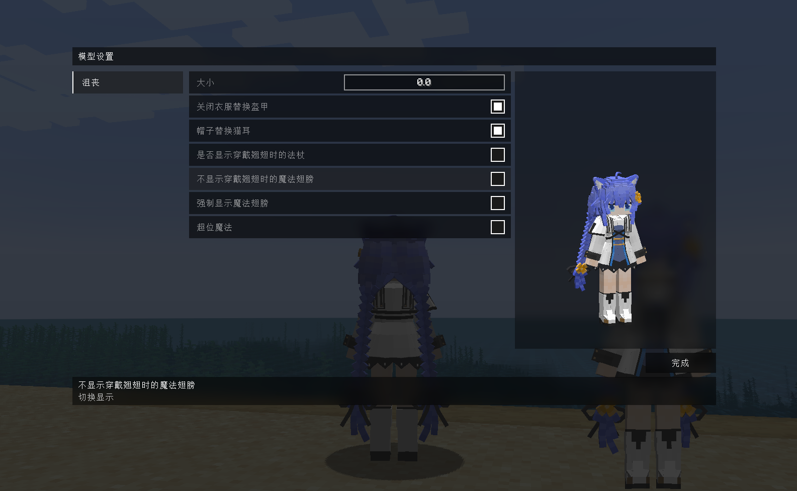

# MushokuTensei_洛淇希_Roxy_Migurdia_LA

## Model Info

Expand/Collapse

<!-- GENERATED MODEL PREVIEW README START -->

<!-- GENERATED MODEL PREVIEW README END -->

- **Name**: #洛琪希 | #Roxy-Migurdia
- **Category**: #Anime
  - **Game**: #MushokuTensei #无职转生～到了异世界就拿出真本事～

## Download

Expand/Collapse

- [MushokuTensei_洛淇希_Roxy_Migurdia.ysm (178.8 KB)](https://raw.githubusercontent.com/nekohalawrence/YSM-Model-Author/main/0084-%E5%B9%BB%E5%8F%A4%E8%AF%97/MushokuTensei_%E6%B4%9B%E6%B7%87%E5%B8%8C_Roxy_Migurdia_LA/MushokuTensei_%E6%B4%9B%E6%B7%87%E5%B8%8C_Roxy_Migurdia.ysm)
- [MushokuTensei_洛淇希_Roxy_Migurdia_1.ysm (231.3 KB)](https://raw.githubusercontent.com/nekohalawrence/YSM-Model-Author/main/0084-%E5%B9%BB%E5%8F%A4%E8%AF%97/MushokuTensei_%E6%B4%9B%E6%B7%87%E5%B8%8C_Roxy_Migurdia_LA/MushokuTensei_%E6%B4%9B%E6%B7%87%E5%B8%8C_Roxy_Migurdia_1.ysm)
- [MushokuTensei_洛淇希_Roxy_Migurdia_v2.0.ysm (1.4 MB)](https://raw.githubusercontent.com/nekohalawrence/YSM-Model-Author/main/0084-%E5%B9%BB%E5%8F%A4%E8%AF%97/MushokuTensei_%E6%B4%9B%E6%B7%87%E5%B8%8C_Roxy_Migurdia_LA/MushokuTensei_%E6%B4%9B%E6%B7%87%E5%B8%8C_Roxy_Migurdia_v2.0.ysm)
- [MushokuTensei_洛淇希_Roxy_Migurdia_v4.0.ysm (1.4 MB)](https://raw.githubusercontent.com/nekohalawrence/YSM-Model-Author/main/0084-%E5%B9%BB%E5%8F%A4%E8%AF%97/MushokuTensei_%E6%B4%9B%E6%B7%87%E5%B8%8C_Roxy_Migurdia_LA/MushokuTensei_%E6%B4%9B%E6%B7%87%E5%B8%8C_Roxy_Migurdia_v4.0.ysm)
- [MushokuTensei_洛淇希_Roxy_Migurdia_v4.1.ysm (398.5 KB)](https://raw.githubusercontent.com/nekohalawrence/YSM-Model-Author/main/0084-%E5%B9%BB%E5%8F%A4%E8%AF%97/MushokuTensei_%E6%B4%9B%E6%B7%87%E5%B8%8C_Roxy_Migurdia_LA/MushokuTensei_%E6%B4%9B%E6%B7%87%E5%B8%8C_Roxy_Migurdia_v4.1.ysm)
- [MushokuTensei_洛淇希_Roxy_Migurdia_v4.1_1.ysm (1.4 MB)](https://raw.githubusercontent.com/nekohalawrence/YSM-Model-Author/main/0084-%E5%B9%BB%E5%8F%A4%E8%AF%97/MushokuTensei_%E6%B4%9B%E6%B7%87%E5%B8%8C_Roxy_Migurdia_LA/MushokuTensei_%E6%B4%9B%E6%B7%87%E5%B8%8C_Roxy_Migurdia_v4.1_1.ysm)

## Author Info

Expand/Collapse

## Author

- **Name**: #幻古诗
  - **Author ID**: `0084`
  - **Role**: #模型 #动作 #动画 | #Model #Motion #Animation
  - **SocialPlatform**: #Bilibili
    - **Bilibili**: https://space.bilibili.com/443702321
  - **SupportPlatform**: #Afdian
    - **Afdian**: https://afdian.com/a/huangushi

