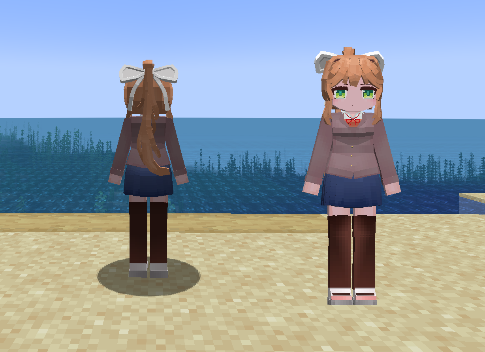
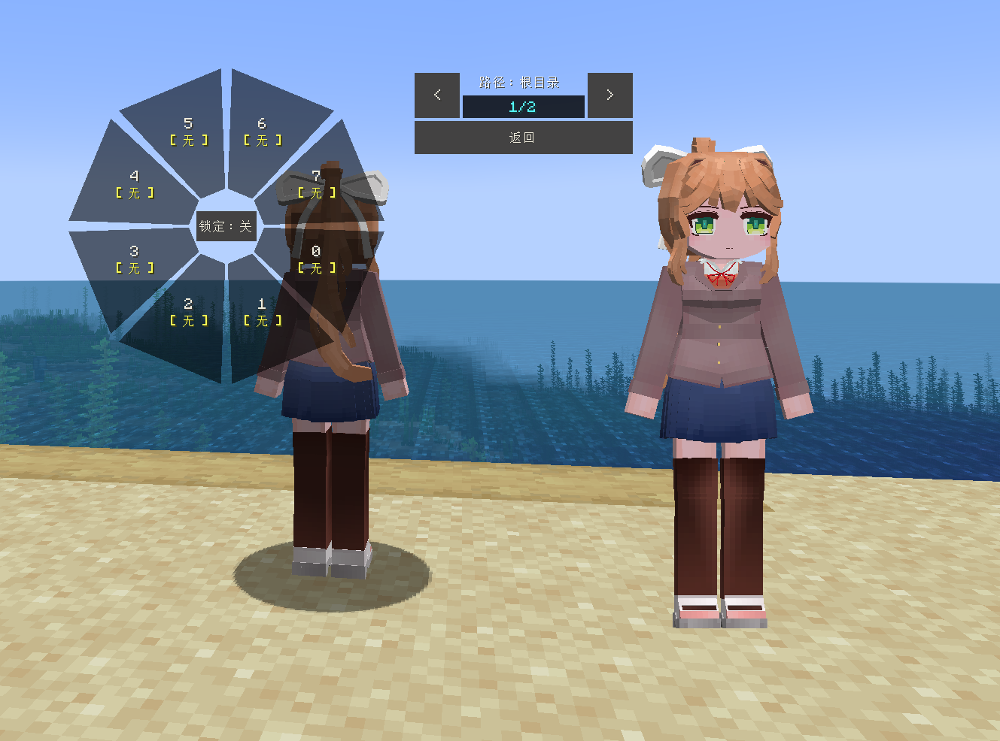

# DDLC_monika_LC

## Model Info

Expand/Collapse

<!-- GENERATED MODEL PREVIEW README START -->

<!-- GENERATED MODEL PREVIEW README END -->

- **Name**: 
- **Category**: #Game
  - **Game**: #DDLC #Doki-Doki-Literature-Club! #心跳文学部！

## Download

Expand/Collapse

- [DDLC_Monika_1_1.ysm (294.4 KB)](https://raw.githubusercontent.com/nekohalawrence/YSM-Model-Author/main/0092-%E8%8F%8A%E5%A7%A5%E7%88%B7/DDLC_monika_LC/DDLC_Monika_1_1.ysm)

## Author Info

Expand/Collapse

## Author

- **Name**: #菊姥爷
  - **Author ID**: `0092`
  - **Role**: #模型 #动作 #动画 | #Model #Motion #Animation
  - **SocialPlatform**: #Bilibili
    - **Bilibili**: https://space.bilibili.com/376780490
  - **SupportPlatform**: #Afdian
    - **Afdian**: https://afdian.com/a/julaoye

