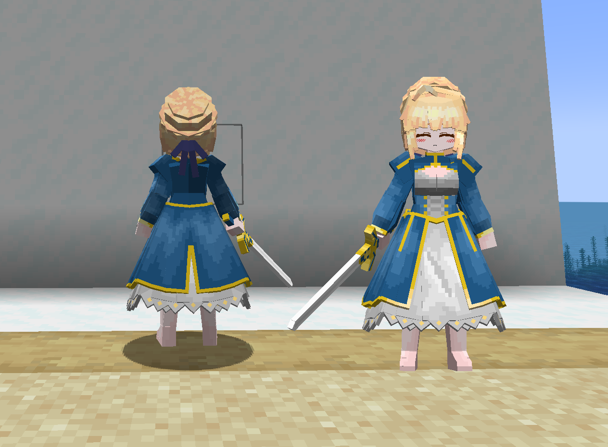
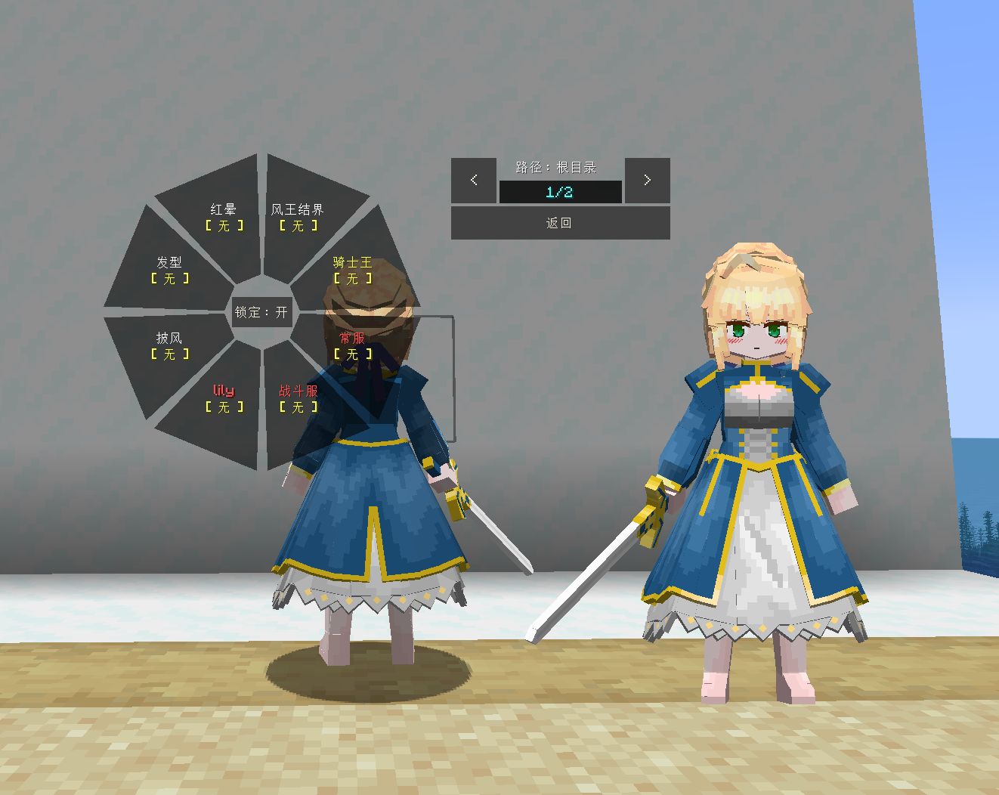
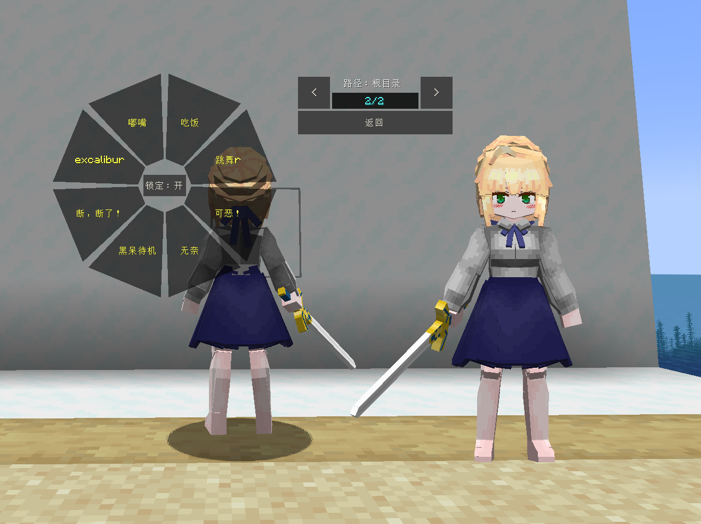
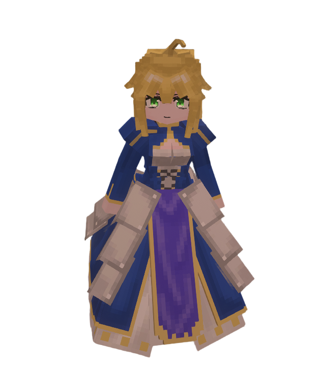
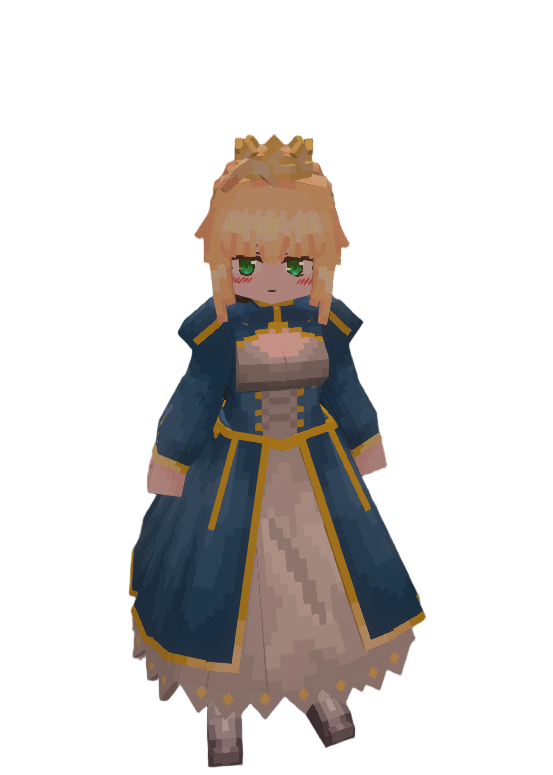

# FGO_阿尔托莉雅・潘德拉贡_Saber-Artoria-Pendragon_LA

## Model Info

Expand/Collapse

<!-- GENERATED MODEL PREVIEW README START -->

<!-- GENERATED MODEL PREVIEW README END -->

- **Name**: #阿尔托莉雅・潘德拉贡 | #Saber-Artoria-Pendragon
- **Category**: #Game
  - **Game**: #FGO #Fate-Grand-Order #命运 - 冠位指定

## Download

Expand/Collapse

- [FGO_阿尔托莉雅・潘德拉贡_Saber-Artoria-Pendragon_v1.5.0.ysm (178.4 KB)](https://raw.githubusercontent.com/nekohalawrence/YSM-Model-Author/main/0093-%E8%8B%8F%E4%BE%9D%E5%87%9B%2C%E7%82%BD%E6%B9%AE/FGO_%E9%98%BF%E5%B0%94%E6%89%98%E8%8E%89%E9%9B%85%E3%83%BB%E6%BD%98%E5%BE%B7%E6%8B%89%E8%B4%A1_Saber-Artoria-Pendragon_LA/FGO_%E9%98%BF%E5%B0%94%E6%89%98%E8%8E%89%E9%9B%85%E3%83%BB%E6%BD%98%E5%BE%B7%E6%8B%89%E8%B4%A1_Saber-Artoria-Pendragon_v1.5.0.ysm)
- [FGO_阿尔托莉雅・潘德拉贡_Saber-Artoria-Pendragon_v1.5.2.ysm (178.6 KB)](https://raw.githubusercontent.com/nekohalawrence/YSM-Model-Author/main/0093-%E8%8B%8F%E4%BE%9D%E5%87%9B%2C%E7%82%BD%E6%B9%AE/FGO_%E9%98%BF%E5%B0%94%E6%89%98%E8%8E%89%E9%9B%85%E3%83%BB%E6%BD%98%E5%BE%B7%E6%8B%89%E8%B4%A1_Saber-Artoria-Pendragon_LA/FGO_%E9%98%BF%E5%B0%94%E6%89%98%E8%8E%89%E9%9B%85%E3%83%BB%E6%BD%98%E5%BE%B7%E6%8B%89%E8%B4%A1_Saber-Artoria-Pendragon_v1.5.2.ysm)
- [FGO_阿尔托莉雅・潘德拉贡_Saber-Artoria-Pendragon_v1.5.4.ysm (178.4 KB)](https://raw.githubusercontent.com/nekohalawrence/YSM-Model-Author/main/0093-%E8%8B%8F%E4%BE%9D%E5%87%9B%2C%E7%82%BD%E6%B9%AE/FGO_%E9%98%BF%E5%B0%94%E6%89%98%E8%8E%89%E9%9B%85%E3%83%BB%E6%BD%98%E5%BE%B7%E6%8B%89%E8%B4%A1_Saber-Artoria-Pendragon_LA/FGO_%E9%98%BF%E5%B0%94%E6%89%98%E8%8E%89%E9%9B%85%E3%83%BB%E6%BD%98%E5%BE%B7%E6%8B%89%E8%B4%A1_Saber-Artoria-Pendragon_v1.5.4.ysm)
- [FGO_阿尔托莉雅・潘德拉贡_Saber-Artoria-Pendragon_v1.5.5.ysm (182.1 KB)](https://raw.githubusercontent.com/nekohalawrence/YSM-Model-Author/main/0093-%E8%8B%8F%E4%BE%9D%E5%87%9B%2C%E7%82%BD%E6%B9%AE/FGO_%E9%98%BF%E5%B0%94%E6%89%98%E8%8E%89%E9%9B%85%E3%83%BB%E6%BD%98%E5%BE%B7%E6%8B%89%E8%B4%A1_Saber-Artoria-Pendragon_LA/FGO_%E9%98%BF%E5%B0%94%E6%89%98%E8%8E%89%E9%9B%85%E3%83%BB%E6%BD%98%E5%BE%B7%E6%8B%89%E8%B4%A1_Saber-Artoria-Pendragon_v1.5.5.ysm)
- [FGO_阿尔托莉雅・潘德拉贡_Saber-Artoria-Pendragon_v1.7.5.ysm (324.8 KB)](https://raw.githubusercontent.com/nekohalawrence/YSM-Model-Author/main/0093-%E8%8B%8F%E4%BE%9D%E5%87%9B%2C%E7%82%BD%E6%B9%AE/FGO_%E9%98%BF%E5%B0%94%E6%89%98%E8%8E%89%E9%9B%85%E3%83%BB%E6%BD%98%E5%BE%B7%E6%8B%89%E8%B4%A1_Saber-Artoria-Pendragon_LA/FGO_%E9%98%BF%E5%B0%94%E6%89%98%E8%8E%89%E9%9B%85%E3%83%BB%E6%BD%98%E5%BE%B7%E6%8B%89%E8%B4%A1_Saber-Artoria-Pendragon_v1.7.5.ysm)
- [FGO_阿尔托莉雅・潘德拉贡_Saber-Artoria-Pendragon_v1.8.0.ysm (548.6 KB)](https://raw.githubusercontent.com/nekohalawrence/YSM-Model-Author/main/0093-%E8%8B%8F%E4%BE%9D%E5%87%9B%2C%E7%82%BD%E6%B9%AE/FGO_%E9%98%BF%E5%B0%94%E6%89%98%E8%8E%89%E9%9B%85%E3%83%BB%E6%BD%98%E5%BE%B7%E6%8B%89%E8%B4%A1_Saber-Artoria-Pendragon_LA/FGO_%E9%98%BF%E5%B0%94%E6%89%98%E8%8E%89%E9%9B%85%E3%83%BB%E6%BD%98%E5%BE%B7%E6%8B%89%E8%B4%A1_Saber-Artoria-Pendragon_v1.8.0.ysm)
- [FGO_阿尔托莉雅・潘德拉贡_Saber-Artoria-Pendragon_v1.8.3.ysm (548.2 KB)](https://raw.githubusercontent.com/nekohalawrence/YSM-Model-Author/main/0093-%E8%8B%8F%E4%BE%9D%E5%87%9B%2C%E7%82%BD%E6%B9%AE/FGO_%E9%98%BF%E5%B0%94%E6%89%98%E8%8E%89%E9%9B%85%E3%83%BB%E6%BD%98%E5%BE%B7%E6%8B%89%E8%B4%A1_Saber-Artoria-Pendragon_LA/FGO_%E9%98%BF%E5%B0%94%E6%89%98%E8%8E%89%E9%9B%85%E3%83%BB%E6%BD%98%E5%BE%B7%E6%8B%89%E8%B4%A1_Saber-Artoria-Pendragon_v1.8.3.ysm)
- [FGO_阿尔托莉雅・潘德拉贡_Saber-Artoria-Pendragon_v2.0.0.ysm (257.7 KB)](https://raw.githubusercontent.com/nekohalawrence/YSM-Model-Author/main/0093-%E8%8B%8F%E4%BE%9D%E5%87%9B%2C%E7%82%BD%E6%B9%AE/FGO_%E9%98%BF%E5%B0%94%E6%89%98%E8%8E%89%E9%9B%85%E3%83%BB%E6%BD%98%E5%BE%B7%E6%8B%89%E8%B4%A1_Saber-Artoria-Pendragon_LA/FGO_%E9%98%BF%E5%B0%94%E6%89%98%E8%8E%89%E9%9B%85%E3%83%BB%E6%BD%98%E5%BE%B7%E6%8B%89%E8%B4%A1_Saber-Artoria-Pendragon_v2.0.0.ysm)
- [FGO_阿尔托莉雅・潘德拉贡_Saber-Artoria-Pendragon_v3.0.0.ysm (1017.6 KB)](https://raw.githubusercontent.com/nekohalawrence/YSM-Model-Author/main/0093-%E8%8B%8F%E4%BE%9D%E5%87%9B%2C%E7%82%BD%E6%B9%AE/FGO_%E9%98%BF%E5%B0%94%E6%89%98%E8%8E%89%E9%9B%85%E3%83%BB%E6%BD%98%E5%BE%B7%E6%8B%89%E8%B4%A1_Saber-Artoria-Pendragon_LA/FGO_%E9%98%BF%E5%B0%94%E6%89%98%E8%8E%89%E9%9B%85%E3%83%BB%E6%BD%98%E5%BE%B7%E6%8B%89%E8%B4%A1_Saber-Artoria-Pendragon_v3.0.0.ysm)
- [FGO_阿尔托莉雅・潘德拉贡_Saber-Artoria-Pendragon_v3.0.1.ysm (741.6 KB)](https://raw.githubusercontent.com/nekohalawrence/YSM-Model-Author/main/0093-%E8%8B%8F%E4%BE%9D%E5%87%9B%2C%E7%82%BD%E6%B9%AE/FGO_%E9%98%BF%E5%B0%94%E6%89%98%E8%8E%89%E9%9B%85%E3%83%BB%E6%BD%98%E5%BE%B7%E6%8B%89%E8%B4%A1_Saber-Artoria-Pendragon_LA/FGO_%E9%98%BF%E5%B0%94%E6%89%98%E8%8E%89%E9%9B%85%E3%83%BB%E6%BD%98%E5%BE%B7%E6%8B%89%E8%B4%A1_Saber-Artoria-Pendragon_v3.0.1.ysm)
- [FGO_阿尔托莉雅・潘德拉贡_Saber-Artoria-Pendragon_v3.0.3.ysm (741.8 KB)](https://raw.githubusercontent.com/nekohalawrence/YSM-Model-Author/main/0093-%E8%8B%8F%E4%BE%9D%E5%87%9B%2C%E7%82%BD%E6%B9%AE/FGO_%E9%98%BF%E5%B0%94%E6%89%98%E8%8E%89%E9%9B%85%E3%83%BB%E6%BD%98%E5%BE%B7%E6%8B%89%E8%B4%A1_Saber-Artoria-Pendragon_LA/FGO_%E9%98%BF%E5%B0%94%E6%89%98%E8%8E%89%E9%9B%85%E3%83%BB%E6%BD%98%E5%BE%B7%E6%8B%89%E8%B4%A1_Saber-Artoria-Pendragon_v3.0.3.ysm)

## Author Info

Expand/Collapse

## Author

- **Name**: #苏依凛 | #炽湮
  - **Author ID**: `0093`
  - **Role**: #模型 | #Model
  - **SocialPlatform**: #Bilibili
    - **Bilibili**: https://space.bilibili.com/76987486
  - **SupportPlatform**: #Afdian
    - **Afdian**: https://afdian.com/a/supermonsterking

