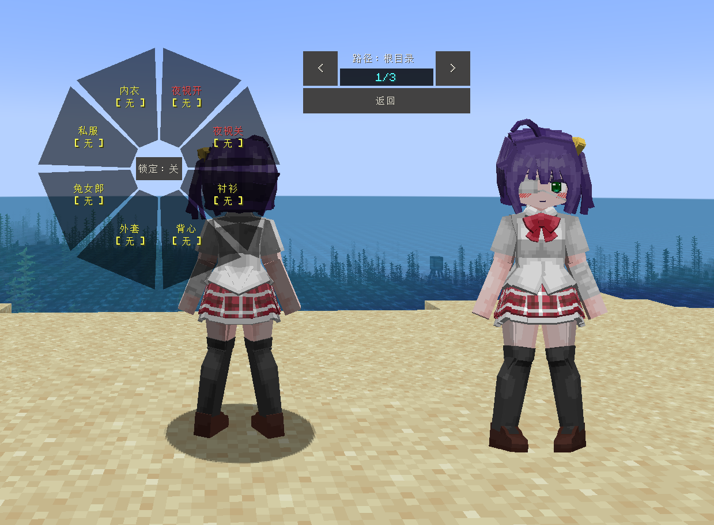
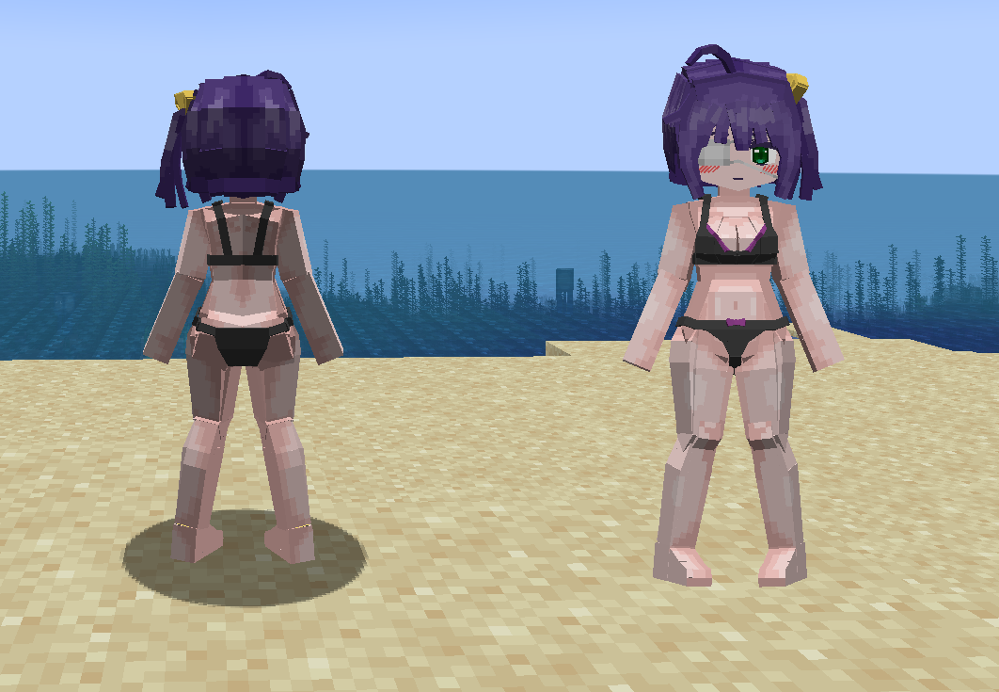
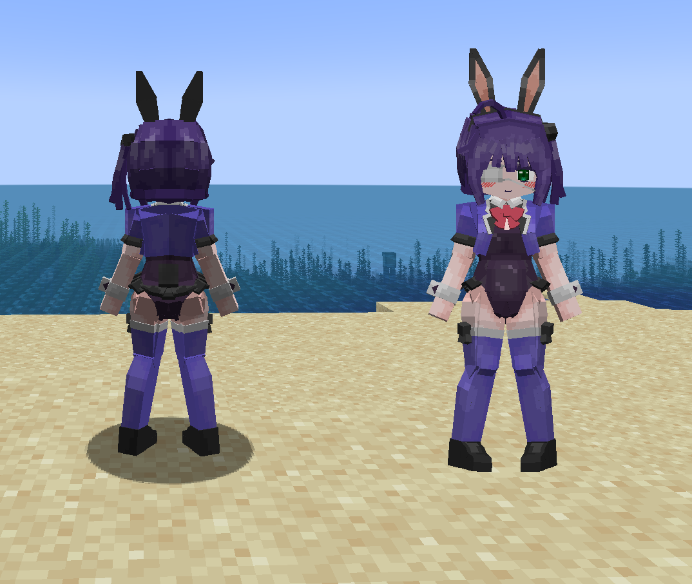
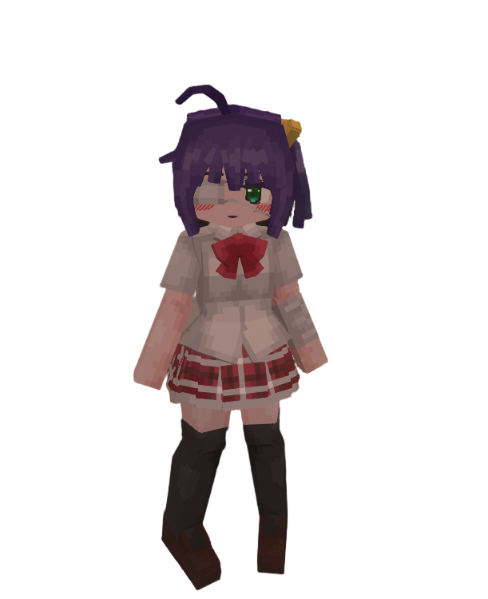

# LCOD_小鸟游六花_Takanashi-Rikka_LA

## Model Info

Expand/Collapse

<!-- GENERATED MODEL PREVIEW README START -->

<!-- GENERATED MODEL PREVIEW README END -->

- **Name**: #小鸟游六花 | #Takanashi-Rikka
- **Category**: #Anime
  - **Game**: #LCOD #Love #中二病でも恋がしたい！

## Download

Expand/Collapse

- [LCOD_小鸟游六花_Takanashi-Rikka_v3.0.0.ysm (528.2 KB)](https://raw.githubusercontent.com/nekohalawrence/YSM-Model-Author/main/0093-%E8%8B%8F%E4%BE%9D%E5%87%9B%2C%E7%82%BD%E6%B9%AE/LCOD_%E5%B0%8F%E9%B8%9F%E6%B8%B8%E5%85%AD%E8%8A%B1_Takanashi-Rikka_LA/LCOD_%E5%B0%8F%E9%B8%9F%E6%B8%B8%E5%85%AD%E8%8A%B1_Takanashi-Rikka_v3.0.0.ysm)
- [LCOD_小鸟游六花_Takanashi-Rikka_v3.0.1.ysm (528.3 KB)](https://raw.githubusercontent.com/nekohalawrence/YSM-Model-Author/main/0093-%E8%8B%8F%E4%BE%9D%E5%87%9B%2C%E7%82%BD%E6%B9%AE/LCOD_%E5%B0%8F%E9%B8%9F%E6%B8%B8%E5%85%AD%E8%8A%B1_Takanashi-Rikka_LA/LCOD_%E5%B0%8F%E9%B8%9F%E6%B8%B8%E5%85%AD%E8%8A%B1_Takanashi-Rikka_v3.0.1.ysm)

## Author Info

Expand/Collapse

## Author

- **Name**: #苏依凛 | #炽湮
  - **Author ID**: `0093`
  - **Role**: #模型 | #Model
  - **SocialPlatform**: #Bilibili
    - **Bilibili**: https://space.bilibili.com/76987486
  - **SupportPlatform**: #Afdian
    - **Afdian**: https://afdian.com/a/supermonsterking

