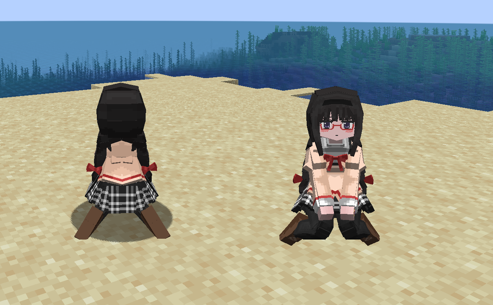

# Madoka_晓美焰_Akemi-Homura

## Model Info

Expand/Collapse

<!-- GENERATED MODEL PREVIEW README START -->

<!-- GENERATED MODEL PREVIEW README END -->

- **Name**: #晓美焰 | #Akemi-Homura
- **Category**: #Anime
  - **Game**: #Madoka #Puella Magi Madoka Magica #魔法少女小圆

## Download

Expand/Collapse

- [Madoka_晓美焰_Akemi-Homura_v2.0.0.ysm (248.0 KB)](https://raw.githubusercontent.com/nekohalawrence/YSM-Model-Author/main/0093-%E8%8B%8F%E4%BE%9D%E5%87%9B%2C%E7%82%BD%E6%B9%AE/Madoka_%E6%99%93%E7%BE%8E%E7%84%B0_Akemi-Homura/Madoka_%E6%99%93%E7%BE%8E%E7%84%B0_Akemi-Homura_v2.0.0.ysm)
- [Madoka_晓美焰_Akemi-Homura_v3.1.0.ysm (783.1 KB)](https://raw.githubusercontent.com/nekohalawrence/YSM-Model-Author/main/0093-%E8%8B%8F%E4%BE%9D%E5%87%9B%2C%E7%82%BD%E6%B9%AE/Madoka_%E6%99%93%E7%BE%8E%E7%84%B0_Akemi-Homura/Madoka_%E6%99%93%E7%BE%8E%E7%84%B0_Akemi-Homura_v3.1.0.ysm)

## Author Info

Expand/Collapse

## Author

- **Name**: #苏依凛 | #炽湮
  - **Author ID**: `0093`
  - **Role**: #模型 #动作 #动画 | #Model #Motion #Animation
  - **SocialPlatform**: #Bilibili
    - **Bilibili**: https://space.bilibili.com/76987486
  - **SupportPlatform**: #Afdian
    - **Afdian**: https://afdian.com/a/supermonsterking

- **Name**: #苏依凛
  - **Role**: #模型 | #Model
  - **SocialPlatform**: #Bilibili
    - **Bilibili**: https://space.bilibili.com/76987486
  - **SupportPlatform**: #Afdian
    - **Afdian**: https://afdian.com/a/supermonsterking

