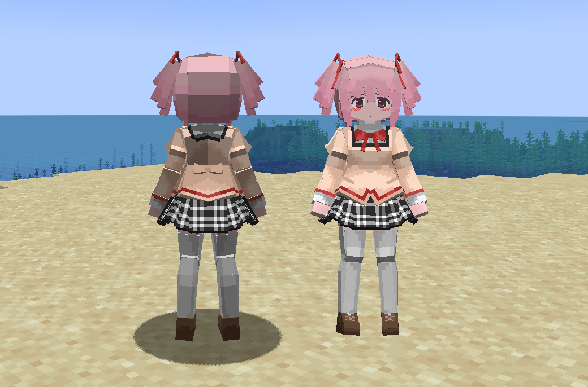
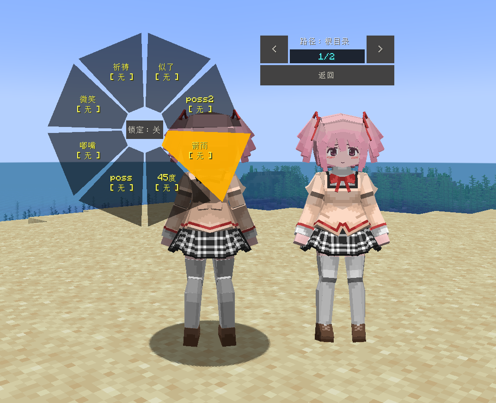
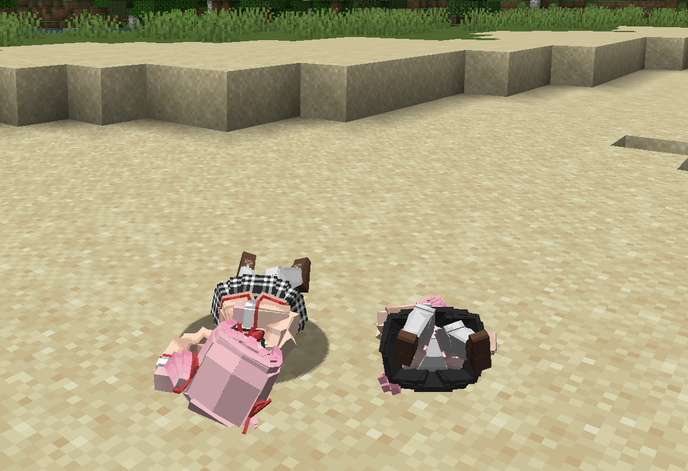

# Madoka_鹿目圆_Kaname-Madoka

## Model Info

Expand/Collapse

<!-- GENERATED MODEL PREVIEW README START -->

<!-- GENERATED MODEL PREVIEW README END -->

- **Name**: #鹿目圆 | #Kaname-Madoka
- **Category**: #Anime
  - **Game**: #Madoka #Puella Magi Madoka Magica #魔法少女小圆

## Download

Expand/Collapse

- [Madoka_鹿目圆_Kaname-Madoka_v2.0.1.ysm (247.4 KB)](https://raw.githubusercontent.com/nekohalawrence/YSM-Model-Author/main/0093-%E8%8B%8F%E4%BE%9D%E5%87%9B%2C%E7%82%BD%E6%B9%AE/Madoka_%E9%B9%BF%E7%9B%AE%E5%9C%86_Kaname-Madoka/Madoka_%E9%B9%BF%E7%9B%AE%E5%9C%86_Kaname-Madoka_v2.0.1.ysm)
- [Madoka_鹿目圆_Kaname-Madoka_v3.0.5.ysm (478.0 KB)](https://raw.githubusercontent.com/nekohalawrence/YSM-Model-Author/main/0093-%E8%8B%8F%E4%BE%9D%E5%87%9B%2C%E7%82%BD%E6%B9%AE/Madoka_%E9%B9%BF%E7%9B%AE%E5%9C%86_Kaname-Madoka/Madoka_%E9%B9%BF%E7%9B%AE%E5%9C%86_Kaname-Madoka_v3.0.5.ysm)
- [Madoka_鹿目圆_Kaname-Madoka_v3.1.1.ysm (1.2 MB)](https://raw.githubusercontent.com/nekohalawrence/YSM-Model-Author/main/0093-%E8%8B%8F%E4%BE%9D%E5%87%9B%2C%E7%82%BD%E6%B9%AE/Madoka_%E9%B9%BF%E7%9B%AE%E5%9C%86_Kaname-Madoka/Madoka_%E9%B9%BF%E7%9B%AE%E5%9C%86_Kaname-Madoka_v3.1.1.ysm)

## Author Info

Expand/Collapse

## Author

- **Name**: #苏依凛 | #炽湮
  - **Author ID**: `0093`
  - **Role**: #模型 #动作 #动画 | #Model #Motion #Animation
  - **SocialPlatform**: #Bilibili
    - **Bilibili**: https://space.bilibili.com/76987486
  - **SupportPlatform**: #Afdian
    - **Afdian**: https://afdian.com/a/supermonsterking

- **Name**: #苏依凛
  - **Role**: #模型 | #Model
  - **SocialPlatform**: #Bilibili
    - **Bilibili**: https://space.bilibili.com/76987486
  - **SupportPlatform**: #Afdian
    - **Afdian**: https://afdian.com/a/supermonsterking

