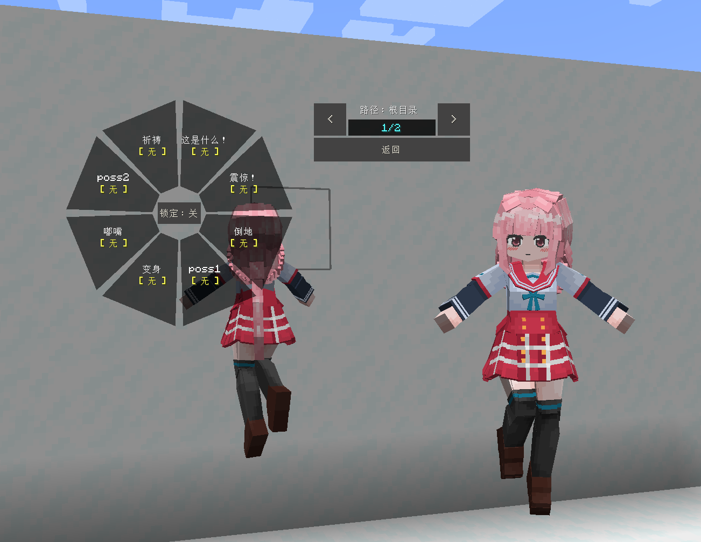

# Magia-Record_环彩羽_Tamaki-Iroha_LB

## Model Info

Expand/Collapse

<!-- GENERATED MODEL PREVIEW README START -->

<!-- GENERATED MODEL PREVIEW README END -->

- **Name**: #环彩羽 | #Tamaki-Iroha
- **Category**: #Game
  - **Game**: #Magia-Record #Magia Record: Puella Magi Madoka Magica Side Story #魔法纪录 魔法少女小圆外传

## Download

Expand/Collapse

- [Magia-Record_环彩羽_Tamaki-Iroha_v3.0.0.ysm (1.1 MB)](https://raw.githubusercontent.com/nekohalawrence/YSM-Model-Author/main/0093-%E8%8B%8F%E4%BE%9D%E5%87%9B%2C%E7%82%BD%E6%B9%AE/Magia-Record_%E7%8E%AF%E5%BD%A9%E7%BE%BD_Tamaki-Iroha_LB/Magia-Record_%E7%8E%AF%E5%BD%A9%E7%BE%BD_Tamaki-Iroha_v3.0.0.ysm)

## Author Info

Expand/Collapse

## Author

- **Name**: #苏依凛 | #炽湮
  - **Author ID**: `0093`
  - **Role**: #模型 | #Model
  - **SocialPlatform**: #Bilibili
    - **Bilibili**: https://space.bilibili.com/76987486
  - **SupportPlatform**: #Afdian
    - **Afdian**: https://afdian.com/a/supermonsterking

