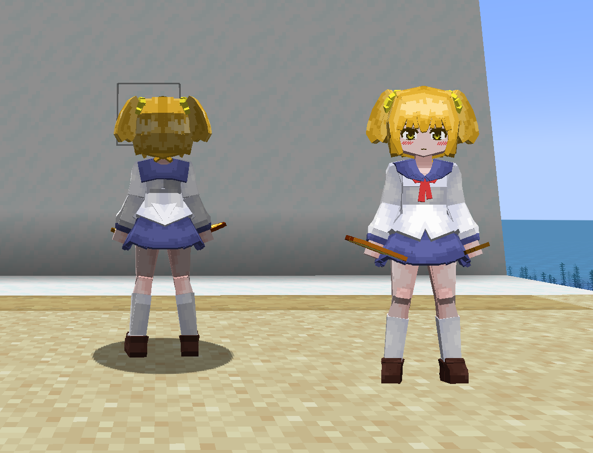
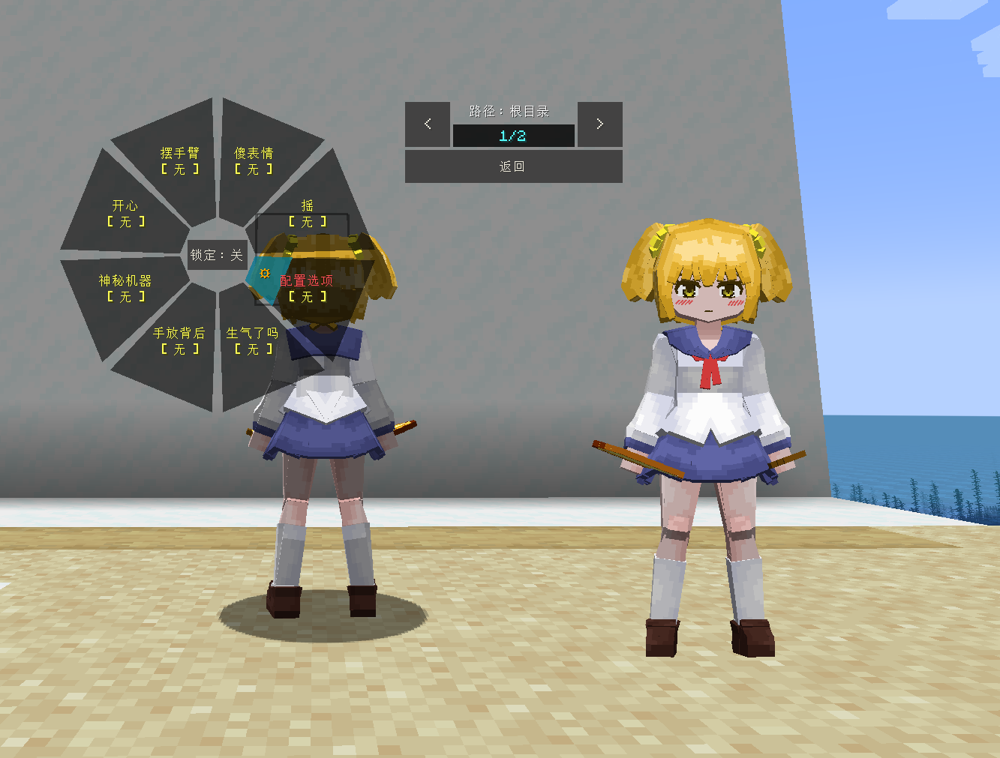
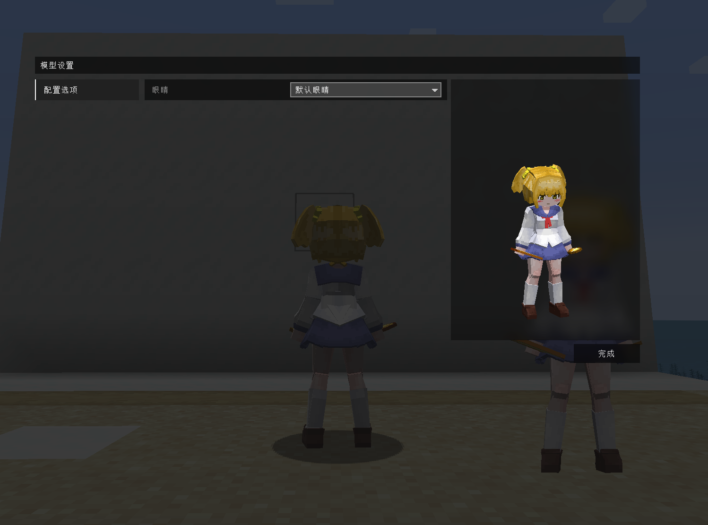
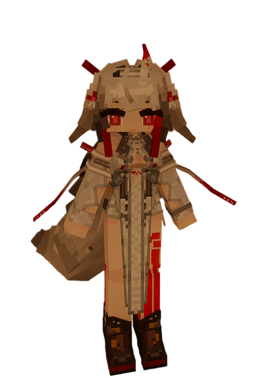

# PTE_子_POP-Popuko_LB

## Model Info

Expand/Collapse

<!-- GENERATED MODEL PREVIEW README START -->

<!-- GENERATED MODEL PREVIEW README END -->

- **Name**: #POP子 | #Popuko
- **Category**: #Anime
  - **Game**: #PTE #Pop Team Epic #pop 子和 pipi 美的日常

## Download

Expand/Collapse

- [PTE_子_POP-Popuko.ysm (459.6 KB)](https://raw.githubusercontent.com/nekohalawrence/YSM-Model-Author/main/0093-%E8%8B%8F%E4%BE%9D%E5%87%9B%2C%E7%82%BD%E6%B9%AE/PTE_%E5%AD%90_POP-Popuko_LB/PTE_%E5%AD%90_POP-Popuko.ysm)

## Author Info

Expand/Collapse

## Author

- **Name**: #苏依凛 | #炽湮
  - **Author ID**: `0093`
  - **Role**: #模型 | #Model
  - **SocialPlatform**: #Bilibili
    - **Bilibili**: https://space.bilibili.com/76987486
  - **SupportPlatform**: #Afdian
    - **Afdian**: https://afdian.com/a/supermonsterking

