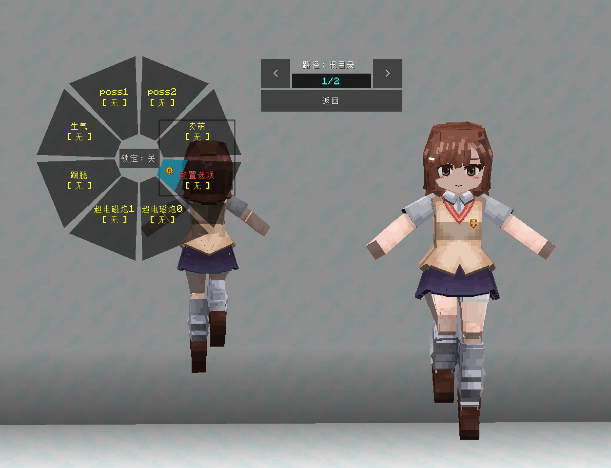

# TMNI_御坂美琴_Misaka-Mikoto

## Model Info

Expand/Collapse

<!-- GENERATED MODEL PREVIEW README START -->

<!-- GENERATED MODEL PREVIEW README END -->

- **Name**: #御坂美琴 | #Misaka-Mikoto
- **Category**: #Anime
  - **Game**: #TMNI #A Certain Magical Index #魔法禁书目录

## Download

Expand/Collapse

- [TMNI_御坂美琴_Misaka-Mikoto_v2.0.0.ysm (229.9 KB)](https://raw.githubusercontent.com/nekohalawrence/YSM-Model-Author/main/0093-%E8%8B%8F%E4%BE%9D%E5%87%9B%2C%E7%82%BD%E6%B9%AE/TMNI_%E5%BE%A1%E5%9D%82%E7%BE%8E%E7%90%B4_Misaka-Mikoto/TMNI_%E5%BE%A1%E5%9D%82%E7%BE%8E%E7%90%B4_Misaka-Mikoto_v2.0.0.ysm)
- [TMNI_御坂美琴_Misaka-Mikoto_v4.0.0.ysm (601.2 KB)](https://raw.githubusercontent.com/nekohalawrence/YSM-Model-Author/main/0093-%E8%8B%8F%E4%BE%9D%E5%87%9B%2C%E7%82%BD%E6%B9%AE/TMNI_%E5%BE%A1%E5%9D%82%E7%BE%8E%E7%90%B4_Misaka-Mikoto/TMNI_%E5%BE%A1%E5%9D%82%E7%BE%8E%E7%90%B4_Misaka-Mikoto_v4.0.0.ysm)

## Author Info

Expand/Collapse

## Author

- **Name**: #苏依凛 | #炽湮
  - **Author ID**: `0093`
  - **Role**: #模型 | #Model
  - **SocialPlatform**: #Bilibili
    - **Bilibili**: https://space.bilibili.com/76987486
  - **SupportPlatform**: #Afdian
    - **Afdian**: https://afdian.com/a/supermonsterking

