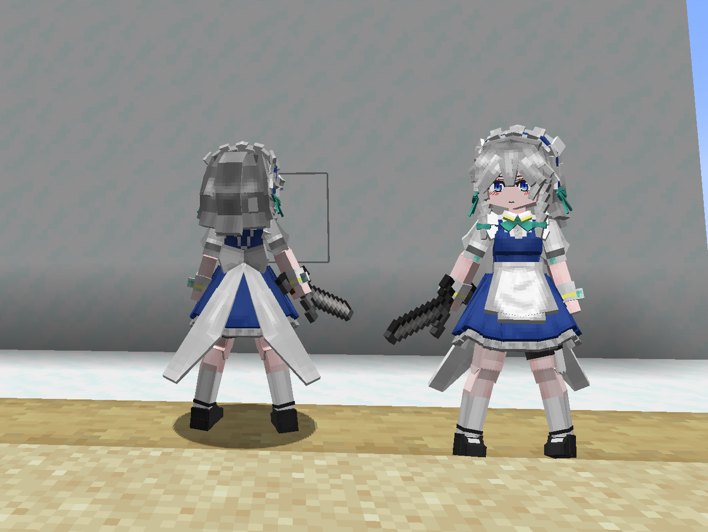
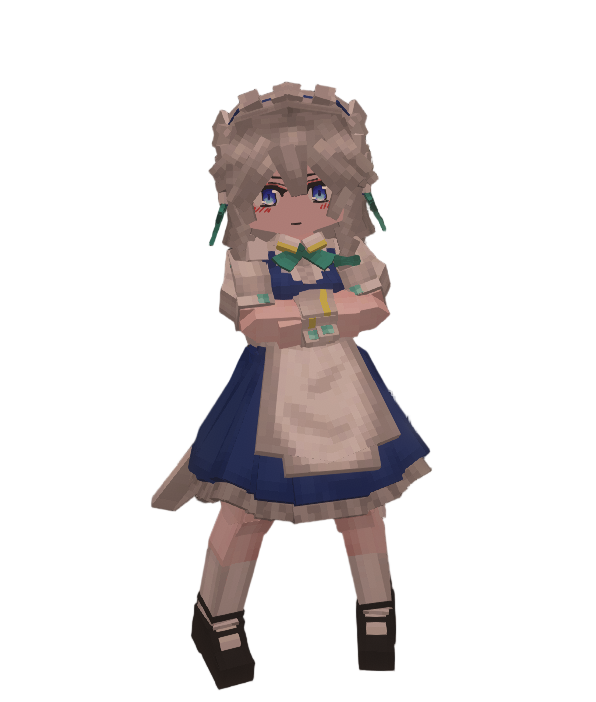

# Touhou_十六夜咲夜_Izayoi-Sakuya_LB

## Model Info

Expand/Collapse

<!-- GENERATED MODEL PREVIEW README START -->

<!-- GENERATED MODEL PREVIEW README END -->

- **Name**: #十六夜咲夜 | #Izayoi-Sakuya
- **Category**: #Other
  - **Game**: #Touhou #Touhou-Project #东方 Project

## Download

Expand/Collapse

- [Touhou_十六夜咲夜_Izayoi-Sakuya.zip (54.4 KB)](https://raw.githubusercontent.com/nekohalawrence/YSM-Model-Author/main/0093-%E8%8B%8F%E4%BE%9D%E5%87%9B%2C%E7%82%BD%E6%B9%AE/Touhou_%E5%8D%81%E5%85%AD%E5%A4%9C%E5%92%B2%E5%A4%9C_Izayoi-Sakuya_LB/Touhou_%E5%8D%81%E5%85%AD%E5%A4%9C%E5%92%B2%E5%A4%9C_Izayoi-Sakuya.zip)
- [Touhou_十六夜咲夜_Izayoi-Sakuya_1.zip (205.1 KB)](https://raw.githubusercontent.com/nekohalawrence/YSM-Model-Author/main/0093-%E8%8B%8F%E4%BE%9D%E5%87%9B%2C%E7%82%BD%E6%B9%AE/Touhou_%E5%8D%81%E5%85%AD%E5%A4%9C%E5%92%B2%E5%A4%9C_Izayoi-Sakuya_LB/Touhou_%E5%8D%81%E5%85%AD%E5%A4%9C%E5%92%B2%E5%A4%9C_Izayoi-Sakuya_1.zip)
- [Touhou_十六夜咲夜_Izayoi-Sakuya_v1.2.0.ysm (123.5 KB)](https://raw.githubusercontent.com/nekohalawrence/YSM-Model-Author/main/0093-%E8%8B%8F%E4%BE%9D%E5%87%9B%2C%E7%82%BD%E6%B9%AE/Touhou_%E5%8D%81%E5%85%AD%E5%A4%9C%E5%92%B2%E5%A4%9C_Izayoi-Sakuya_LB/Touhou_%E5%8D%81%E5%85%AD%E5%A4%9C%E5%92%B2%E5%A4%9C_Izayoi-Sakuya_v1.2.0.ysm)
- [Touhou_十六夜咲夜_Izayoi-Sakuya_v1.2.1.ysm (123.3 KB)](https://raw.githubusercontent.com/nekohalawrence/YSM-Model-Author/main/0093-%E8%8B%8F%E4%BE%9D%E5%87%9B%2C%E7%82%BD%E6%B9%AE/Touhou_%E5%8D%81%E5%85%AD%E5%A4%9C%E5%92%B2%E5%A4%9C_Izayoi-Sakuya_LB/Touhou_%E5%8D%81%E5%85%AD%E5%A4%9C%E5%92%B2%E5%A4%9C_Izayoi-Sakuya_v1.2.1.ysm)
- [Touhou_十六夜咲夜_Izayoi-Sakuya_v2.0.5.ysm (176.8 KB)](https://raw.githubusercontent.com/nekohalawrence/YSM-Model-Author/main/0093-%E8%8B%8F%E4%BE%9D%E5%87%9B%2C%E7%82%BD%E6%B9%AE/Touhou_%E5%8D%81%E5%85%AD%E5%A4%9C%E5%92%B2%E5%A4%9C_Izayoi-Sakuya_LB/Touhou_%E5%8D%81%E5%85%AD%E5%A4%9C%E5%92%B2%E5%A4%9C_Izayoi-Sakuya_v2.0.5.ysm)
- [Touhou_十六夜咲夜_Izayoi-Sakuya_v2.0.7.ysm (164.5 KB)](https://raw.githubusercontent.com/nekohalawrence/YSM-Model-Author/main/0093-%E8%8B%8F%E4%BE%9D%E5%87%9B%2C%E7%82%BD%E6%B9%AE/Touhou_%E5%8D%81%E5%85%AD%E5%A4%9C%E5%92%B2%E5%A4%9C_Izayoi-Sakuya_LB/Touhou_%E5%8D%81%E5%85%AD%E5%A4%9C%E5%92%B2%E5%A4%9C_Izayoi-Sakuya_v2.0.7.ysm)
- [Touhou_十六夜咲夜_Izayoi-Sakuya_v2.5.0.ysm (166.4 KB)](https://raw.githubusercontent.com/nekohalawrence/YSM-Model-Author/main/0093-%E8%8B%8F%E4%BE%9D%E5%87%9B%2C%E7%82%BD%E6%B9%AE/Touhou_%E5%8D%81%E5%85%AD%E5%A4%9C%E5%92%B2%E5%A4%9C_Izayoi-Sakuya_LB/Touhou_%E5%8D%81%E5%85%AD%E5%A4%9C%E5%92%B2%E5%A4%9C_Izayoi-Sakuya_v2.5.0.ysm)
- [Touhou_十六夜咲夜_Izayoi-Sakuya_v2.5.1.ysm (170.0 KB)](https://raw.githubusercontent.com/nekohalawrence/YSM-Model-Author/main/0093-%E8%8B%8F%E4%BE%9D%E5%87%9B%2C%E7%82%BD%E6%B9%AE/Touhou_%E5%8D%81%E5%85%AD%E5%A4%9C%E5%92%B2%E5%A4%9C_Izayoi-Sakuya_LB/Touhou_%E5%8D%81%E5%85%AD%E5%A4%9C%E5%92%B2%E5%A4%9C_Izayoi-Sakuya_v2.5.1.ysm)
- [Touhou_十六夜咲夜_Izayoi-Sakuya_v2.6.0.ysm (167.9 KB)](https://raw.githubusercontent.com/nekohalawrence/YSM-Model-Author/main/0093-%E8%8B%8F%E4%BE%9D%E5%87%9B%2C%E7%82%BD%E6%B9%AE/Touhou_%E5%8D%81%E5%85%AD%E5%A4%9C%E5%92%B2%E5%A4%9C_Izayoi-Sakuya_LB/Touhou_%E5%8D%81%E5%85%AD%E5%A4%9C%E5%92%B2%E5%A4%9C_Izayoi-Sakuya_v2.6.0.ysm)

## Author Info

Expand/Collapse

## Author

- **Name**: #苏依凛 | #炽湮
  - **Author ID**: `0093`
  - **Role**: #模型 #动作 #动画 | #Model #Motion #Animation
  - **SocialPlatform**: #Bilibili
    - **Bilibili**: https://space.bilibili.com/76987486
  - **SupportPlatform**: #Afdian
    - **Afdian**: https://afdian.com/a/supermonsterking

