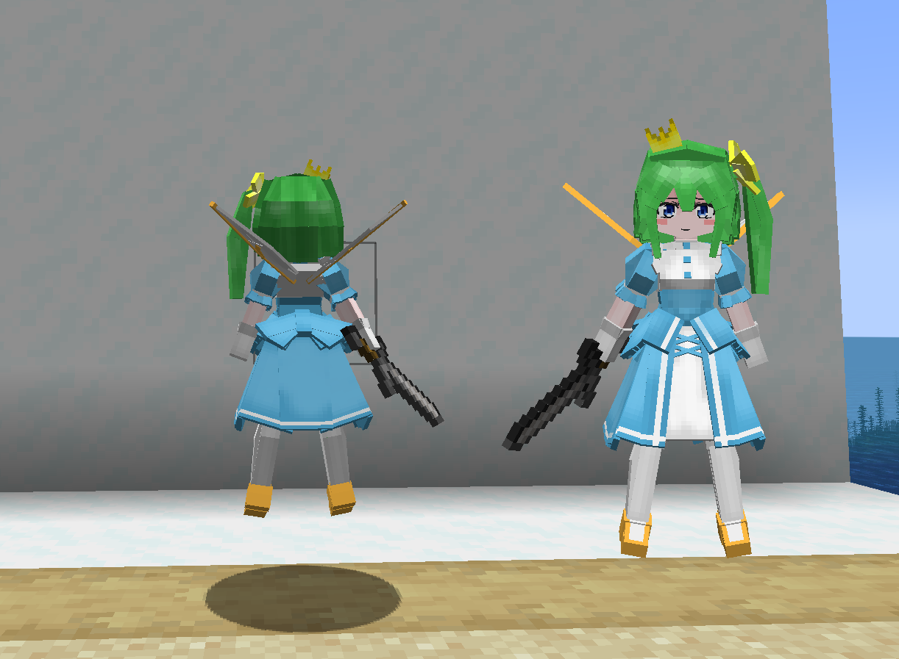
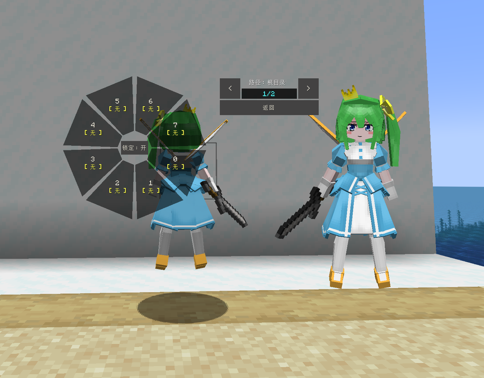
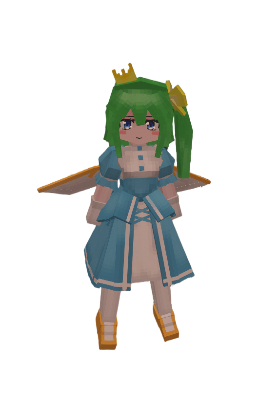

# Touhou_大妖精_Daiyousei_LC

## Model Info

Expand/Collapse

<!-- GENERATED MODEL PREVIEW README START -->

<!-- GENERATED MODEL PREVIEW README END -->

- **Name**: #大妖精 | #Daiyousei
- **Category**: #Other
  - **Game**: #Touhou #Touhou-Project #东方 Project

## Download

Expand/Collapse

- [Touhou_大妖精_Daiyousei.ysm (61.9 KB)](https://raw.githubusercontent.com/nekohalawrence/YSM-Model-Author/main/0093-%E8%8B%8F%E4%BE%9D%E5%87%9B%2C%E7%82%BD%E6%B9%AE/Touhou_%E5%A4%A7%E5%A6%96%E7%B2%BE_Daiyousei_LC/Touhou_%E5%A4%A7%E5%A6%96%E7%B2%BE_Daiyousei.ysm)
- [Touhou_大妖精_Daiyousei_v1.1.5.ysm (61.8 KB)](https://raw.githubusercontent.com/nekohalawrence/YSM-Model-Author/main/0093-%E8%8B%8F%E4%BE%9D%E5%87%9B%2C%E7%82%BD%E6%B9%AE/Touhou_%E5%A4%A7%E5%A6%96%E7%B2%BE_Daiyousei_LC/Touhou_%E5%A4%A7%E5%A6%96%E7%B2%BE_Daiyousei_v1.1.5.ysm)
- [Touhou_大妖精_Daiyousei_v2.0.0.ysm (103.7 KB)](https://raw.githubusercontent.com/nekohalawrence/YSM-Model-Author/main/0093-%E8%8B%8F%E4%BE%9D%E5%87%9B%2C%E7%82%BD%E6%B9%AE/Touhou_%E5%A4%A7%E5%A6%96%E7%B2%BE_Daiyousei_LC/Touhou_%E5%A4%A7%E5%A6%96%E7%B2%BE_Daiyousei_v2.0.0.ysm)
- [Touhou_大妖精_Daiyousei_v2.1.0.ysm (103.8 KB)](https://raw.githubusercontent.com/nekohalawrence/YSM-Model-Author/main/0093-%E8%8B%8F%E4%BE%9D%E5%87%9B%2C%E7%82%BD%E6%B9%AE/Touhou_%E5%A4%A7%E5%A6%96%E7%B2%BE_Daiyousei_LC/Touhou_%E5%A4%A7%E5%A6%96%E7%B2%BE_Daiyousei_v2.1.0.ysm)

## Author Info

Expand/Collapse

## Author

- **Name**: #苏依凛 | #炽湮
  - **Author ID**: `0093`
  - **Role**: #模型 #动作 #动画 | #Model #Motion #Animation
  - **SocialPlatform**: #Bilibili
    - **Bilibili**: https://space.bilibili.com/76987486
  - **SupportPlatform**: #Afdian
    - **Afdian**: https://afdian.com/a/supermonsterking

