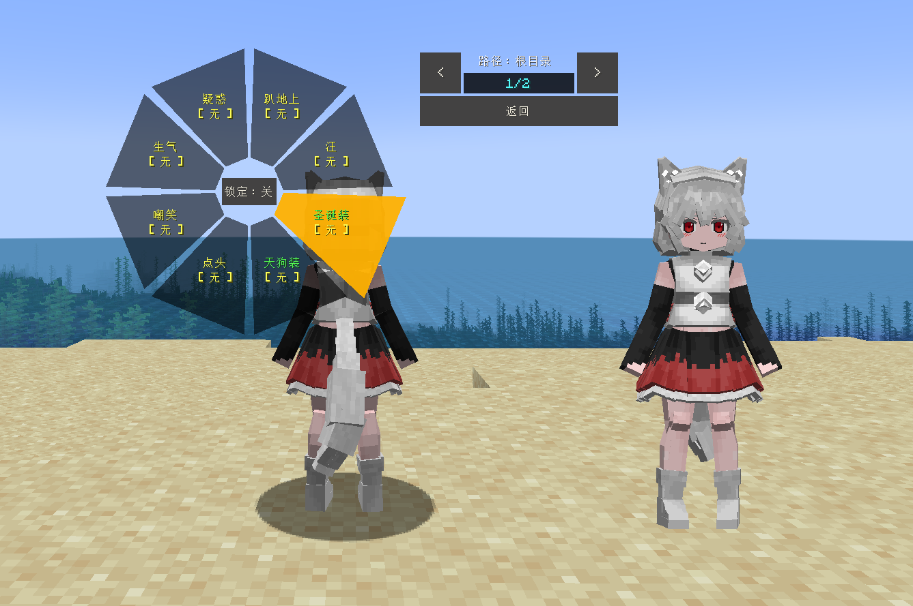
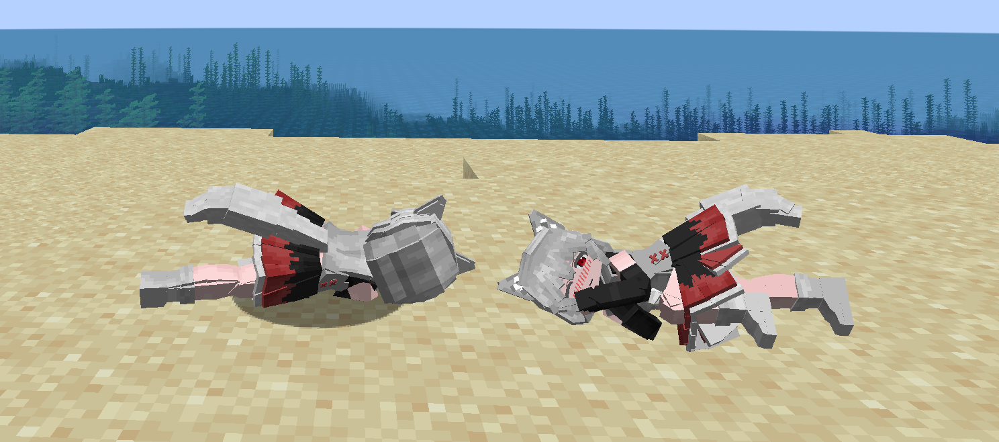
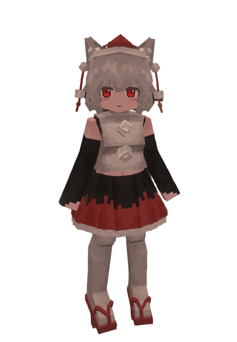

# Touhou_犬走椛_Inubashiri-Momizi_LA

## Model Info

Expand/Collapse

<!-- GENERATED MODEL PREVIEW README START -->

<!-- GENERATED MODEL PREVIEW README END -->

- **Name**: #犬走椛 | #Inubashiri-Momizi
- **Category**: #Other
  - **Game**: #Touhou #Touhou-Project #东方 Project

## Download

Expand/Collapse

- [Touhou_犬走椛_Inubashiri-Momizi_v3.0.1.ysm (427.2 KB)](https://raw.githubusercontent.com/nekohalawrence/YSM-Model-Author/main/0093-%E8%8B%8F%E4%BE%9D%E5%87%9B%2C%E7%82%BD%E6%B9%AE/Touhou_%E7%8A%AC%E8%B5%B0%E6%A4%9B_Inubashiri-Momizi_LA/Touhou_%E7%8A%AC%E8%B5%B0%E6%A4%9B_Inubashiri-Momizi_v3.0.1.ysm)
- [Touhou_犬走椛_Inubashiri-Momizi_v3.0.3.ysm (436.2 KB)](https://raw.githubusercontent.com/nekohalawrence/YSM-Model-Author/main/0093-%E8%8B%8F%E4%BE%9D%E5%87%9B%2C%E7%82%BD%E6%B9%AE/Touhou_%E7%8A%AC%E8%B5%B0%E6%A4%9B_Inubashiri-Momizi_LA/Touhou_%E7%8A%AC%E8%B5%B0%E6%A4%9B_Inubashiri-Momizi_v3.0.3.ysm)
- [Touhou_犬走椛_Inubashiri-Momizi_v3.0.4.ysm (436.6 KB)](https://raw.githubusercontent.com/nekohalawrence/YSM-Model-Author/main/0093-%E8%8B%8F%E4%BE%9D%E5%87%9B%2C%E7%82%BD%E6%B9%AE/Touhou_%E7%8A%AC%E8%B5%B0%E6%A4%9B_Inubashiri-Momizi_LA/Touhou_%E7%8A%AC%E8%B5%B0%E6%A4%9B_Inubashiri-Momizi_v3.0.4.ysm)

## Author Info

Expand/Collapse

## Author

- **Name**: #苏依凛 | #炽湮
  - **Author ID**: `0093`
  - **Role**: #模型 | #Model
  - **SocialPlatform**: #Bilibili
    - **Bilibili**: https://space.bilibili.com/76987486
  - **SupportPlatform**: #Afdian
    - **Afdian**: https://afdian.com/a/supermonsterking

