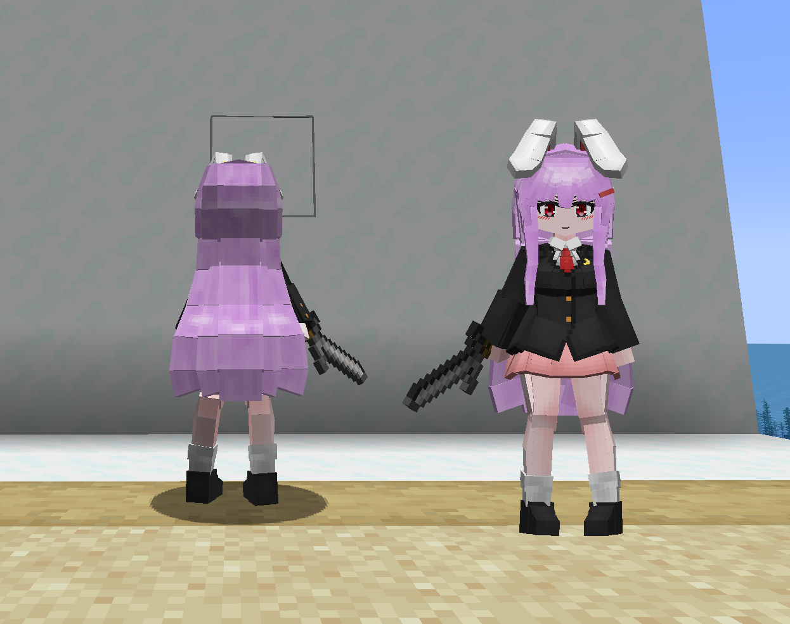
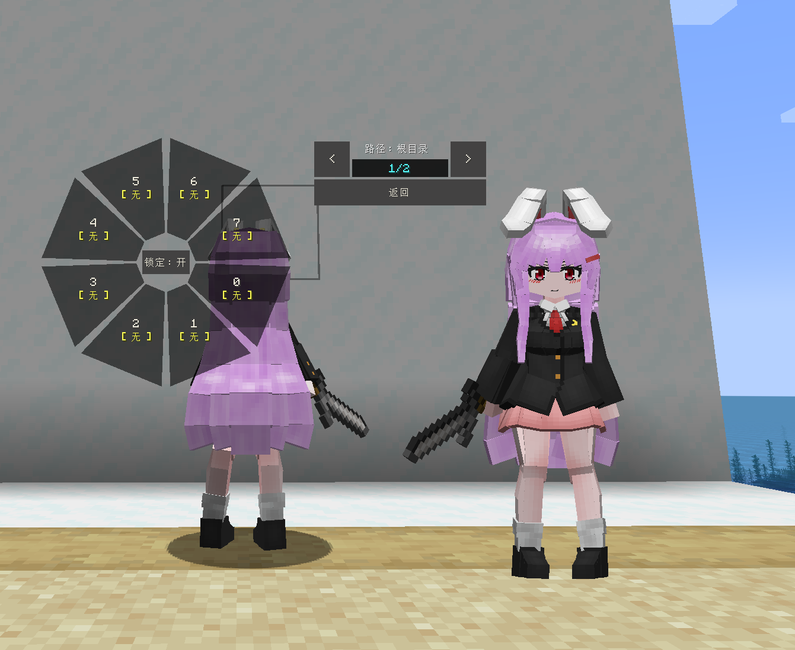
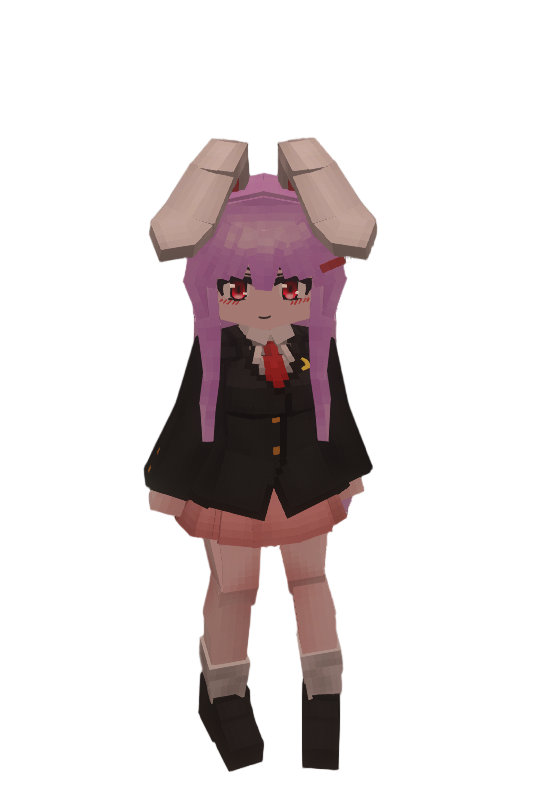

# Touhou_铃仙·优昙华院·因幡_Reisen-Udongein-Inaba_LB

## Model Info

Expand/Collapse

<!-- GENERATED MODEL PREVIEW README START -->

<!-- GENERATED MODEL PREVIEW README END -->

- **Name**: #铃仙·优昙华院·因幡 | #Reisen-Udongein-Inaba
- **Category**: #Other
  - **Game**: #Touhou #Touhou-Project #东方 Project

## Download

Expand/Collapse

- [Touhou_铃仙·优昙华院·因幡_Reisen-Udongein-Inaba_v2.5.0.ysm (263.5 KB)](https://raw.githubusercontent.com/nekohalawrence/YSM-Model-Author/main/0093-%E8%8B%8F%E4%BE%9D%E5%87%9B%2C%E7%82%BD%E6%B9%AE/Touhou_%E9%93%83%E4%BB%99%C2%B7%E4%BC%98%E6%98%99%E5%8D%8E%E9%99%A2%C2%B7%E5%9B%A0%E5%B9%A1_Reisen-Udongein-Inaba_LB/Touhou_%E9%93%83%E4%BB%99%C2%B7%E4%BC%98%E6%98%99%E5%8D%8E%E9%99%A2%C2%B7%E5%9B%A0%E5%B9%A1_Reisen-Udongein-Inaba_v2.5.0.ysm)
- [Touhou_铃仙·优昙华院·因幡_Reisen-Udongein-Inaba_v2.5.1.ysm (263.3 KB)](https://raw.githubusercontent.com/nekohalawrence/YSM-Model-Author/main/0093-%E8%8B%8F%E4%BE%9D%E5%87%9B%2C%E7%82%BD%E6%B9%AE/Touhou_%E9%93%83%E4%BB%99%C2%B7%E4%BC%98%E6%98%99%E5%8D%8E%E9%99%A2%C2%B7%E5%9B%A0%E5%B9%A1_Reisen-Udongein-Inaba_LB/Touhou_%E9%93%83%E4%BB%99%C2%B7%E4%BC%98%E6%98%99%E5%8D%8E%E9%99%A2%C2%B7%E5%9B%A0%E5%B9%A1_Reisen-Udongein-Inaba_v2.5.1.ysm)

## Author Info

Expand/Collapse

## Author

- **Name**: #苏依凛 | #炽湮
  - **Author ID**: `0093`
  - **Role**: #模型 #动作 #动画 | #Model #Motion #Animation
  - **SocialPlatform**: #Bilibili
    - **Bilibili**: https://space.bilibili.com/76987486
  - **SupportPlatform**: #Afdian
    - **Afdian**: https://afdian.com/a/supermonsterking

