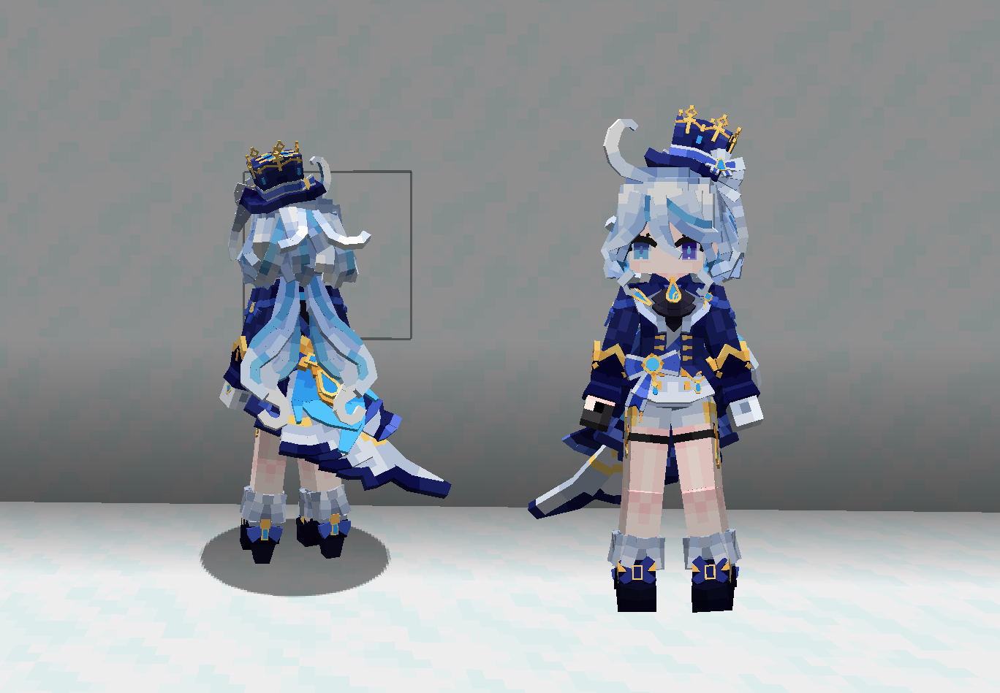
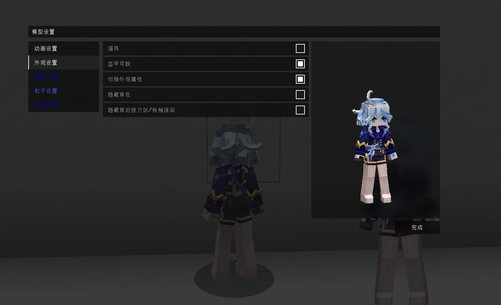

# GI_芙宁娜_Furina_LA

## Model Info

Expand/Collapse

<!-- GENERATED MODEL PREVIEW README START -->

<!-- GENERATED MODEL PREVIEW README END -->

- **Name**: #芙宁娜 | #Furina
- **Category**: #Game
  - **Game**: #GI #Genshin Impact #原神

## Download

Expand/Collapse

- [GI_芙宁娜_Furina_v3.10.ysm (10.5 MB)](https://raw.githubusercontent.com/nekohalawrence/YSM-Model-Author/main/0094-%E5%A2%A8%E6%9F%93%E9%80%9D%E7%BE%BD%2CFeather_aya/GI_%E8%8A%99%E5%AE%81%E5%A8%9C_Furina_LA/GI_%E8%8A%99%E5%AE%81%E5%A8%9C_Furina_v3.10.ysm)
- [GI_芙宁娜_Furina_v3.11.ysm (10.5 MB)](https://raw.githubusercontent.com/nekohalawrence/YSM-Model-Author/main/0094-%E5%A2%A8%E6%9F%93%E9%80%9D%E7%BE%BD%2CFeather_aya/GI_%E8%8A%99%E5%AE%81%E5%A8%9C_Furina_LA/GI_%E8%8A%99%E5%AE%81%E5%A8%9C_Furina_v3.11.ysm)
- [GI_芙宁娜_Furina_v3.12.ysm (13.3 MB)](https://raw.githubusercontent.com/nekohalawrence/YSM-Model-Author/main/0094-%E5%A2%A8%E6%9F%93%E9%80%9D%E7%BE%BD%2CFeather_aya/GI_%E8%8A%99%E5%AE%81%E5%A8%9C_Furina_LA/GI_%E8%8A%99%E5%AE%81%E5%A8%9C_Furina_v3.12.ysm)
- [GI_芙宁娜_Furina_v3.13.ysm (13.1 MB)](https://raw.githubusercontent.com/nekohalawrence/YSM-Model-Author/main/0094-%E5%A2%A8%E6%9F%93%E9%80%9D%E7%BE%BD%2CFeather_aya/GI_%E8%8A%99%E5%AE%81%E5%A8%9C_Furina_LA/GI_%E8%8A%99%E5%AE%81%E5%A8%9C_Furina_v3.13.ysm)
- [GI_芙宁娜_Furina_v3.13_1.ysm (14.8 MB)](https://raw.githubusercontent.com/nekohalawrence/YSM-Model-Author/main/0094-%E5%A2%A8%E6%9F%93%E9%80%9D%E7%BE%BD%2CFeather_aya/GI_%E8%8A%99%E5%AE%81%E5%A8%9C_Furina_LA/GI_%E8%8A%99%E5%AE%81%E5%A8%9C_Furina_v3.13_1.ysm)
- [GI_芙宁娜_Furina_v3.13_2.ysm (13.1 MB)](https://raw.githubusercontent.com/nekohalawrence/YSM-Model-Author/main/0094-%E5%A2%A8%E6%9F%93%E9%80%9D%E7%BE%BD%2CFeather_aya/GI_%E8%8A%99%E5%AE%81%E5%A8%9C_Furina_LA/GI_%E8%8A%99%E5%AE%81%E5%A8%9C_Furina_v3.13_2.ysm)
- [GI_芙宁娜_Furina_v3.13_3.ysm (14.8 MB)](https://raw.githubusercontent.com/nekohalawrence/YSM-Model-Author/main/0094-%E5%A2%A8%E6%9F%93%E9%80%9D%E7%BE%BD%2CFeather_aya/GI_%E8%8A%99%E5%AE%81%E5%A8%9C_Furina_LA/GI_%E8%8A%99%E5%AE%81%E5%A8%9C_Furina_v3.13_3.ysm)
- [GI_芙宁娜_Furina_v3.13_4.ysm (13.0 MB)](https://raw.githubusercontent.com/nekohalawrence/YSM-Model-Author/main/0094-%E5%A2%A8%E6%9F%93%E9%80%9D%E7%BE%BD%2CFeather_aya/GI_%E8%8A%99%E5%AE%81%E5%A8%9C_Furina_LA/GI_%E8%8A%99%E5%AE%81%E5%A8%9C_Furina_v3.13_4.ysm)
- [GI_芙宁娜_Furina_v3.13_5.ysm (13.1 MB)](https://raw.githubusercontent.com/nekohalawrence/YSM-Model-Author/main/0094-%E5%A2%A8%E6%9F%93%E9%80%9D%E7%BE%BD%2CFeather_aya/GI_%E8%8A%99%E5%AE%81%E5%A8%9C_Furina_LA/GI_%E8%8A%99%E5%AE%81%E5%A8%9C_Furina_v3.13_5.ysm)
- [GI_芙宁娜_Furina_v3.13_6.ysm (14.8 MB)](https://raw.githubusercontent.com/nekohalawrence/YSM-Model-Author/main/0094-%E5%A2%A8%E6%9F%93%E9%80%9D%E7%BE%BD%2CFeather_aya/GI_%E8%8A%99%E5%AE%81%E5%A8%9C_Furina_LA/GI_%E8%8A%99%E5%AE%81%E5%A8%9C_Furina_v3.13_6.ysm)
- [GI_芙宁娜_Furina_v3.14.ysm (13.1 MB)](https://raw.githubusercontent.com/nekohalawrence/YSM-Model-Author/main/0094-%E5%A2%A8%E6%9F%93%E9%80%9D%E7%BE%BD%2CFeather_aya/GI_%E8%8A%99%E5%AE%81%E5%A8%9C_Furina_LA/GI_%E8%8A%99%E5%AE%81%E5%A8%9C_Furina_v3.14.ysm)
- [GI_芙宁娜_Furina_v3.14_1.ysm (14.8 MB)](https://raw.githubusercontent.com/nekohalawrence/YSM-Model-Author/main/0094-%E5%A2%A8%E6%9F%93%E9%80%9D%E7%BE%BD%2CFeather_aya/GI_%E8%8A%99%E5%AE%81%E5%A8%9C_Furina_LA/GI_%E8%8A%99%E5%AE%81%E5%A8%9C_Furina_v3.14_1.ysm)
- [GI_芙宁娜_Furina_v3.3.ysm (1.7 MB)](https://raw.githubusercontent.com/nekohalawrence/YSM-Model-Author/main/0094-%E5%A2%A8%E6%9F%93%E9%80%9D%E7%BE%BD%2CFeather_aya/GI_%E8%8A%99%E5%AE%81%E5%A8%9C_Furina_LA/GI_%E8%8A%99%E5%AE%81%E5%A8%9C_Furina_v3.3.ysm)
- [GI_芙宁娜_Furina_v3.4.ysm (2.4 MB)](https://raw.githubusercontent.com/nekohalawrence/YSM-Model-Author/main/0094-%E5%A2%A8%E6%9F%93%E9%80%9D%E7%BE%BD%2CFeather_aya/GI_%E8%8A%99%E5%AE%81%E5%A8%9C_Furina_LA/GI_%E8%8A%99%E5%AE%81%E5%A8%9C_Furina_v3.4.ysm)
- [GI_芙宁娜_Furina_v3.8.ysm (11.1 MB)](https://raw.githubusercontent.com/nekohalawrence/YSM-Model-Author/main/0094-%E5%A2%A8%E6%9F%93%E9%80%9D%E7%BE%BD%2CFeather_aya/GI_%E8%8A%99%E5%AE%81%E5%A8%9C_Furina_LA/GI_%E8%8A%99%E5%AE%81%E5%A8%9C_Furina_v3.8.ysm)
- [GI_芙宁娜_Furina_v3.9.ysm (11.7 MB)](https://raw.githubusercontent.com/nekohalawrence/YSM-Model-Author/main/0094-%E5%A2%A8%E6%9F%93%E9%80%9D%E7%BE%BD%2CFeather_aya/GI_%E8%8A%99%E5%AE%81%E5%A8%9C_Furina_LA/GI_%E8%8A%99%E5%AE%81%E5%A8%9C_Furina_v3.9.ysm)

## Author Info

Expand/Collapse

## Author

- **Name**: #墨染逝羽 | #Feather_aya
  - **Author ID**: `0094`
  - **Role**: #模型 | #Model
  - **SocialPlatform**: #Bilibili
    - **Bilibili**: https://space.bilibili.com/5718046
  - **SupportPlatform**: #Afdian
    - **Afdian**: https://afdian.com/a/FliegeSA

## Co-creator

- **Name**: 星屑海螺
  - **Role**: #动画 | #Animation
  - **SocialPlatform**: #Bilibili
    - **Bilibili**: https://space.bilibili.com/14975572
  - **SupportPlatform**: #Afdian
    - **Afdian**: https://afdian.com/a/lucia2048

- **Name**: NguyenDevs
  - **Role**: #Misc #音效 #Trans | #Sound
  - **SocialPlatform**: #Facebook #TikTok
    - **Facebook**: https://facebook.com/NguyenDevs
    - **TikTok**: https://tiktok.com/@nguyendevs
  - **SupportPlatform**: #Afdian
    - **Afdian**: https://afdian.com/a/NguyenDevs

