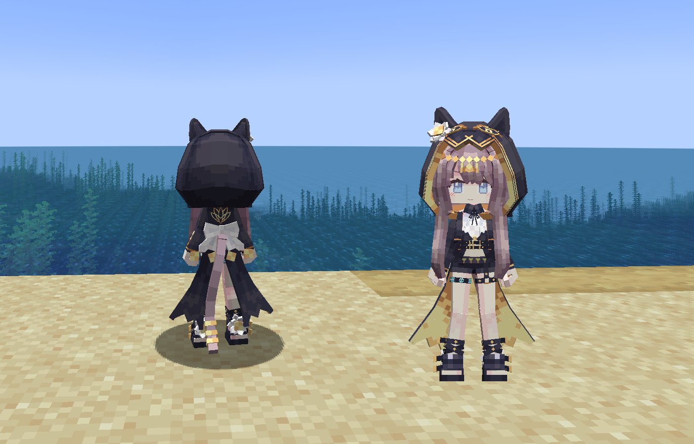
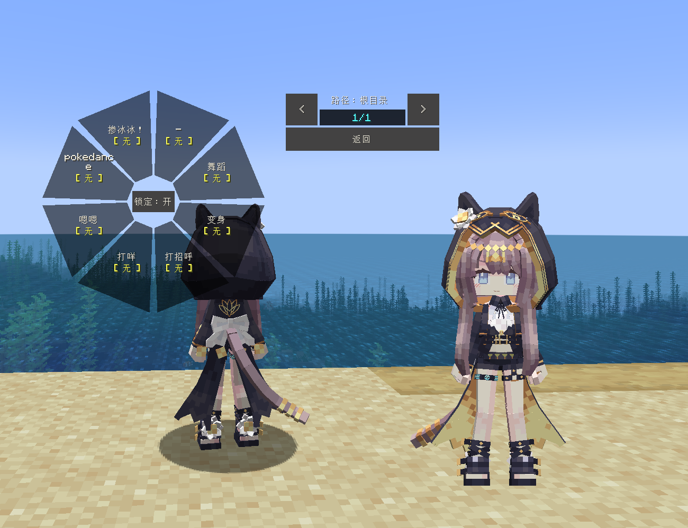
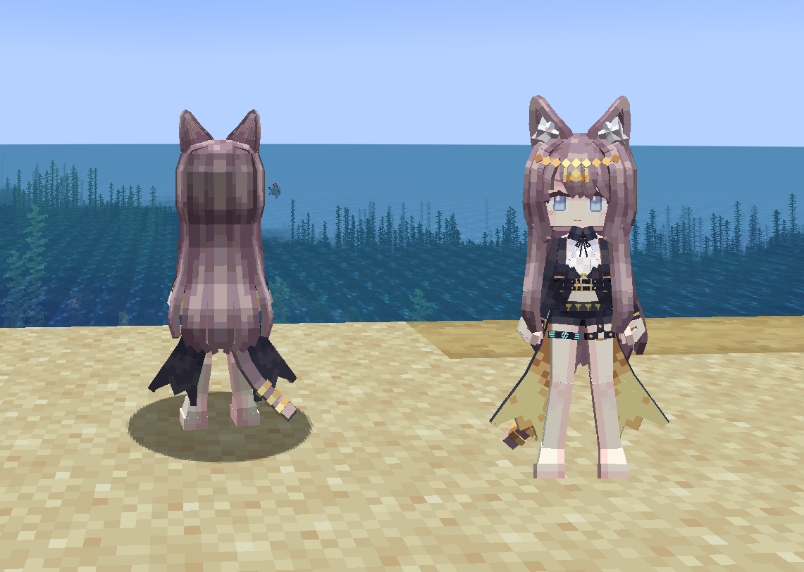
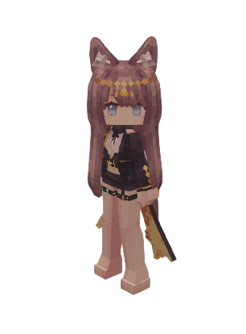
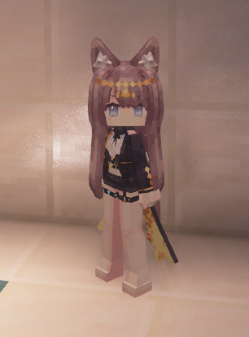

# AK_Pepe_佩佩_LA

## Model Info

Expand/Collapse

<!-- GENERATED MODEL PREVIEW README START -->

<!-- GENERATED MODEL PREVIEW README END -->

- **Name**: #佩佩 | #Pepe
- **Category**: #Game
  - **Game**: #AK #Arknights #明日方舟

## Download

Expand/Collapse

- [AK_佩佩_Pepe_v1.0.ysm (340.7 KB)](https://raw.githubusercontent.com/nekohalawrence/YSM-Model-Author/main/0095-%E6%BA%90%E7%9F%B3%E5%A7%AC%E5%8F%98%E4%BD%93%2Craw_chicken%2C%E9%B8%A1%E5%A7%AC/AK_Pepe_%E4%BD%A9%E4%BD%A9_LA/AK_%E4%BD%A9%E4%BD%A9_Pepe_v1.0.ysm)

## Author Info

Expand/Collapse

## Author

- **Name**: #源石姬变体 | #raw_chicken | #鸡姬
  - **Author ID**: `0095`
  - **Role**: #模型 #动画 | #Model #Animation
  - **SocialPlatform**: #Bilibili #Pixiv
    - **Bilibili**: https://space.bilibili.com/219540765
    - **Pixiv**: https://www.pixiv.net/users/31376770
  - **SupportPlatform**: #Afdian #Unifans
    - **Afdian**: https://afdian.com/a/rawchicken
    - **Unifans**: https://app.unifans.io/c/rawchickenneg

