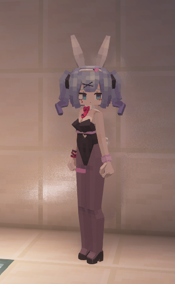

# VOC_Hatsune-Miku_初音未来_兔子洞_LA

## Model Info

Expand/Collapse

<!-- GENERATED MODEL PREVIEW README START -->

<!-- GENERATED MODEL PREVIEW README END -->

- **Name**: #初音未来 | #Hatsune-Miku
- **Category**: #Music
  - **Game**: #VOC #VOCALOID #虚拟歌姬

## Download

Expand/Collapse

- [VOC_初音_兔子洞_Hatsune-Miku.ysm (183.5 KB)](https://raw.githubusercontent.com/nekohalawrence/YSM-Model-Author/main/0095-%E6%BA%90%E7%9F%B3%E5%A7%AC%E5%8F%98%E4%BD%93%2Craw_chicken%2C%E9%B8%A1%E5%A7%AC/VOC_Hatsune-Miku_%E5%88%9D%E9%9F%B3%E6%9C%AA%E6%9D%A5_%E5%85%94%E5%AD%90%E6%B4%9E_LA/VOC_%E5%88%9D%E9%9F%B3_%E5%85%94%E5%AD%90%E6%B4%9E_Hatsune-Miku.ysm)
- [VOC_初音_兔子洞_Hatsune-Miku_rabbithole_0.ysm (114.9 KB)](https://raw.githubusercontent.com/nekohalawrence/YSM-Model-Author/main/0095-%E6%BA%90%E7%9F%B3%E5%A7%AC%E5%8F%98%E4%BD%93%2Craw_chicken%2C%E9%B8%A1%E5%A7%AC/VOC_Hatsune-Miku_%E5%88%9D%E9%9F%B3%E6%9C%AA%E6%9D%A5_%E5%85%94%E5%AD%90%E6%B4%9E_LA/VOC_%E5%88%9D%E9%9F%B3_%E5%85%94%E5%AD%90%E6%B4%9E_Hatsune-Miku_rabbithole_0.ysm)

## Author Info

Expand/Collapse

## Author

- **Name**: #源石姬变体 | #raw_chicken | #鸡姬
  - **Author ID**: `0095`
  - **Role**: #模型 #动作 #动画 | #Model #Motion #Animation
  - **SocialPlatform**: #Bilibili #Pixiv
    - **Bilibili**: https://space.bilibili.com/219540765
    - **Pixiv**: https://www.pixiv.net/users/31376770
  - **SupportPlatform**: #Afdian #Unifans
    - **Afdian**: https://afdian.com/a/rawchicken
    - **Unifans**: https://app.unifans.io/c/rawchickenneg

