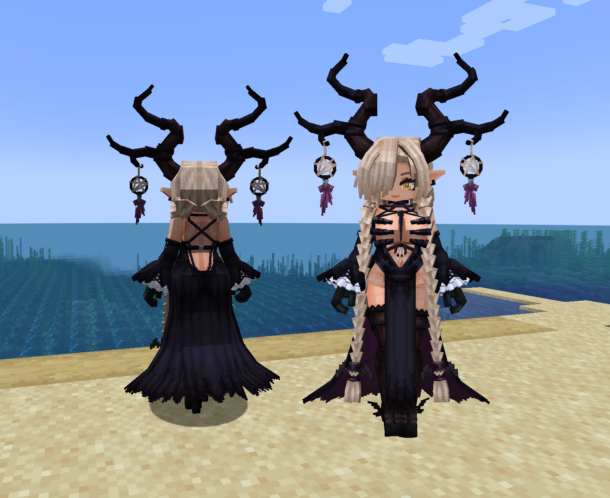

# AL_Owari_尾张_愿望为爱_LB

## Model Info

Expand/Collapse

<!-- GENERATED MODEL PREVIEW README START -->

<!-- GENERATED MODEL PREVIEW README END -->

- **Name**: #尾张 | #Owari
- **Category**: #Game
  - **Game**: #AL #Azur-Lane #碧蓝航线

## Download

Expand/Collapse

- [AL_尾张_愿望为爱_Owari.ysm (380.2 KB)](https://raw.githubusercontent.com/nekohalawrence/YSM-Model-Author/main/0102-Dreamer%2C%E6%99%AE%E9%80%9A%E7%9A%84%E6%9C%A8%E5%B1%90/AL_Owari_%E5%B0%BE%E5%BC%A0_%E6%84%BF%E6%9C%9B%E4%B8%BA%E7%88%B1_LB/AL_%E5%B0%BE%E5%BC%A0_%E6%84%BF%E6%9C%9B%E4%B8%BA%E7%88%B1_Owari.ysm)

## Author Info

Expand/Collapse

## Author

- **Name**: #Dreamer | #普通的木屐
  - **Author ID**: `0102`
  - **Role**: #模型 #动作 #动画 | #Model #Motion #Animation
  - **SocialPlatform**: #Bilibili #WeChat #QQ
    - **Bilibili**: https://afdian.com/a/CommonMuJi
    - **WeChat**: MC_CommonMuJi
    - **QQ**: 1776296661
  - **SupportPlatform**: #Afdian
    - **Afdian**: https://space.bilibili.com/768300

