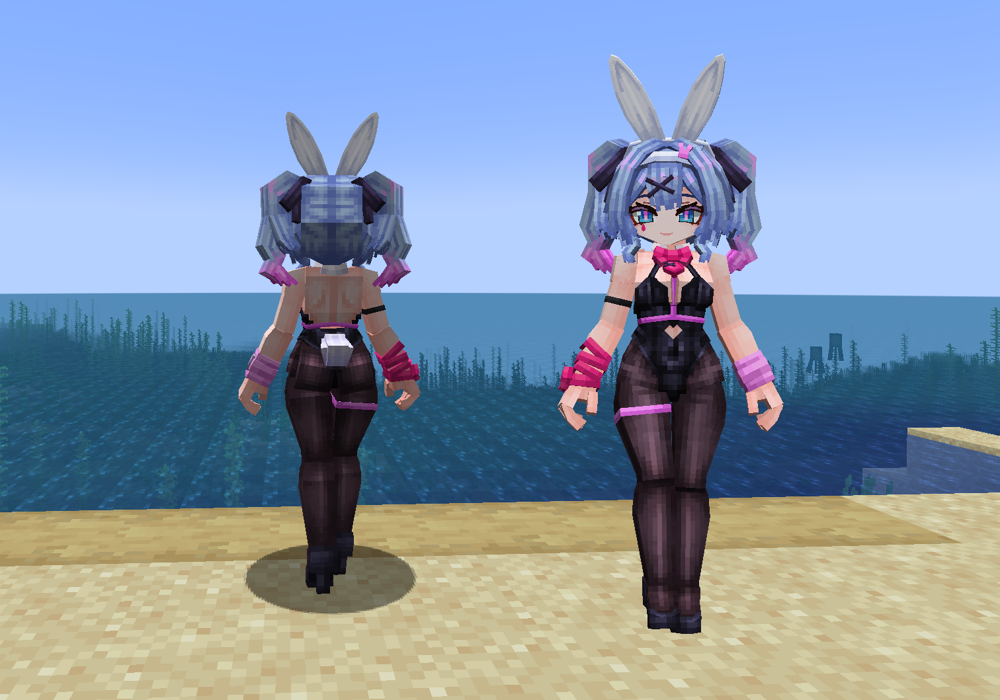
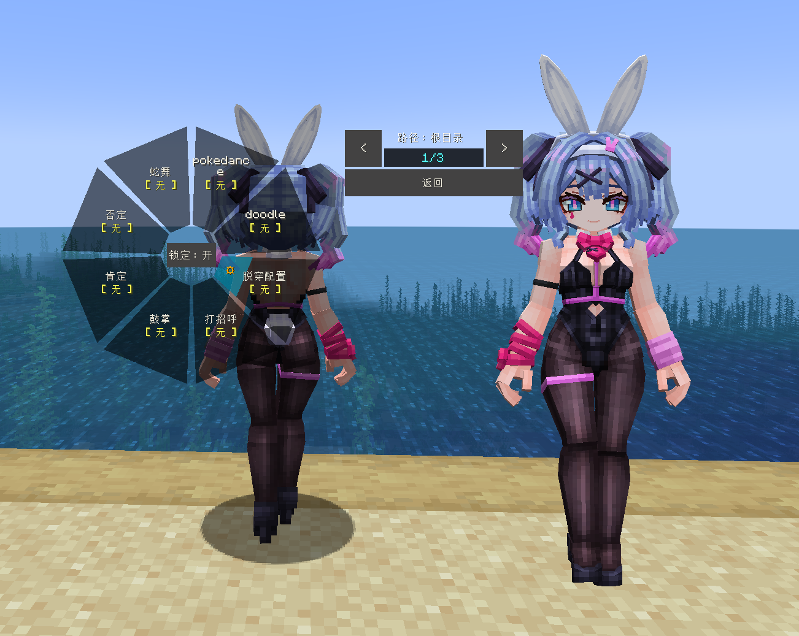
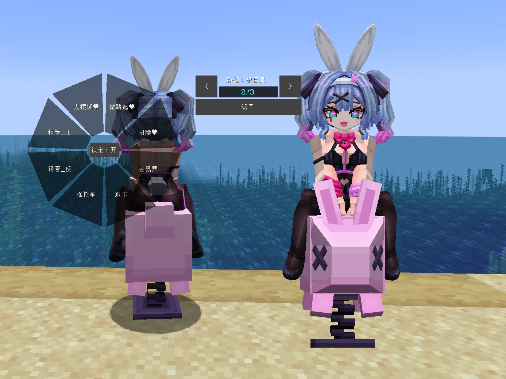
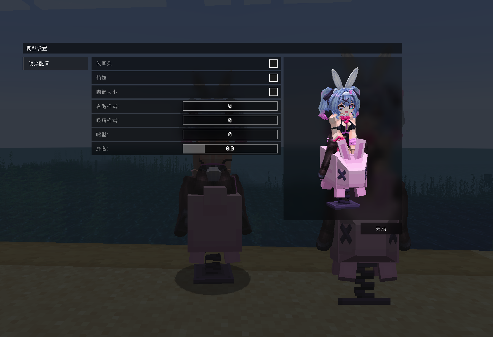
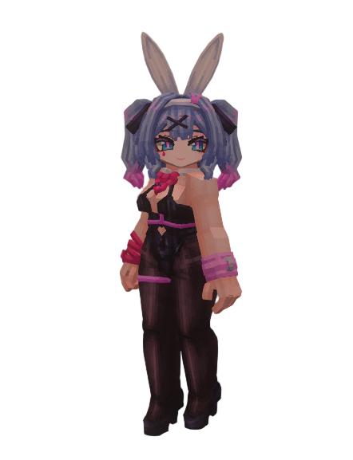

# VOC_Hatsune-Miku_初音未来_LB

## Model Info

Expand/Collapse

<!-- GENERATED MODEL PREVIEW README START -->

<!-- GENERATED MODEL PREVIEW README END -->

- **Name**: #初音未来 | #Hatsune-Miku
- **Category**: #Music
  - **Game**: #VOC #VOCALOID #虚拟歌姬

## Download

Expand/Collapse

- [VOC_初音未来_Hatsune-Miku_rabbithole_v1.1.ysm (904.3 KB)](https://raw.githubusercontent.com/nekohalawrence/YSM-Model-Author/main/0102-Dreamer%2C%E6%99%AE%E9%80%9A%E7%9A%84%E6%9C%A8%E5%B1%90/VOC_Hatsune-Miku_%E5%88%9D%E9%9F%B3%E6%9C%AA%E6%9D%A5_LB/VOC_%E5%88%9D%E9%9F%B3%E6%9C%AA%E6%9D%A5_Hatsune-Miku_rabbithole_v1.1.ysm)

## Author Info

Expand/Collapse

## Author

- **Name**: #Dreamer | #普通的木屐
  - **Author ID**: `0102`
  - **Role**: #模型 | #Model
  - **SocialPlatform**: #Bilibili #WeChat #QQ
    - **Bilibili**: https://afdian.com/a/CommonMuJi
    - **WeChat**: MC_CommonMuJi
    - **QQ**: 1776296661
  - **SupportPlatform**: #Afdian
    - **Afdian**: https://space.bilibili.com/768300

## Co-creator

- **Name**: 普通的木屐
  - **Role**: #UP主
  - **SocialPlatform**: #WeChat #Bilibili
    - **WeChat**: MC_CommonMuJi
    - **Bilibili**: https://space.bilibili.com/768300

