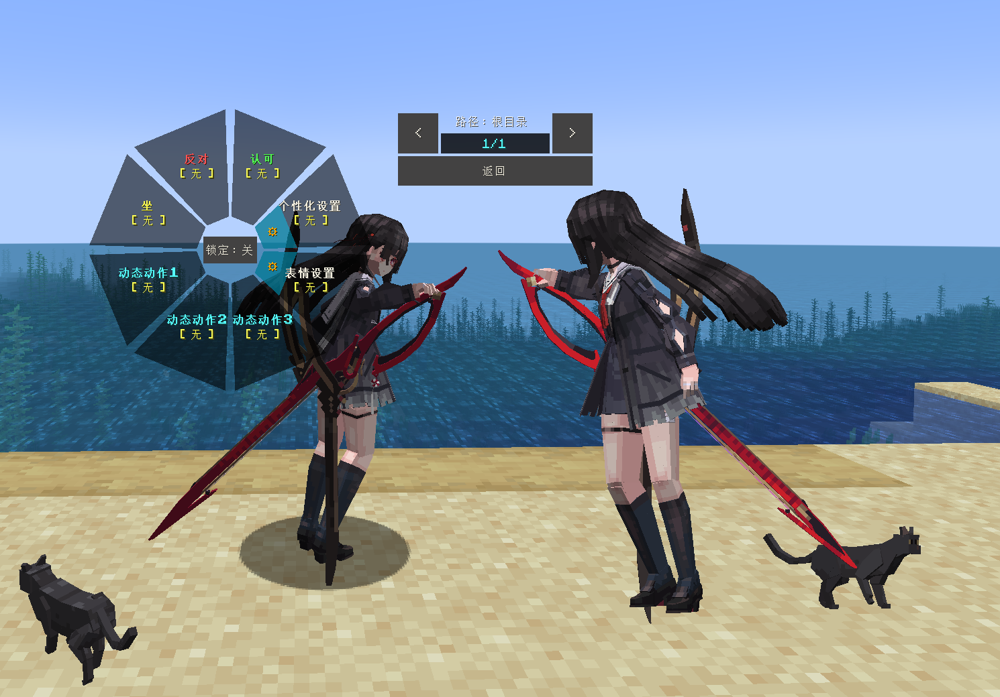
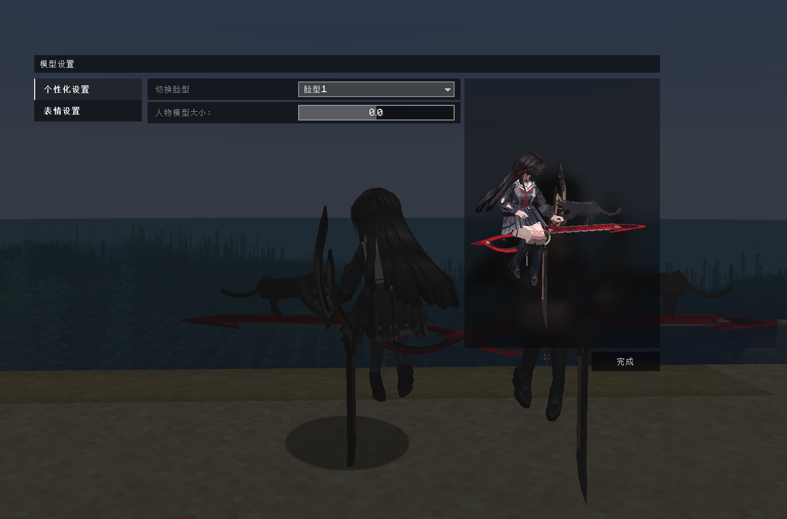

# WW_Chisa_千咲_LA

## Model Info

Expand/Collapse

<!-- GENERATED MODEL PREVIEW README START -->

<!-- GENERATED MODEL PREVIEW README END -->

- **Name**: #千咲 | #Chisa
- **Category**: #Game
  - **Game**: #WW #Wuthering-Waves #鸣潮

## Download

Expand/Collapse

- [WW_千咲_CHISA.ysm (4.8 MB)](https://raw.githubusercontent.com/nekohalawrence/YSM-Model-Author/main/0103-%E6%B5%85%E9%99%8C%E8%8F%8C/WW_Chisa_%E5%8D%83%E5%92%B2_LA/WW_%E5%8D%83%E5%92%B2_CHISA.ysm)

## Author Info

Expand/Collapse

## Author

- **Name**: #浅陌菌
  - **Author ID**: `0103`
  - **Role**: 模型 | 动画 | 适配
  - **SocialPlatform**: #Bilibili #QQ
    - **Bilibili**: https://space.bilibili.com/24513198
    - **QQ**: 1063585053
  - **SupportPlatform**: #Afdian
    - **Afdian**: https://afdian.com/a/tc_fox

## Co-creator

- **Name**: 艺方堂
  - **Role**: #公益分享

- **Name**: 艺方坊
  - **Role**: #售后服务

- **Name**: 艺方阁
  - **Role**: #定制咨询

