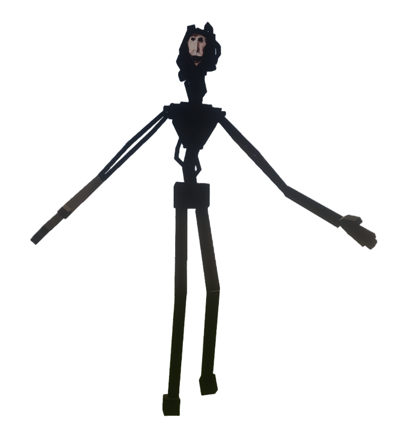

# Analog-Horror_The-Locust_蝗虫

## Model Info

Expand/Collapse

<!-- GENERATED MODEL PREVIEW README START -->

<!-- GENERATED MODEL PREVIEW README END -->

- **Name**: #蝗虫 | #The-Locust
- **Category**: #Other
  - **Game**: #Analog-Horror #模拟恐怖

## Download

Expand/Collapse

- [The Locust.ysm (2.8 MB)](https://raw.githubusercontent.com/nekohalawrence/YSM-Model-Author/main/0104-%E7%A7%91%E5%88%97%E5%A4%AB%E6%96%AF%E5%9F%BA%2CKolevsky128/Analog-Horror_The-Locust_%E8%9D%97%E8%99%AB/The%20Locust.ysm)

## Author Info

Expand/Collapse

## Author

- **Name**: #科列夫斯基 | Kolevsky128
  - **Author ID**: `0104`
  - **Role**: #模型 | #Model
  - **SocialPlatform**: #Twitter #Bilibili
    - **Twitter**: https://x.com/Kolevsky128
    - **Bilibili**: https://space.bilibili.com/1504662164
  - **SupportPlatform**: #Afdian #Unifans
    - **Afdian**: https://afdian.com/a/Kolevsky
    - **Unifans**: https://app.unifans.io/c/kolevsky

