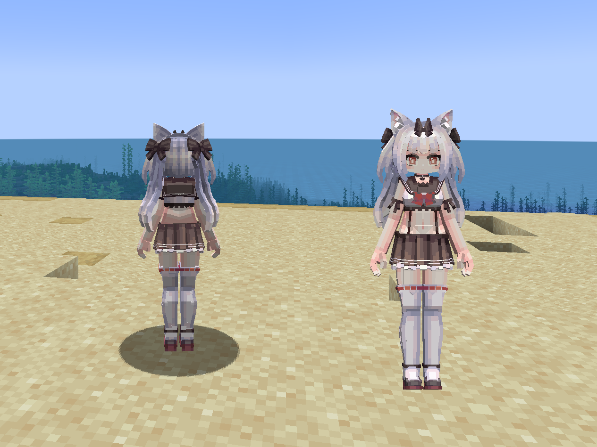
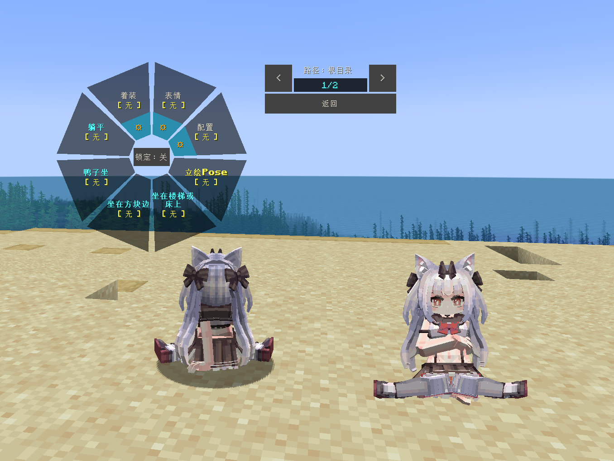
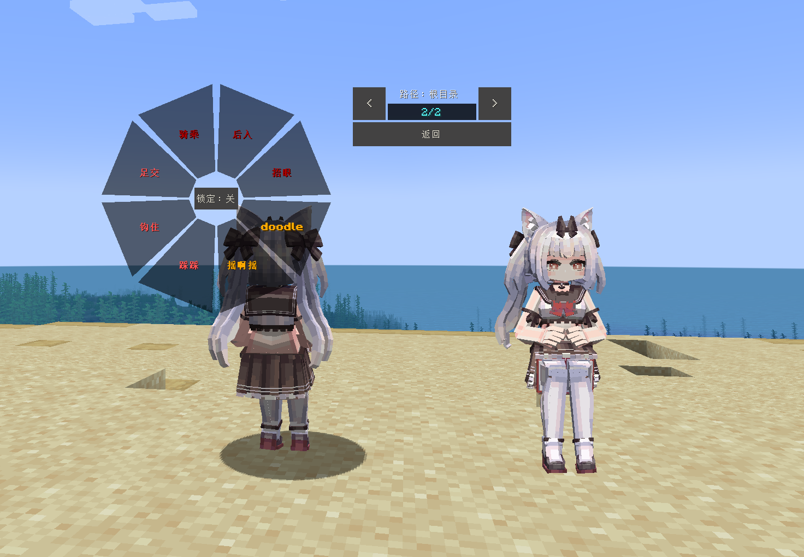
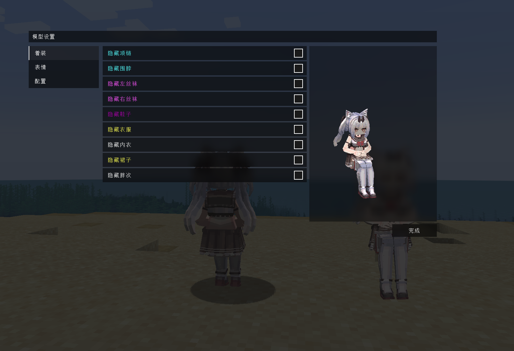

# AL_雪风_KanCollect-Yukikaze_LA

## Model Info

Expand/Collapse

<!-- GENERATED MODEL PREVIEW README START -->

<!-- GENERATED MODEL PREVIEW README END -->

- **Name**: #雪风 | #Kancollect-Yukikaze
- **Category**: #Game
  - **Game**: #AL #Azur-Lane #碧蓝航线

## Download

Expand/Collapse

- [AL_雪风_KanCollect-Yukikaze_v2.4.1.ysm (1.3 MB)](https://raw.githubusercontent.com/nekohalawrence/YSM-Model-Author/main/0105-%E8%B6%85%E7%BA%A7%E5%A4%A7%E9%B8%A1%E8%85%BF%E4%B8%B6%2CNss/AL_%E9%9B%AA%E9%A3%8E_KanCollect-Yukikaze_LA/AL_%E9%9B%AA%E9%A3%8E_KanCollect-Yukikaze_v2.4.1.ysm)
- [AL_雪风_KanCollect-Yukikaze_v2.4.1_1.ysm (2.4 MB)](https://raw.githubusercontent.com/nekohalawrence/YSM-Model-Author/main/0105-%E8%B6%85%E7%BA%A7%E5%A4%A7%E9%B8%A1%E8%85%BF%E4%B8%B6%2CNss/AL_%E9%9B%AA%E9%A3%8E_KanCollect-Yukikaze_LA/AL_%E9%9B%AA%E9%A3%8E_KanCollect-Yukikaze_v2.4.1_1.ysm)
- [AL_雪风_KanCollect-Yukikaze_v2.4.2.ysm (1.3 MB)](https://raw.githubusercontent.com/nekohalawrence/YSM-Model-Author/main/0105-%E8%B6%85%E7%BA%A7%E5%A4%A7%E9%B8%A1%E8%85%BF%E4%B8%B6%2CNss/AL_%E9%9B%AA%E9%A3%8E_KanCollect-Yukikaze_LA/AL_%E9%9B%AA%E9%A3%8E_KanCollect-Yukikaze_v2.4.2.ysm)
- [AL_雪风_KanCollect-Yukikaze_v2.6.1.ysm (7.7 MB)](https://raw.githubusercontent.com/nekohalawrence/YSM-Model-Author/main/0105-%E8%B6%85%E7%BA%A7%E5%A4%A7%E9%B8%A1%E8%85%BF%E4%B8%B6%2CNss/AL_%E9%9B%AA%E9%A3%8E_KanCollect-Yukikaze_LA/AL_%E9%9B%AA%E9%A3%8E_KanCollect-Yukikaze_v2.6.1.ysm)
- [AL_雪风_KanCollect-Yukikaze_v2.6.2.ysm (7.7 MB)](https://raw.githubusercontent.com/nekohalawrence/YSM-Model-Author/main/0105-%E8%B6%85%E7%BA%A7%E5%A4%A7%E9%B8%A1%E8%85%BF%E4%B8%B6%2CNss/AL_%E9%9B%AA%E9%A3%8E_KanCollect-Yukikaze_LA/AL_%E9%9B%AA%E9%A3%8E_KanCollect-Yukikaze_v2.6.2.ysm)

## Author Info

Expand/Collapse

## Author

- **Name**: #超级大鸡腿丶 | #Nss
  - **Author ID**: `0105`
  - **Role**: #模型 | #Model

## Co-creator

- **Name**: 星语
  - **Role**: #动作 | #Motion
  - **SocialPlatform**: #Bilibili
    - **Bilibili**: 316739550

